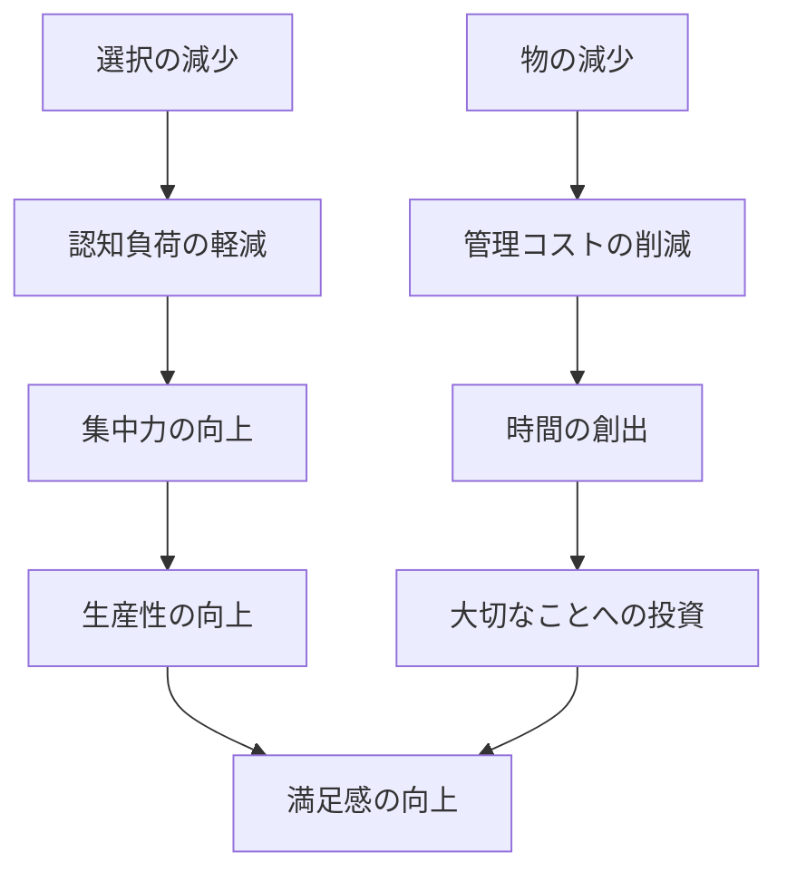

## はじめに

「何かを探しているのに、どこにあるかわからない」「服がいっぱいあるのに、毎朝何を着るか迷う」—こんな経験、ありませんか？実は、私たちは予想以上に「物の管理」に時間とエネルギーを費やしています。

ミニマリズムは「物を減らす」だけの話ではありません。不要なものを減らすことで、本当に大切なことにリソースを集中させ、生産性と幸福感を高めるライフスタイルなのです。

## 概念図解

## なぜ物が多いと生産性が下がるのか

### 選択疲労という科学的メカニズム

心理学者のシェナ・イェンガーとマーク・レッパーの研究によると、選択肢が多すぎると、人は選択をせずにその場を離れてしまう傾向があります。これを「選択のパラドックス」と呼びます。

**実験結果：**
- ジャムの種類が24種類ある店では、3%の人だけが購入
- 6種類しかない店では、30%の人が購入

**仕事への応用：**
- 朝の「何を着るか」の迷いで、1日の意志力を消耗
- 整理されていないデスクが、注意散漫を招く
- アプリが多すぎるスマホが、集中を妨げる

### 物理的な散らかりが脳に与える影響

プリンストン大学の研究によると、視界に散らかりがあると、脳はそれを無意識に処理し続け、本来の作業への集中を妨げられます。

## 少なく持つことで得られる5つのメリット

### 1. 朝の「意思決定エネルギー」を節約

**スティーブ・ジョブズの例：**
あのスティーブ・ジョブズは、毎日同じ黒のタートルネックを着ていました。「毎日何を着るか考える時間を節約したかった」と語っています。

**実践例：**
- 仕事服を制服化（ユニフォーム化）
- 朝食メニューを固定化
- 定番の朝ルーティンを作る

### 2. 探す時間がゼロになる

**Before：**
「あの資料、どこに置いたっけ？」→ 毎日15分探す → 月に5時間、年に60時間を無駄に

**After：**
「あの資料は、いつもこの引き出し」→ 即座にアクセス

**具体的な整理術：**
- 「一読一処」の徹底
- デジタルファイルの命名規則統一
- 「定位置」を徹底

### 3. お金と時間の両方が浮く

**購買決定の簡素化：**
「これ、本当に必要？」という問いを徹底すると、衝動買いが激減します。

**事例：**
ミニマリストの田中さん（仮名）は、物を減らした結果、月の支出が30%減少。浮いたお金で、スキルアップのためのオンライン講座に投資し、年収が150万円アップしました。

### 4. クリエイティブな思考が増える

**余白の力：**
物事が満ちていると、新しいアイデアが入ってくるスペースがありません。物理的な余白が、思考の余白を生み出します。

**著名人の実践：**
アインシュタインは「乱雑なデスクは混乱した頭の証拠」と言いましたが、実際には「必要なものだけ」を置く厳格な基準を持っていました。

### 5. 精神衛生が向上する

**片付けられた空間の効果：**
- ストレスホルモン（コルチゾール）の低下
- リラックス効果の向上
- 睡眠の質の改善

## ミニマリズム実践の3ステップ

### Step 1：見える場所から始める（今日できる）

**デスクの整理：**
1. デスクの上のものを全て箱に入れる
2. 本当に必要なものだけを戻す（ペン、ノートPCなど）
3. 1週間使わなかったものは別の場所へ

**スマホの整理：**
1. ホーム画面のアプリを減らす（7個以下が目標）
2. 通知をオフにする
3. フォルダで整理

### Step 2：クローゼットの見直し（今週やる）

**「1年ルール」：**
1年間着ていない服は、おそらく今後も着ません。

**「ビジネスカジュアル7日分」戦略：**
- トップス：7枚
- ボトムス：3枚
- アウター：2枚
- 小物：最少限

これだけで、実質無限の組み合わせができます。

### Step 3：情報ダイエット（今月やる）

**ニュースの整理：**
- SNSフォローを半分に
- メルマガ登録を見直し
- 「後で読む」を溜めない

## 注意点：ミニマリズムの落とし穴

### 過度な減らしすぎに注意

「減らすこと」自体が目的にならないように。必要なものまで捨ててしまうと、逆に不便になります。

### 他人との比較は不要

「あの人はもっと少ない」という比較は意味がありません。自分にとっての「最適な量」を見つけることが大切です。

### 一度にやりすぎない

全てを一度に整理しようとすると、疲れて挫折します。毎日1つの引き出しから始めるのがおすすめです。

## まとめ

ミニマリズムは「持たない」ことではなく、「大切なものだけを持つ」ことです。物を減らすことで、時間と認知リソースが解放され、本当に重要なことに集中できるようになります。

**明日から始めるステップ：**
1. 今：デスクの上をスッキリさせる
2. 明日：朝のルーティンを1つ固定化
3. 今週：クローゼットから1年着ていない服を10枚選ぶ
4. 来月：情報摂取を半分に減らす

「少ない」が「豊か」を生む。それがミニマリズムの本質です。
