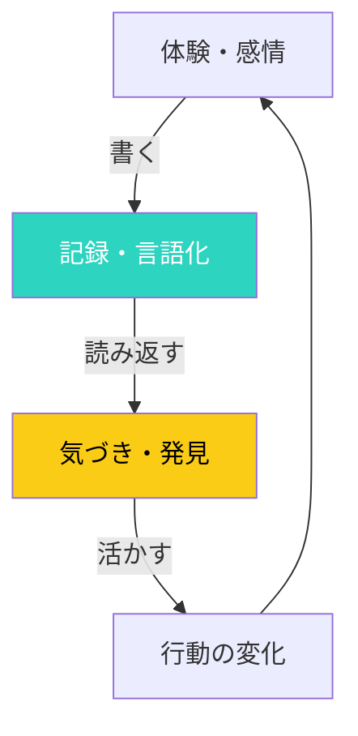

## はじめに

「日記を書こうと思っても、3日でやめてしまう」「書いても振り返らないから意味がわからない」—こんな悩み、ありませんか？

ジャーナリングは「書くだけ」ではありません。目的に応じた「書き方」を知ることで、単なる記録を超えた、自己理解と成長のツールに変わります。この記事では、5つの実証済みジャーナリング手法を紹介します。

## 概念図解

### ジャーナリングのフィードバックループ



## 5つのジャーナリング手法

### 1. モーニングページ - 脳のデトックス

**発案者：**
ジュリア・キャメロン著『アーティスト・ウェイ』で提唱された手法です。

**やり方：**
朝起きてすぐ（布団から出る前が理想）、手書きで3ページを書きます。内容は何でもOK。不平不満でも、 TODOリストでも、夢の話でも。

**効果：**
- 脳内の「ノイズ」を書き出し、スッキリする
- 無意識の悩みや願望が浮き彫りになる
- 創造性が解放される

**実践者の声：**
「最初は『何を書いているのかわからない』と感じましたが、2週間続けたら、朝のモヤモヤがなくなり、1日のスタートが軽くなりました」（32歳、デザイナー）

**コツ：**
- 書き直さない（誤字脱字OK）
- 人に見せない（心の壁を取り払う）
- 8週間は毎日続ける（効果が出るまでの期間）

### 2. 感謝ジャーナル - 幸福感を高める

**科学的根拠：**
ポジティブ心理学の創始者マーチン・セリグマンの研究により、「感謝を書く」ことで主観的幸福感が向上することが実証されています。

**やり方：**
毎晩、紙またはアプリに「今日感謝したいこと」を3つ書きます。「なぜそれに感謝しているか」まで書くと効果的です。

**例：**
```
1. 朝ごはんに妻が作ってくれた味噌汁
   → 忙しいのに気遣ってくれて、愛を感じた

2. 電車で座れたこと
   → 疲れていたから、本が読めてラッキーだった

3. 上司が提案を褒ってくれたこと
   → 認められている実感が湧いた
```

**効果が出るタイミング：**
1週間で気分の変化を感じ、3週間で習慣化され、3ヶ月で楽観的な思考パターンが身につきます。

### 3. バレットジャーナル - タスクと人生の統合

**発案者：**
ライダー・キャロルが考案。手帳術として世界的に流行しています。

**やり方：**
点（bullet）を使って、タスク・イベント・メモを簡潔に記録します。

```
• タスク
○ イベント（予定）
- メモ（情報）
× 完了したタスク
> 翌日に延期
< 別月に延期
```

**特徴：**
- 月間・週間・日間のログを連続させる
- 「マイグレーション」で未完了タスクを振り返る
- 「コレクション」で特定テーマをまとめる

**向いている人：**
- デジタルよりアナログが好き
- 柔軟なシステムが欲しい
- タスク管理と日記を一元化したい

### 4. 5分間日記 - 忙しい人のための習慣

**コンセプト：**
朝と夜、それぞれ5分だけ書く。高い継続率を誇るシンプルなフォーマットです。

**朝（3問）：**
1. 今日感謝していること3つは？
2. 今日を最高の日にするためにできることは？
3. 今日の自分への宣言は？

**夜（2問）：**
1. 今日起こった素晴らしいこと3つは？
2. 今日改善できることは？

**実例：**
IT企業に勤める田中さん（仮名）は、深夜残業が多く日記を書く時間がないと悩んでいました。「5分間日記」に切り替えたところ、継続率が飛躍的に向上し、半年後には「毎日の小さな達成感」が自信に繋がったと語ります。

### 5. フィードバックジャーナル - 成長を加速させる

**目的：**
自分の行動と結果を客観的に振り返り、学びを定着させる。

**週次フォーマット：**
```
【今週の振り返り】

□ 週の目標は達成できたか？
→ 

□ 最も上手くいったことは？
→ 

□ 最も上手くいかなかったことは？
→ 

□ その原因は？
→ 

□ 来週どう活かすか？
→ 

□ 来週の1つの焦点は？
→ 
```

**実践のポイント：**
- 感情的になりすぎない（「ダメだった」→「どう改善するか」）
- パターンを探す（毎週同じ失敗をしていないか）
- 小さな成功も記録する

## ジャーナリングを習慣化する7つのコツ

### 1. 時間を固定する
同じ時間に書くことで、習慣化しやすくなります。朝なら朝、夜なら夜。

### 2. 場所を固定する
同じ場所で書くことで、書くモードに入りやすくなります。

### 3. 敷居を下げる
「1行でもいい」という気持ちで始める。完璧を求めない。

### 4. ツールをこだわらない
高級なノートでなくても、スマホのメモアプリでもOK。

### 5. 人に宣言する
家族や友達に「日記を書いている」と伝えると、続けやすくなります。

### 6. 30日チャレンジをする
最初の30日間は「実験期間」として、縛りを設ける。

### 7. 振り返ることを楽しむ
1ヶ月に1回、過去の日記を読み返す時間を設ける。

## まとめ

ジャーナリングは、自己理解を深め、ストレスを軽減し、目標達成を支援する強力なツールです。5つの手法の中から、自分に合ったものを選び、まずは30日間続けてみましょう。

**今日から始めるステップ：**
1. 今：5つの手法から1つ選ぶ
2. 今日：明日からの朝か夜の時間を確保
3. 明日：最初の1ページを書く
4. 30日後：振り返って効果を確認

「書く」ことで、自分の内側が見えてきます。ジャーナリングを始めて、より豊かな自己対話を楽しみましょう。
