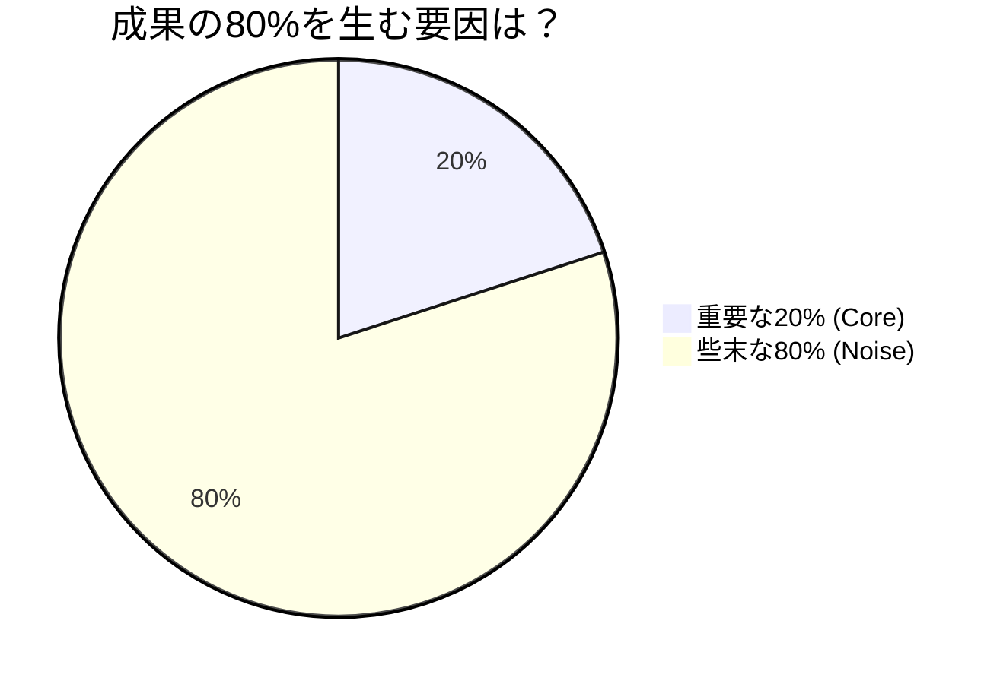
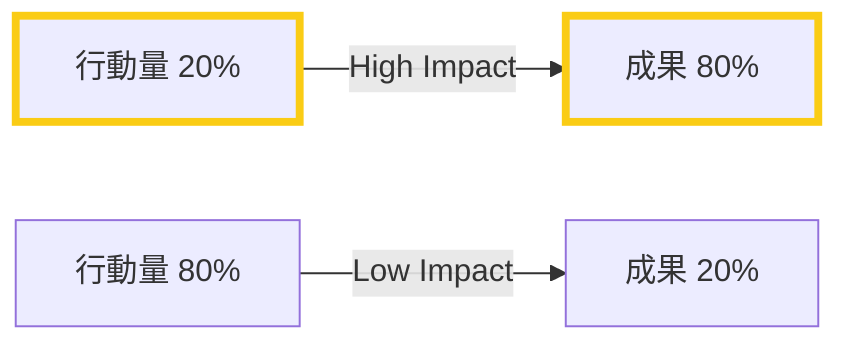

## はじめに

「一生懸命働いているのに、成果が出ない」「忙しいのに、重要なことに手が回らない」—そんな悩みを抱える人は、80/20の法則（パレートの法則）を知るべきです。

19世紀の経済学者ヴィルフレド・パレートが発見したこの法則は、「成果の80%は、原因の20%から生まれる」というものです。仕事に応用すれば、圧倒的な生産性向上が期待できます。

## 概念図解

### 80:20の真実





## 80/20の法則が当てはまる場面

### ビジネスでの例

**売上：**
- 顧客の20%が、売上の80%を生む
- 商品の20%が、利益の80%を生む

**仕事：**
- タスクの20%が、成果の80%を生む
- 会議の20%が、決定事項の80%を占める

**人間関係：**
- 友人の20%が、幸福感の80%を生む
- 読書の20%が、知識の80%を生む

### 具体的な事例

**ケース1：営業マンAさん**
20社の顧客を担当していましたが、売上の80%は上位4社（20%）から。残りの16社に時間を使いすぎていたことに気づき、上位4社との関係強化に注力。結果、売上が150%に。

**ケース2：エンジニアBさん**
毎日30個のタスクをこなしていましたが、分析してみると重要なのは6個（20%）だけ。残りは「緊急だが重要でない」ものでした。6個に集中するようになり、プロジェクトの早期完了を実現。

## 重要な20%を見極める3ステップ

### Step 1：現状の分析

**タスク分析シート：**
```
| タスク | 所要時間 | 成果への影響(1-10) | 重要度 |
|--------|----------|-------------------|--------|
| A | 2h | 9 | ◎ |
| B | 3h | 3 | △ |
| C | 1h | 8 | ◎ |
| D | 4h | 2 | ✕ |
```

**1週間の記録：**
1週間、全ての作業と時間を記録します。後から「どれが重要だったか」を振り返ります。

### Step 2：重要度のランキング

**重要度の判定基準：**
- 会社の目標にどれだけ貢献するか
- 自分の成長にどれだけ繋がるか
- やらなかった場合の影響の大きさ

**ABC分析：**
- **A（最重要）**：成果の80%を生む20%
- **B（重要）**：必要だが緊急でない
- **C（できるだけ減らす）**：些末な作業

### Step 3：時間配分の再設計

**理想の時間配分：**
```
□ Aタスク（最重要）：60%の時間
□ Bタスク（重要）：30%の時間
□ Cタスク（些末）：10%以下
```

**実際の時間配分（多くの人）：**
```
□ Aタスク：20%
□ Bタスク：30%
□ Cタスク：50% ← 問題！
```

## 80/20を実践する3つの方法

### 1. 「しないことリスト」を作る

**考え方：**
「何をするか」より「何をしないか」を決める方が重要です。

**例：**
```
【今月やらないこと】
□ 緊急でないメールの即座の返信
□ 全員参加の会議への出席
□ 完璧を求めすぎた資料作り
□ SNSの業務中のチェック
```

### 2. 「最高の20%」に投資する

**時間投資：**
最重要タスクには、最高の時間帯（朝の2時間など）を割り当てます。

**金銭投資：**
生産性向上に必要なツールや教育には、躊躇なく投資します。

**人間関係投資：**
最も重要な人（上司、キーマン顧客、パートナー）との関係に時間を使います。

### 3. 「些末な80%」を自動化・委譲する

**自動化：**
- メールのテンプレート化
- 定型作業のマクロ化
- リマインダーの自動設定

**委譲：**
- 部下や同僚に依頼できるものは依頼
- 外部サービスの活用
- 「やらなくてもいいこと」の削除

## 注意点と落とし穴

### 完璧な20%を求めすぎない

80/20の法則は「大まかな指針」であり、厳密な数式ではありません。「およそ重要な少数に集中しよう」という意味で捉えましょう。

### 「残りの80%」を完全に無視しない

全てを20%に絞ると、長期的に問題が生じます。残りの80%も「適切に」こなす必要があります。

### 定期的な見直しが必要

「重要な20%」は変わります。四半期ごとに見直し、常に最適なタスクに集中しましょう。

## まとめ

80/20の法則は「もっと働け」ではなく「もっと賢く働け」というメッセージです。重要な少数に集中し、些末な多数を削減することで、圧倒的な成果を生み出せます。

**今週から始めるステップ：**
1. 今：先週の作業を振り返り、重要だった20%を特定
2. 今週：その20%に60%の時間を割く実験
3. 来週：結果を測定し、改善
4. 来月：チームに展開

「忙しさ」から「生産性」へ。80/20の法則を味方に、スマートな働き方を手に入れましょう。
