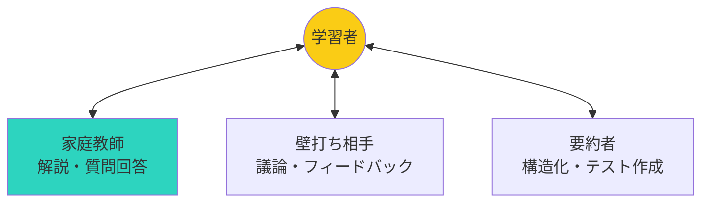

## はじめに

「新しいスキルを学びたいけど、時間がない」「分からないことを人に聞くのが気まずい」「教材を読んでも、自分に合っているかわからない」—こんな悩み、AIが解決します。

ChatGPTやClaudeなどのAIは、24時間365日対応の「パーソナル家庭教師」として機能します。この記事では、AIを学習パートナーとして活用する具体的な方法を5つのシーンで解説します。

## 概念図解

### AIパートナーの3つの役割



## 5つの学習シーンでのAI活用

### 1. 初心者の「入門ガイド」として

**シーン：**
全く新しい分野（プログラミング、投資、デザインなど）を学び始める時。

**従来の方法：**
厚い入門書を買って、1章から順番に読む。分からない用語が出てきて挫折。

**AI活用：**
```
プロンプト例：
「Pythonプログラミングをゼロから学びたいです。
プログラミング経験はありません。
3ヶ月で実用的なスキルを身につけるための
ステップバイステップの学習ロードマップを作成してください。
各ステップで学ぶべき項目と、確認テストを含めてください。」
```

**メリット：**
- 自分のレベルに合わせたカリキュラム
- 分からない用語は即座に質問可能
- 教科書の「順序」に縛られない

**実例：**
営業職の佐藤さん（仮名）は、AIに「営業職からプログラマー転職のための学習計画」を立ててもらい、6ヶ月の独学後、無事に転職を実現しました。

### 2. 「分からない」を「分かる」に変換する解説者

**シーン：**
難しい概念（経済学の理論、科学の法則、ビジネス用語など）を理解したい時。

**従来の方法：**
Google検索して、Wikipediaを読む。専門用語が多くて理解できない。

**AI活用：**
```
プロンプト例：
「『機会費用』という経済学の概念を、
高校生にも分かるように説明してください。
日常生活の具体例を3つ含め、
なぜこの概念が重要かも教えてください。」
```

**テクニック：「〇〇のように説明して」**
```
「量子力学を、『レストランの待ち行列』の例えで説明してください」
「株価の動きを、『サーフィンの波』のように説明してください」
```

**実例：**
大学生の田中さんは、AIに「微積分を料理のレシピのように説明してもらい」、数学が苦手な自分でも概念をつかむことができました。

### 3. 「壁打ち相手」としての議論パートナー

**シーン：**
学んだ内容を整理し、自分の言葉で説明できるか確認したい時。

**従来の方法：**
一人で勉強していて、理解できているか自信がない。

**AI活用：**
```
プロンプト例：
「私は今、『マーケティングの4P』について学びました。
以下の内容で理解度をテストしてください。
間違っている点や、不足している点を指摘してください。

[自分で書いた説明を貼り付ける]
```

**「教えてもらう」から「教える」へ：**
```
プロンプト例：
「私が今から『ボトムアップ思考』について説明します。
5歳の子供にも分かるように説明しているか、
フィードバックしてください。」
```

**メリット：**
- 人前で間違えることのない安全な環境
- 客観的なフィードバック
- 説明力の向上

### 4. 「個別テスト」作成の出題者

**シーン：**
学習内容を定着させたい、試験前の確認が必要な時。

**従来の方法：**
市販の問題集を買う。自分の弱点に合っていない。

**AI活用：**
```
プロンプト例：
「以下の学習内容に基づいて、理解度確認テストを10問作成してください。
難易度は初級3問、中級4問、上級3問でお願いします。
答えは最後にまとめて表示してください。

[学習した内容を貼り付ける]
```

**応用：間違えた問題の再テスト**
```
「先ほどのテストで間違えた問題と同じ知識を問う、
別の問題を3問作成してください。」
```

**実例：**
資格試験勉強中の山田さんは、AIに「毎日10問の模擬テスト」を作成してもらい、合格までの3ヶ月間、毎日の学習を継続できました。

### 5. 「多言語の対話パートナー」として

**シーン：**
語学学習で、実際に話す練習が必要な時。

**従来の方法：**
会話教室に通う（時間的・金銭的コストが高い）。

**AI活用：**
```
プロンプト例：
「英語学習のパートナーとして、カフェでの会話をシミュレートしてください。
私の英語のレベルは中級で、文法や単語の間違いがあれば、
優しく訂正してください。では始めましょう。」
```

**ロールプレイの例：**
```
「日本語教師として、初級レベルの生徒と練習してください。
場面は『レストランで注文する』です。」

「ビジネス英語の練習パートナーとして、
会議で意見を述べる場面をロールプレイしてください。」
```

**メリット：**
- 24時間いつでも練習可能
- 間違えても恥ずかしくない
- 自分のレベルに合わせた対話

## 効果的なAI活用の5つのコツ

### 1. 具体性を高める
❌ 「教えて」
⭕ 「Pythonのfor文を、リスト処理の例で説明してください」

### 2. 文脈を提供する
❌ 「これを解説して」
⭕ 「私はプログラミング初心者で、Pythonを3日目で学んでいます。リストについて教えてください」

### 3. 形式を指定する
❌ 「まとめて」
⭕ 「3つのポイントにまとめ、それぞれに具体例をつけてください」

### 4. 対話を続ける
1回の回答で終わらず、「もっと詳しく」「別の例を」「簡潔に」など、継続して問いかける。

### 5. 批判的に受け止める
AIの回答は必ずしも正確ではありません。重要な情報は他のソースでも確認しましょう。

## まとめ

AIは「教える側」から「学びを支援する側」へと、教育のパラダイムを変えつつあります。24時間対応のパーソナルチューターとして、自分のペースで学びを深めていきましょう。

**今日から始めるステップ：**
1. 今：学びたいテーマを1つ決める
2. 今日：上記の5つのシーンから1つ選び、AIに問いかけてみる
3. 今週：毎日30分、AIと対話しながら学習する
4. 来月：学習成果を人に説明してみる

AIは道具です。どう使うかはあなた次第。賢く活用して、学びの効率を最大化しましょう。
