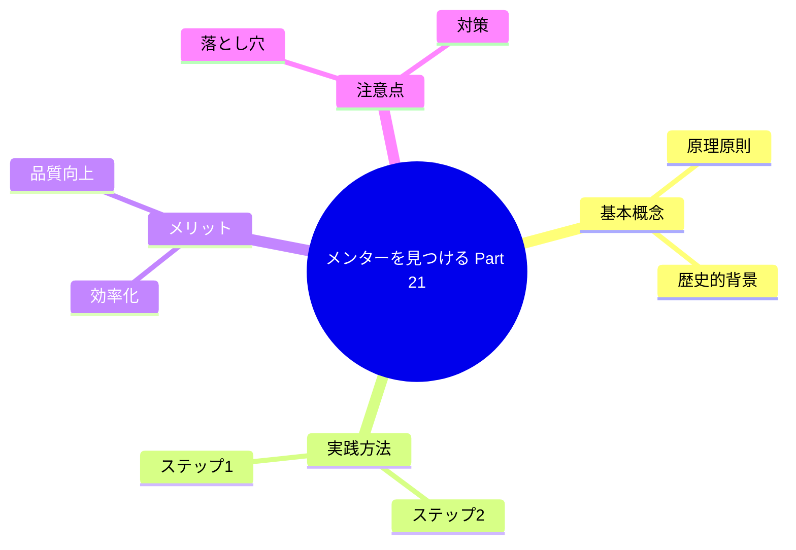

## はじめに

独学には限界がある。メンターから学ぶことで、成長が加速します。
本記事では、このテーマについて深く掘り下げ、実践的なアプローチを紹介します。

## 概念図解

## なぜこれが重要なのか

現代社会において、このテーマは多くの人が直面する課題です。
情報過多の時代だからこそ、本質を見極め、適切に行動することが求められています。

特に日本のビジネス環境では、効率性と創造性の両立が難しくなっています。
しかし、適切なフレームワークとマインドセットを持つことで、劇的な変化を起こすことが可能です。

> 「重要なのは、何をどれだけやったかではなく、どのようなインパクトを残したかである」

## 3つの重要なポイント

### 1. 根本的な原因を理解する

多くの人は、表面的な症状に対処しようとします。しかし、根本的な原因はより深い部分にあります。
例えば、時間が足りないと感じる場合、問題は「時間の量」ではなく「選択の質」にあることが多いのです。

### 2. 小さな実践から始める

知識を持っているだけでは意味がありません。
「知っている」と「できている」の間には大きな溝があります。
まずは今日からできる1分のアクションを見つけましょう。

### 3. 持続可能なシステムを作る

意志の力に頼ると、いつか挫折します。
自動的にうまくいくような「仕組み」や「環境」を整えることが、長期的な成功の鍵です。

## 具体的なアクションプラン

明日から実践できる具体的なステップは以下の通りです。

1. **現状の可視化**: まずは自分自身やチームの状況を客観的に記録する。
2. **ボトルネックの特定**: 進捗を阻害している最大の要因を見つける。
3. **実験と検証**: 新しい方法を試し、その結果を振り返る。
4. **フィードバックループ**: 周囲からのフィードバックを得て、改善を繰り返す。

## 実践のヒント

### 毎日続けるために

- 最初は5分から始める
- 完璧を求めない
- 記録をつける
- 仲間を見つける

### よくある失敗パターン

- 一度に多くを変えようとする
- 結果を急ぎすぎる
- 途中で投げ出す
- 自分を責める

## まとめ

メンターを見つける Part 21を理解し実践することで、あなたの仕事や生活はより豊かになります。
完璧を目指す必要はありません。まずは一つだけ試してみてください。

その小さな一歩が、やがて大きな変化につながります。

---

次のステップとして、関連する記事も読んでみてください。
一つの視点だけでなく、複数の視点を持つことで、より深い理解が得られます。
