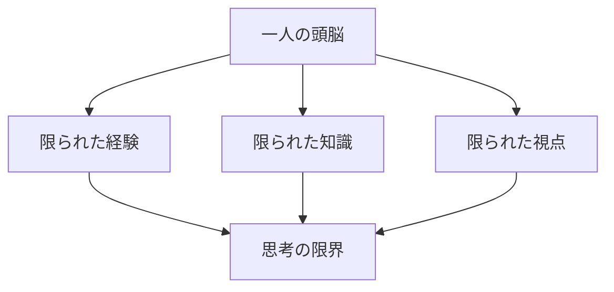
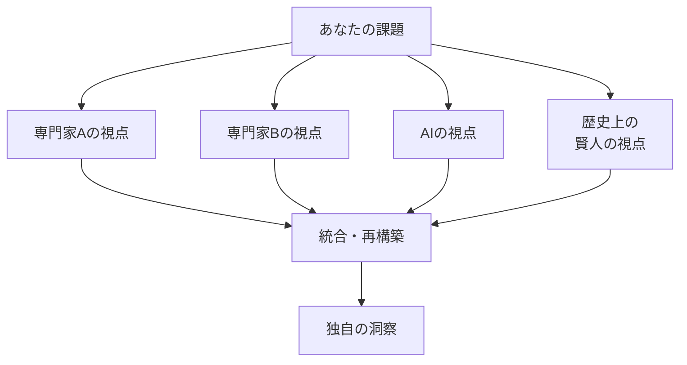
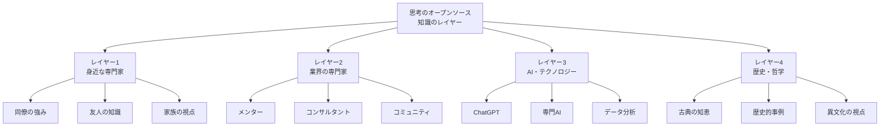
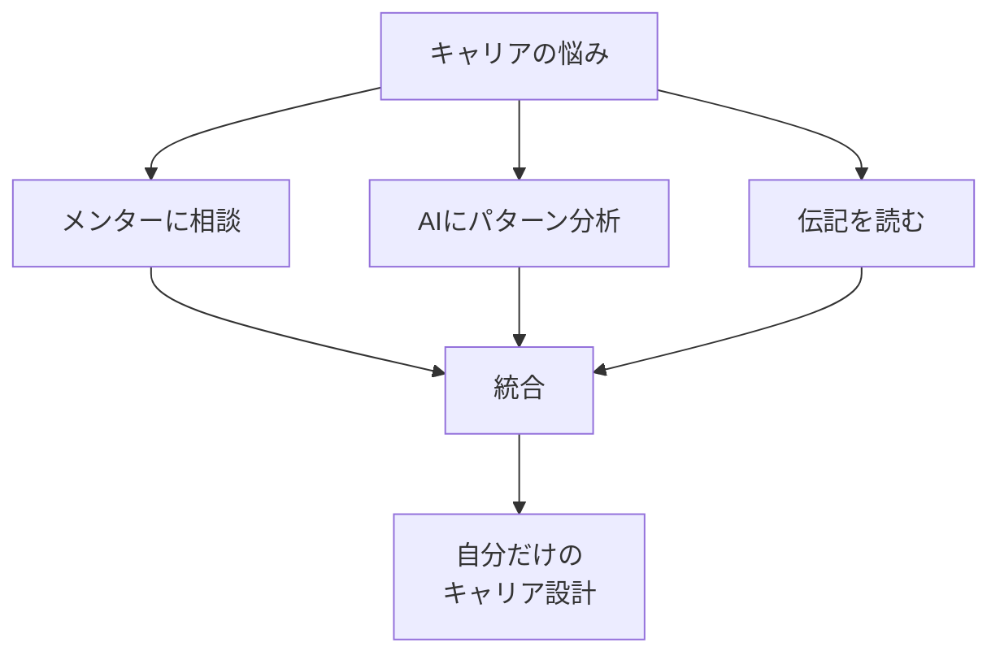
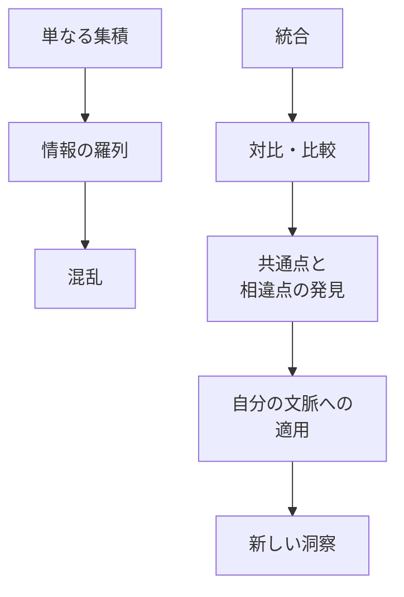
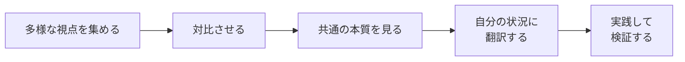
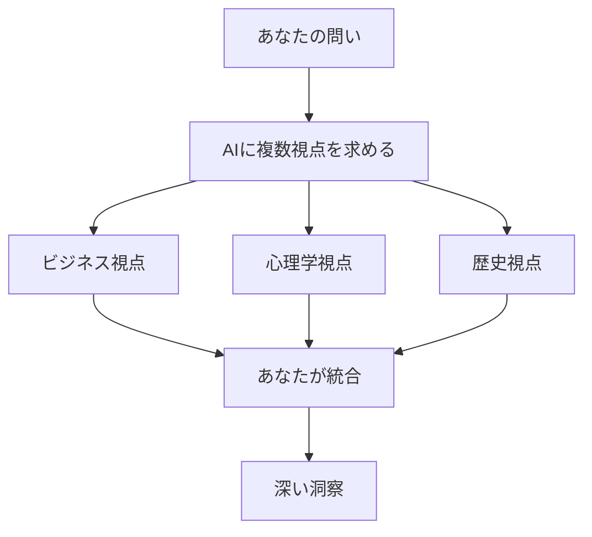

## はじめに

「自分で考えなければ...」

「人に頼るのは甘え...」

そう思い込んで、
一人で悩んでいませんか？

でも、本当に優れた思考は、
**一人の頭の中から生まれるのではありません**。

多様な視点を統合し、
自分の中で再構築することで、
**誰も到達できない深い洞察**が生まれます。

それが「思考のオープンソース化」です。

---

## オープンソース思考とは

### 従来の思考の限界



どんなに優秀な人でも、
**一人の視点には限界**があります。

### オープンソース化の構造



**多様な頭脳を「借りて」、
自分の中で再構築する**。

---

## 誰の頭脳を借りるか

### 外部知識のレイヤー



### 活用の例



---

## 統合の技術

### 単なる集積ではない



### 統合のプロセス



---

## AI時代のオープンソース思考

### AIとの協働



### 具体的なプロンプト例

```
「この課題について、
以下の3つの視点から分析してください：
1. ビジネス戦略の視点
2. 心理学の視点
3. 歴史的な類似事例の視点」
```

---

## 実践できること

**① 「誰に聞くか」リストを作る**

悩みごとの相談先を
3人ずつ決めておく。

**② AIを「壁打ち相手」に**

ChatGPTに
「この問題について、
　複数の専門家の視点で
　意見してください」と依頼。

**③ 「対比読書」をする**

同じテーマの本を
異なる立場の著者から
2冊同時に読む。

**④ 週に1回「外部脳会議」**

自分の課題を持ち寄り、
互いの視点を共有する
小さな会を開く。

---

## まとめ

思考のオープンソース化は、
**「自分で考えない」ことではありません**。

むしろ、
**「もっと深く考える」ための、
知恵の借り方**です。

一人の限界を認め、
多様な頭脳を統合し、
自分だけの洞察を生み出す。

それが、
複雑な時代を生き抜く
**知的謙虚さと創造性**です。

---

## セッションでできること

コーチングセッションは、
**あなたの「外部脳」**の一つです。

- あなたの課題への多角的な視点提供
- 多様なフレームワークの適用
- あなたの洞察の統合支援

**一人で抱え込まず、
知恵を借りることは、
賢さの表れです。**


[→ 体験セッションの詳細を見る](/sessions)
一緒に、
より深い思考を
作り上げていきましょう。
