## はじめに

「今日やることリストは作ったのに、終わらなかった」「予定が詰まっているのに、肝心なことが進まない」—ToDoリストだけでは、時間管理は不十分です。

タイムブロッキングは、タスクではなく「時間」に予定を入れる手法です。エロン・マスク、ビル・ゲイツ、カル・ニューポートなど、多くの生産性の高い人が実践しています。この記事では、タイムブロッキングの具体的な方法を解説します。

## 概念図解

### タイムブロッキングのイメージ

```mermaid
gantt
    title 理想の1日
    dateFormat HH:mm
    axisFormat %H:%mm
    
    section AM
    Deep Work (重要) :active, 09:00, 2h
    Buffer (予備)    : 11:00, 30m
    Email/Chat       : 11:30, 30m
    
    section PM
    Meeting (協働)   : 13:00, 2h
    Tasks (雑務)     : 15:00, 1h
    Review (明日の計画) : 16:30, 30m
```



## ToDoリストの限界

### なぜToDoリストだけではダメなのか

**問題1：優先順位が不明確**
リストに10個のタスクがあっても、どれから始めるべきかわからない。

**問題2：時間の見積もりが曖昧**
「今日やる」と思っていても、実際には時間が足りない。

**問題3：緊急に流される**
メールや会議に時間を取られ、重要な作業が後回しになる。

**問題4：完了の定義がない**
いつまでにやるか決まっていないので、先延ばしになりやすい。

### タイムブロッキングの解決策

**「何をやるか」→「いつ、何をやるか」**
時間をあらかじめブロックすることで、タスクに「時間の枠」が与えられます。

## タイムブロッキングの基本

### Step 1：ブロックの種類を決める

**主要なブロック：**
```
□ ディープワーク（深い作業）
  → 集中が必要な重要タスク
  → 朝の2-3時間が理想

□ シャローワーク（浅い作業）
  → メール、承認、電話対応
  → 午後にまとめて処理

□ ミーティング
  → 会議、打ち合わせ
  → 特定の日や時間帯に集中

□ バッファー（予備時間）
  → 予定のオーバー対応
  → 急なタスク対応

□ リカバリー（回復時間）
  → 休憩、食事、移動
  → 過労防止のため必須
```

### Step 2：1日のスケジュールを設計

**理想的な1日の例：**
```
07:00-08:00  朝のルーティン（運動、朝食）
08:00-09:00  メール・連絡事項の確認
09:00-11:00  【ディープワーク】最重要タスク
11:00-11:30  バッファー・小休憩
11:30-12:30  シャローワーク（雑務処理）
12:30-13:30  昼食・休息
13:30-15:30  会議・打ち合わせ
15:30-16:00  バッファー
16:00-17:00  【ディープワーク】次要タスク
17:00-17:30  明日の計画・振り返り
```

### Step 3：カレンダーに落とし込む

**デジタルツール：**
- Google Calendar
- Outlook Calendar
- Notion
- Sunsama

**アナログツール：**
- 手帳に時間枠を書き込む
- タイムスケジュールシート

**重要：**
カレンダーに「予定として」入れること。これが予定外の割り込みを防ぎます。

## 実践テクニック

### テクニック1：「パーソナルタイム」を確保

自分の時間を守るため、カレンダーに「ブロック」を入れておきます。

```
「集中作業中 - 14:00まで割り込みNG」
「個人の時間 - 予定を入れない」
```

**効果：**
他人からの会議招待を防ぎ、自分の時間を守ります。

### テクニック2：オーバーブッキングを避ける

**問題：**
1つのタスクに1時間と見積もっても、実際には1.5時間かかる。

**対策：**
- 見積もりの1.5倍の時間を確保
- タスク間に15-30分のバッファーを入れる
- 「予定の見積もり」の見積もりも入れる

### テクニック3：週次レビュー

毎週末（金曜夕方など）に、来週のタイムブロックを設計します。

**レビュー項目：**
```
□ 先週のブロックは機能したか？
□ どのブロックがオーバーしたか？
□ 来週の最重要タスクは何か？
□ 来週の会議は必要か？
□ ディープワーク用の時間は確保できているか？
```

## よくある問題と解決策

### 問題1：予定が狂う

**解決策：**
- バッファー時間を増やす
- 「予定外」ブロックを作る
- 柔軟に再スケジュール

### 問題2：集中できない

**解決策：**
- ディープワークブロック中は通知オフ
- ポモドーロテクニックとの併用
- 環境を整える（カフェ、別室など）

### 問題3：チームとの調整が難しい

**解決策：**
- 共有カレンダーに「集中時間」を表示
- 会議は特定の日に集中
- 「オープンアワー」を設定

## 実例：エロン・マスクのタイムブロッキング

**5分単位の管理：**
エロン・マスクは、1日を5分単位で管理しています。極端な例ですが、「細かく計画する」ことの重要性を示しています。

**実践可能な応用：**
- 30分単位のブロック（一般の人向け）
- 1時間単位のブロック（初心者向け）

## まとめ

タイムブロッキングは、ToDoリストの「いつやるか」を明確にすることで、実際の行動につなげる強力な手法です。カレンダーを「予定の記録」から「行動の設計図」として使いましょう。

**明日から始めるステップ：**
1. 今：明日の「最重要タスク」を1つ決める
2. 今日：カレンダーに明日の9:00-11:00を「集中作業時間」としてブロック
3. 明日：ブロックを守って作業する
4. 今週：1週間分のタイムブロックを設計する

「時間を管理する」のではなく、「時間を設計する」。その意識転換が、生産性向上の鍵です。
