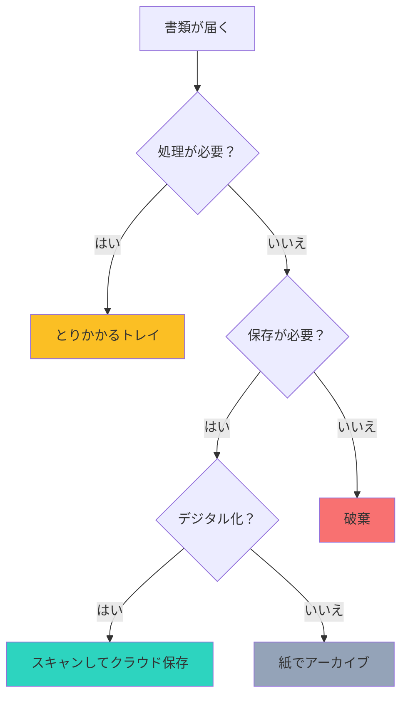

## はじめに

「書類がどこにあるかわからない」「必要な書類を探すのに10分もかかる」「机の上が紙で山積みになっている」—こんな悩み、ありませんか？

デジタル化が進む現代でも、紙の書類は依然として私たちの仕事に深く根付いています。領収書、契約書、資料、メモ…紙とデジタルが混在する中で、効率的な整理術を身につけることが、生産性向上の鍵となります。

この記事では、紙とデジタルの最適な使い分けと、書類ストレスから解放される具体的な整理術を紹介します。

## 概念図解

### 書類の分類フロー



## 紙とデジタルの使い分け基準

### 紙にすべきもの

**創造性が求められる作業：**
- アイデア出しや企画の初期段階
- マインドマップや発散的思考
- デザインのラフスケッチ

**深い集中が必要な読み物：**
- 長文のレポートや論文
- 重要な契約書の精読
- 編集作業が必要な原稿

**法的・正式的な書類：**
- 捺印が必要な契約書
- 原本が求められる証明書
- 重要な収入印紙付き書類

### デジタルにすべきもの

**検索が必要な情報：**
- 領収書や領収証
- 過去のメールや資料
- 検索可能にしたい記録

**共有・協働が必要なもの：**
- チームで編集するドキュメント
- 複数人が参照するマニュアル
- フィードバックが必要な原稿

**量が多く保存場所を圧迫するもの：**
- 雑誌の切り抜き
- 過去の請求書
- 参考資料のコピー

## 紙の整理システム：「とりかかる・保留・アーカイブ」の3トレイ

### トレイ1：とりかかる（In Progress）

**用途：**
今週中に処理すべき書類を入れます。

**ルール：**
- 週明けに中身を必ずゼロにする
- 1週間以上滞在している書類がないか確認
- ビジュアル化することで「見える化」を実現

**実践例：**
田中さんは、月曜朝にこのトレイを確認し、週の計画を立てています。「とりかかり」の書類が多すぎる場合は、優先順位を見直すきっかけにしています。

### トレイ2：保留（Pending）

**用途：**
他人の返答待ちや、特定の日まで動けない書類を入れます。

**ルール：**
- 書類に「次のアクション日」を付箋で貼る
- 毎日1回は確認し、動けるものがないかチェック
- 長期保留は別フォルダへ移動

**実践例：**
山田部長は、保留トレイの書類に「3/15確認」と書いた付箋を貼り、その日にカレンダーでリマインダーを設定しています。

### トレイ3：アーカイブ（Reference）

**用途：**
保存が必要だが、すぐには使わない書類を入れます。

**ルール：**
- 月1回程度の頻度で整理
- 年度やプロジェクトごとに分類
- デジタル化を検討する候補

## デジタル整理術：ファイル命名規則とフォルダ構造

### 命名規則：「日付_プロジェクト名_内容_版数」

**良い例：**
```
2026-03-15_新商品企画_提案書_v2.pdf
2026-03-10_山田商事_見積書_最終版.xlsx
2026-03-01_月次報告_営業部_確定版.pptx
```

**メリット：**
- 日付で時系列ソート可能
- 検索しやすい
- 版数管理が明確
- どのファイルが最新か一目瞭然

### フォルダ構造のベストプラクティス

```
📁 書類
├── 📁 01_とりかかり中
│   └── （週次で空にする）
├── 📁 02_プロジェクト別
│   ├── 📁 2026-03_新商品企画
│   ├── 📁 2026-03_システム刷新
│   └── 📁 2026-02_（完了したプロジェクト）
├── 📁 03_定期業務
│   ├── 📁 月次報告
│   ├── 📁 経費精算
│   └── 📁 会議資料
├── 📁 04_アーカイブ
│   ├── 📁 2025年
│   └── 📁 2024年
└── 📁 99_参考資料
    └── （雑誌切り抜きなど）
```

## 紙からデジタルへ：スキャン術のコツ

### スキャンで困る3つの問題と解決策

**問題1：どれをスキャンすべきか迷う**

解決策：
- 「この書類、また探すかも？」と思ったらスキャン
- 「紙のままの方が便利？」と思ったら保管
- 迷ったらとりあえずスキャン（データは消せる）

**問題2：スキャンしたデータが整理されていない**

解決策：
- スキャンと同時にファイル名を変更
- 「スキャン」フォルダは一時置き場にして、週1回整理
- OCR対応のスキャナーで検索可能に

**問題3：スキャンが面倒**

解決策：
- スマホスキャンアプリ（Adobe Scan, CamScanner等）を活用
- 定型的な書類は自動分類機能を利用
- 毎日決まった時間にバッチ処理

### おすすめスキャンワークフロー

```
Step 1: 書類を「スキャン待ち」ボックスに入れる
Step 2: 毎週金曜夕方にスキャン（バッチ処理）
Step 3: 即座にファイル名を変更
Step 4: 適切なフォルダに移動
Step 5: 不要な紙は破棄、必要ならアーカイブ
```

## 実例：完璧すぎない整理術

### ケース1：サラリーマンAさんの場合

**状況：**
毎日大量の書類が届くが、整理の時間がない。

**解決策：**
- デジタル化は「重要なもののみ」に絞る
- 紙は「とりかかり」「完了」「アーカイブ」の3分類のみ
- 1ヶ月以上見ていないアーカイブは箱に入れて押入れへ
- 必要になったら検索（意外と出てこない）

**結果：**
「完璧を諦めたら、逆に整理が続くようになった」とのこと。

### ケース2：フリーランスBさんの場合

**状況：**
領収書の管理が大変。確定申告の時期が地獄。

**解決策：**
- スマホで領収書は即スキャン（専用アプリ使用）
- 紙は月1回のバッチでシュレッダー
- クラウド上で「年_月」フォルダに自動分類

**結果：**
確定申告の準備時間が3日から3時間に短縮。

## 維持するための習慣

### 毎日の習慣（5分）
- とりかかりトレイを確認
- 終業時に机の上を片付ける

### 毎週の習慣（15分）
- とりかかりトレイを空にする
- スキャン待ちボックスを処理
- ファイル名を整理

### 毎月の習慣（1時間）
- アーカイブフォルダを見直し
- 不要なデジタルファイルを削除
- 紙のアーカイブを箱詰め

## まとめ

書類整理の本質は「完璧さ」ではなく「使いやすさ」です。紙とデジタルを使い分け、自分に合ったシステムを構築することが重要です。

**今日から始めるステップ：**
1. 今：机の上の書類を「処理必要」「保留」「アーカイブ」に分ける
2. 今日：3トレイシステムを導入する
3. 今週：ファイル命名規則を決め、過去ファイルの一部を改名する
4. 来月：スキャン習慣を確立する

「整理しなきゃ」と思いつつ後回しにしていませんか？完璧を目指さず、まずは「分類すること」から始めてみましょう。小さな一歩が、書類ストレスからの解放につながります。
