## はじめに

「メールの確認、1時間に1回やってる」「細かい仕事が多くて、大きな作業が進まない」「1日の終わりに気づくと、何をやったか覚えていない」—こんな状態、ありませんか？

これは「コンテキストスイッチ」という脳の切り替えコストが原因です。タスクを頻繁に切り替えることで、実際の作業時間よりも切り替え時間の方が長くなってしまうのです。

バッチ処理は、同じ種類のタスクをまとめて処理することで、この切り替えコストを最小化する手法です。この記事では、バッチ処理の効果と具体的な実践方法を紹介します。

## 概念図解

### バッチ処理 vs 細切れ処理

```mermaid
gantt
    title 細切れ処理 vs バッチ処理
    dateFormat HH:mm
    axisFormat %H:%mm
    
    section 細切れ処理
    メール確認    :a1, 09:00, 10m
    切替コスト    :crit, after a1, 5m
    レポート作業  :a2, after a1, 15m
    切替コスト    :crit, after a2, 5m
    メール確認    :a3, after a2, 10m
    切替コスト    :crit, after a3, 5m
    打ち合わせ    :a4, after a3, 15m
    
    section バッチ処理
    レポート作業  :b1, 09:00, 45m
    打ち合わせ    :b2, after b1, 30m
    メールバッチ  :b3, after b2, 30m
```



## なぜバッチ処理が効率的なのか

### コンテキストスイッチのコスト

**脳科学的研究によると：**
- タスク切り替えにかかる時間：平均5〜15分
- 1日に10回切り替えると：50〜150分のロス
- 深い集中状態に入るまで：15〜20分かかる

**具体例：**
メールを1時間に1回確認する人と、1日3回決まった時間に確認する人を比較すると、後者の方が実質的な作業時間が2時間以上多くなります。

### フロー状態の維持

**フロー状態とは：**
完全に集中し、作業に没入している状態。生産性が最高に達する状態です。

**バッチ処理の効果：**
- フロー状態を長く維持できる
- 作業の質が向上する
- 達成感が高まる

## バッチ処理できるタスクの種類

### メール・メッセージ対応

**細切れ処理（非効率）：**
通知が来るたびに即座に確認・返信
→ 1日20回以上のコンテキストスイッチ

**バッチ処理（効率的）：**
- 午前中1回（11:00〜11:30）
- 午後1回（15:00〜15:30）
- 終業前1回（17:00〜17:30）

**ポイント：**
緊急の連絡手段は別途確保（電話、チャットの緊急通知など）。メールは基本的に非同期コミュニケーション。

### 打ち合わせ・会議

**バッチ化の方法：**
- 会議は特定の曜日に集中（例：火・木のみ）
- 打ち合わせは1日の前半にまとめる
- 短い打ち合わせは「オープンアワー」に限定

**実例：**
あるマネージャーは、火曜と木曜を「会議デー」とし、他の曜日は会議を入れないルールを作りました。結果、月・水・金は集中して深い作業ができるようになりました。

### 経費精算・事務作業

**バッチ化の方法：**
- 領収書の整理：毎週金曜夕方
- 経費申請：月2回（15日・末日）
- 書類整理：週1回

**メリット：**
事務作業にかかる時間が「毎日少しずつ」から「まとめて一気に」になることで、切り替えコストが大幅に削減されます。

### クリエイティブ作業

**バッチ化の方法：**
- アイデア出し：週1回のブレインストーミングセッション
- 執筆：朝の2時間をブロック
- デザイン：午後のまとまった時間

**ポイント：**
創造的な作業は特に「深い集中」が必要なので、バッチ化の効果が大きいです。

## バッチ処理の実践ステップ

### Step 1：自分のタスクを分類する

**分類カテゴリ例：**
```
□ メール・連絡対応
□ 会議・打ち合わせ
□ 書類作成・資料作成
□ データ分析
□ 経費・事務処理
□ 学習・情報収集
□ 創造的作業（企画・執筆など）
```

**確認ポイント：**
- 1日に何回切り替えているかカウント
- どのタスクが一番集中を妨げているか特定

### Step 2：バッチの単位を決める

**時間帯によるバッチ：**
```
09:00-11:00  深い作業ブロック
11:00-12:00  連絡・対応ブロック
13:00-15:00  会議・打ち合わせブロック
15:00-17:00  個人作業ブロック
```

**曜日によるバッチ：**
```
月：企画・戦略
火：会議・調整
水：深い作業
木：会議・調整
金：事務・振り返り
```

### Step 3：環境を整える

**通知の制御：**
- メール通知をオフにする
- Slack/Teamsは特定時間のみ確認
- スマートフォンは別室に置く

**周囲への共有：**
- 「集中時間中は連絡を控えてほしい」と伝える
- 共有カレンダーに「集中ブロック」を表示
- チームでバッチ処理の文化を作る

## 実例：バッチ処理で変わった3人の話

### ケース1：営業担当Aさん

**Before：**
- メールを常時確認（1日30回以上）
- 顧客対応が断続的に入る
- 企画書作成が進まない

**After：**
- メール確認を1日3回に制限
- 顧客対応は午前と午後に集中
- 14:00-16:00を「企画書作成時間」に確保

**結果：**
企画書の質が向上し、承認率が20%上昇。残業時間も週5時間減少。

### ケース2：エンジニアBさん

**Before：**
- Slackの通知で集中が途切れる
- コードレビューが随時入る
- 深い設計作業ができない

**After：**
- Slackは1時間に1回確認
- コードレビューは午前と午後の決まった時間
- 09:00-12:00を「コーディングブロック」に

**結果：**
バグ発生率が30%減少。設計の質が向上し、後からの手戻りが減った。

### ケース3：マネージャーCさん

**Before：**
- 会議が1日に散在している
- 自分の作業時間がない
- 常に疲弊している感じ

**After：**
- 火・木を「会議デー」に
- 月・水・金は会議を原則入れない
- 「オープンアワー」を設定し、それ以外は集中時間

**結果：**
チーム全体の生産性が向上。自分も深い作業ができ、戦略的な業務に時間を使えるようになった。

## よくある質問と回答

### Q：緊急の連絡が来たらどうする？

**A：**
緊急の基準を明確にしましょう。「今すぐ対応しないと業務が止まる」ものだけを緊急とし、それ以外はバッチ処理の時間まで待ちます。緊急連絡用の手段（電話など）を別途確保しておきましょう。

### Q：チームメンバーがすぐに返信を求めてくる？

**A：**
バッチ処理の方針を共有し、「緊急でない限り、2時間以内には返信します」と伝えましょう。実際に守ることで信頼が生まれます。また、Slackのステータスメッセージや、メールの署名で対応時間を明示するのも効果的です。

### Q：どのくらいの頻度でバッチ処理すべき？

**A：**
タスクによって異なります。メールは1日2〜3回、事務作業は週1〜2回、創造作業は半日以上のブロックが理想です。自分の業務内容と集中力の持続時間に合わせて調整してください。

## まとめ

バッチ処理は、単なる「まとめてやる」ではなく「脳の切り替えコストを最小化する」科学的な手法です。同じ作業時間でも、バッチ化することで生産性が数倍向上することがあります。

**今日から始めるステップ：**
1. 今：自分の1日のタスク切り替え回数をカウントする
2. 今日：メール確認を決まった時間（朝・昼・夕）に限定する
3. 今週：1つのタスクカテゴリをバッチ化して試す
4. 来月：週単位のバッチスケジュールを設計する

「忙しいからまとめられない」ではなく、「忙しいだからこそまとめる」ことを意識してみてください。バッチ処理は、忙しい現代人にこそ必要なスキルです。
