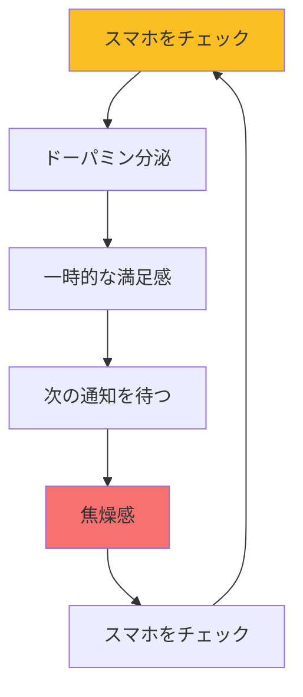

## はじめに

「スマホを見ると何時間も経っている」「通知が気になって集中できない」「寝る前にスマホを見て、気づいたら深夜」「休日も仕事のメールが気になる」—こんな状態、ありませんか？

私たちは「常にオンライン」が当たり前の時代に生きています。便利な一方で、情報過多とデジタル疲れは現代の新しいストレスです。

デジタルデトックスは、意図的にデジタル機器から離れることで、心と脳をリセットする実践です。この記事では、極端な「断ち切り」ではなく、現実的に続けられるデジタルデトックスの方法を紹介します。

## 概念図解

### デジタルストレスのサイクル

## デジタル過多の現状

### 衝撃の統計データ

**スマホ使用時間：**
- 日本人の平均スマホ使用時間：1日4〜5時間
- 1日にスマホを確認する回数：平均150回以上
- 20代以下では、1日6時間以上の人も多数

**仕事への影響：**
- 通知を受け取ると、集中の回復に平均23分かかる
- マルチタスクは生産性を40%低下させる
- メールを常時チェックする人は、ストレスレベルが高い

**健康への影響：**
- 寝る前のスマホ使用は睡眠の質を低下させる
- SNS使用時間とうつ症状に相関関係
- 「テックネック」などの身体的問題も増加

### なぜスマホから離れられないのか

**脳科学の観点から：**
- スマホの通知は「報酬系」を刺激し、ドーパミンを分泌
- 「もしかしたら何かあるかも」というFOMO（見逃し恐怖症）
- 無限スクロールは「ゼニアニ効果」を利用した設計

**社会的観点から：**
- 仕事上の「常時対応可能」という期待
- SNSでの承認欲求
- 情報を取り残される不安

## デジタルデトックスの3つのレベル

### レベル1：マイクロデトックス（初心者向け）

**内容：**
日常の中で、短時間デジタルから離れる。

**実践例：**
- 食事中はスマホを別の部屋に置く
- 通勤中は音楽だけで、SNSは見ない
- トイレ中はスマホを使わない
- 就寝1時間前はスマホを見ない

**効果：**
小さな習慣の積み重ねで、デジタルへの依存度が徐々に下がります。

### レベル2：デイリーデトックス（中級者向け）

**内容：**
毎日、決まった時間帯を「デジタルフリー」にする。

**実践例：**
- 午前中の2時間を「ディープワーク時間」に設定
- 21:00〜翌朝7:00を「デジタル断ち時間」に設定
- 日曜日の午前中を「アナログタイム」に設定

**ポイント：**
通知をオフにし、スマートフォンを物理的に遠ざけることが重要です。

### レベル3：ウィークリーデトックス（上級者向け）

**内容：**
週に1日、または月に1度、完全にデジタルから離れる日を作る。

**実践例：**
- 土曜日を「アナログデー」にする
- 長期休暇中に「デジタルフリーキャンプ」に行く
- スマホを持たずに1日を過ごす

**注意点：**
急に始めると不安になるので、レベル1・2で慣れてから挑戦しましょう。

## 実践的なデジタルデトックス術

### 1. 通知の断捨離

**手順：**
1. スマホのすべての通知を確認
2. 「絶対にすぐ見る必要がある」ものだけを残す（例：電話、緊急連絡）
3. それ以外はすべてオフにする

**結果：**
多くの人が、通知を減らしたことで、集中力が劇的に向上したと報告しています。

### 2. アプリの整理と制限

**手順：**
1. ホーム画面から「時間泥棒アプリ」を削除
2. スクリーンタイム制限を設定
3. グレースケールモードにする（彩度を下げると魅力的に見えなくなる）

**ポイント：**
「使わない」ではなく「見えにくくする」ことで、無意識の使用を減らせます。

### 3. デジタルフリーゾーンの設定

**場所の例：**
- 寝室（スマホは充電ステーションへ）
- ダイニングテーブル
- 浴室
- 車の運転中

**ルール：**
その場所では絶対にスマホを使わない、という決まりを作ります。

### 4. アナログ活動の復活

**おすすめの活動：**
- 紙の本を読む
- 手書きで日記を書く
- アナログのゲーム（カードゲーム、ボードゲーム）
- 自然の中を散歩する
- 絵を描く、楽器を演奏する

**効果：**
スマホに依存していた時間が解放され、創造性や対人関係が向上します。

## 実例：デジタルデトックスで変わった人たち

### ケース1：営業職・30代男性

**Before：**
- スマホを1日100回以上確認
- 寝る前に2時間以上SNSを見ていた
- 寝不足で昼間も集中できない

**実践：**
- 就寝1時間前からスマホを寝室に持ち込まない
- 通知を電話のみに制限
- 朝の1時間を「アナログ読書時間」に

**After：**
- 睡眠の質が向上し、朝スッキリ起きられるようになった
- 1日の集中時間が2時間増加
- 部下との対話が深くなり、チームの雰囲気が改善

### ケース2：主婦・40代女性

**Before：**
- 子育ての合間にSNSを見るのが習慣化
- 他の人の「理想的な生活」を見て落ち込む
- 子供との時間が「ながらスマホ」になっていた

**実践：**
- 子供と一緒の時間はスマホをカバンに入れる
- 朝と昼のSNS時間を15分に制限
- 夕方から就寝までは「家族アナログタイム」

**After：**
- 子供との関係が深まり、会話が増えた
- SNSで他者と比較する時間が減り、自己肯定感が向上
- 家事の効率が上がり、自分の時間が増えた

### ケース3：経営者・50代男性

**Before：**
- 常時メール対応が必要で、休日もスマホを見ていた
- 家族旅行中も仕事のメールが気になっていた
- 長期的な戦略思考の時間がない

**実践：**
- 緊急連絡用に「電話のみ」というルールを社内に周知
- 土日はメールを見ない（月曜朝に一括対応）
- 1ヶ月に1度、スマホなしの「瞑想リトリート」に参加

**After：**
- 長期的な視点で経営判断できるようになった
- 家族との時間の質が向上
- 社員も「上司が休んでいる」という見本になり、組織全体の働き方が改善

## デジタルデトックスの課題と対策

### 課題1：仕事上の対応が必要

**対策：**
- 「緊急連絡のみ電話」というルールを作る
- 自動返信で「〜時間に返信します」と設定
- 代わりの連絡手段を用意（代行者、固定電話など）

### 課題2：SNSからの情報が必要

**対策：**
- 情報収集時間を決めてバッチ処理
- RSSリーダーなどで効率化
- 「見る」から「探す」に意識を変える

### 課題3：友人との連絡手段がなくなる

**対策：**
- 実際に会う機会を増やす
- 電話やビデオ通話に切り替える
- 手紙やはがきを送る

## まとめ

デジタルデトックスは、デジタルを「敵」とするのではなく、自分にとって本当に必要な使い方を見極める練習です。完全に断つ必要はなく、使い方をコントロールできれば十分です。

**今日から始めるステップ：**
1. 今：スマホの通知を半分に減らす
2. 今日：食事中はスマホを使わない
3. 今週：寝る1時間前からスマホを見ない
4. 来月：半日の「デジタルフリー時間」を作る

「常につながっている」ことが「常に生産的」ではありません。意図的に離れる時間を作ることで、より良いアイデア、より深い関係、より豊かな人生が待っています。
