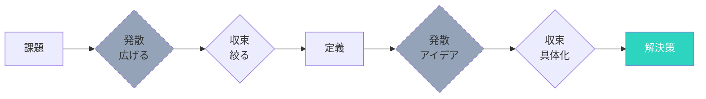

## はじめに

「私はクリエイティブな人間じゃない」「アイデアが出ない」「新しい発想なんて無理」—こう思っていませんか？

実は、創造性は「生まれつきの才能」ではなく「鍛えられる筋肉」のようなものです。アイデアを生み出す脳の仕組みを理解し、日々の習慣を変えることで、誰でも創造的な思考力を身につけられます。

## 概念図解

### 発散と収束（ダブルダイヤモンド）



## 創造性の脳科学

### なぜアイデアは「ひらめく」のか

脳科学研究によると、創造的なひらめきは、普段は接続していない脳の領域が一時的にリンクした時に生じます。

**重要なポイント：**
- 創造性は「天才だけのもの」ではない
- 創造的な状態は「準備」によって作り出せる
- 日々の習慣が、創造的な脳を作る

## クリエイティブ思考を鍛える5つの習慣

### 習慣1：アイデアを「常に」書き留める

**ジョブズの例：**
スティーブ・ジョブズは、常にジーンズのポケットにメモ帳を入れ、思いついたアイデアを即座に書き留めていました。iPhoneの原点も、そうした「書き留め」から生まれました。

**実践法：**
```
□ スマホにメモアプリを用意（Appleメモ、Google Keep、Notionなど）
□ ベッドサイドにメモ帳を置く
□ アイデアが浮かんだら、3秒以内に書く
□ 週に1回、アイデアを見直す
```

**効果：**
脳は「書き留められている」と安心し、さらに新しいアイデアを生み出せるようになります。

### 習慣2：「発散→収束」のサイクルを回す

**ダブルダイヤモンドの概念：**
デザイン思考で使われるフレームワークです。

1. **発散（Diverge）**：可能性を広げる
2. **収束（Converge）**：選択を絞る

**実践例：**
```
【問題】新しい商品企画

Step 1：発散
→ 100個のアイデアを出す（良い悪い関係なく）
→ 制約なしで自由に発想

Step 2：収束  
→ 100個から10個に絞る
→ 実現可能性で選別

Step 3：再発散
→ 残った10個の改善案を各10個ずつ出す

Step 4：最終収束
→ 最終的な解決策を1-3個に絞る
```

**ポイント：**
「良いアイデアだけを出そう」とすると、発散が阻害されます。まずは量を重視します。

### 習慣3：異なる分野の「 dots を繋げる」

**スティーブ・ジョブズの名言：**
「クリエイティブとは、ものごとをつなげる能力だ」

**実践法：**
```
□ 普段読まないジャンルの本を読む
□ 全く違う業界の人と話す
□ 趣味を増やす
□ 新しい体験をする
```

**実例：**
エアビーアンドビーの創業者は、デザインの「信用と評価システム」を、ホテル業界に応用しました。異なる分野の仕組みを応用したイノベーションです。

### 習慣4：「アイデアのインキュベーション」を活かす

**脳科学の知見：**
意識的に考え続けるより、一度脳に「寝かせる」方が、良いアイデアが浮かびやすくなります。

**実践法：**
```
【アイデアの寝かせ方】

1. 午前中：問題を理解し、情報収集
2. 昼：別の作業をする（意識から離す）
3. 午後：散歩やシャワーで「ひらめき」を待つ
4. 夕方：アイデアを書き留める
```

**効果的な「寝かせ」活動：**
- 散歩（適度な運動）
- シャワー（リラックス状態）
- 通勤（脳が自動運転モード）
- 睡眠（REM睡眠中の連想）

### 習慣5：「制約」を味方につける

**意外な事実：**
「何でもあり」の状況より、「制約がある」方が創造性が発揮されます。

**実例：**
- Twitterの140文字制限が生んだ簡潔な表現
- 俳句の5-7-5の音数が生んだ美
- 予算制約が生んだ独創的な映画表現

**実践法：**
```
【自己制約の例】

□ 「100円で解決する方法を考える」
□ 「1時間で完成させる方法は？」
□ 「子供にも説明できるように」
□ 「絵だけで説明する」
□ 「3つの単語だけで表現する」
```

## 創造性を阻害する3つの習慣

### 1. 完璧主義
「最初から完璧なアイデアを出そう」とすると、発想が固まります。「まずは量を出す」が重要です。

### 2. 同じ情報だけ摂取
同じ業界のニュース、同じタイプの人との会話だけでは、新しいdotsが増えません。

### 3. 批判的思考の先走り
アイデアを出すフェーズで「でも無理じゃない？」と批判すると、発散が止まります。批判は収束のフェーズで行います。

## クリエイティブ思考を促進する環境設計

### 物理的環境
- 散らかったデスク（適度な散らかりは創造性に良い）
- 自然光の取り入れ
- アイデアを貼り出せるホワイトボード

### 時間的環境
- 朝の創造時間（脳が疲れていないうちに）
- 予定のない「余白時間」の確保
- バックツーバックの会議を避ける

### 社会的環境
- 多様な人との交流
- 「アイデアを批判しない」合意のある場
- 定期的なアイデア共有会

## まとめ

創造性は才能ではなく、習慣です。アイデアを書き留め、発散と収束を繰り返し、異なる分野を学び、アイデアを寝かせ、制約を活かす—これらの習慣を日々の生活に組み込むことで、誰でもクリエイティブな思考力を身につけられます。

**今日から始めるステップ：**
1. 今：スマホにメモアプリを開き、今浮かんだアイデアを3つ書く
2. 今日：普段読まないジャンルの記事を1つ読む
3. 今週：1つの問題について「100個のアイデア」を出す挑戦
4. 来月：アイデア共有会を友人と開催

「アイデアが出ない人」はいません。「アイデアを無視している人」だけです。今日から、あなたのアイデアを大切にし始めましょう。
