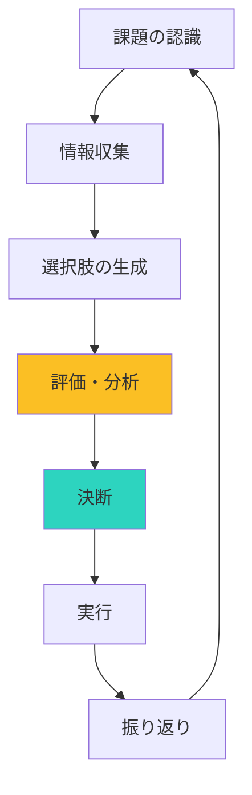

## はじめに

「あの時、あっちを選んでおけばよかった」「また同じミスを繰り返してしまった」「優柔不断で決められない」—こんな経験、ありませんか？

私たちは1日に約35,000回の選択をしていると言われています。小さな選択から大きな決断まで、意思決定の質が人生の質を左右します。

でも、良い意思決定をするのは才能ではなく、学べるスキルです。この記事では、質の高い意思決定をするための3つの思考法を、具体例とともに紹介します。

## 概念図解

### 質の高い意思決定のプロセス



## なぜ意思決定が難しいのか

### 脳のバイアス（偏り）

**確証バイアス：**
自分の信念に合う情報だけを集め、反証を無視する傾向。

**例：**
「この人は能力がない」と思い込むと、その人のミスだけに目が行き、良い部分が見えなくなる。

**サンクコスト効果：**
過去に投資した時間やお金を「もったいない」と思い、本来ならやめるべきことを続けてしまう。

**例：**
つまらない映画を「お金を払ったから」最後まで見る。

**感情による影響：**
怒りや恐怖、興奮している状態では、理性的な判断ができなくなる。

### 情報過多

現代は選択肢が多すぎる時代。「選択のパラドックス」という現象があり、選択肢が多すぎると、決断できなくなり、満足度も低下します。

## 思考法1：逆算思考 - 未来から今を見る

### 概念

「今から未来を考える」のではなく、「未来の理想像から逆算して今を決める」思考法です。

**スティーブ・ジョブズの例：**
iPodを開発する際、ジョブズは「今の技術で何ができるか」から考えなかった。代わりに「ユーザーの理想体験は何か」を考え、そこから逆算して技術を選びました。結果、1,000曲をポケットに入れられる製品が生まれました。

### 実践ステップ

**Step 1：理想の終点を描く**

「3年後、自分はどうなっていたいか」「このプロジェクトの成功とは何か」を具体的に書き出します。

```
【例：キャリア選択の場合】
3年後の理想：
- テクノロジーと人の架け橋になる仕事をしている
- リモートワークで柔軟な働き方ができている
- 年収は現在の1.5倍
- 家族との時間を週末は完全に確保している
```

**Step 2：逆算して中間地点を設定**

「3年後にそうなるためには、1年後にはどうなっていなければならないか」「1年後にそうなるためには、3ヶ月後には何を終えているか」と逆算していきます。

**Step 3：今やるべきことを決める**

逆算した結果、「今」やるべき最優先アクションが明確になります。

### 活用シーン

- キャリア選択
- 長期プロジェクトの計画
- 人生の優先順位決め
- 新規事業の立ち上げ

## 思考法2：10-10-10ルール - 時間軸で選択肢を評価する

### 概念

スージー・ウェルチが提唱した思考法です。選択肢を「10分後」「10ヶ月後」「10年後」の3つの時間軸で評価します。

### 実践例

**シナリオ：転職の決断**

```
【選択肢A：今の会社に留まる】
10分後：安心するが、不満も続く
10ヶ月後：状況は変わらず、モチベーション低下
10年後：同じようなポジションで後悔している可能性

【選択肢B：新しい会社に転職】
10分後：不安でいっぱい
10ヶ月後：新しい環境に慣れ、成長を実感
10年後：新しいキャリアパスが開けている可能性
```

**分析：**
10分後の感情では「留まる」が正しい選択に見えるが、10年後の視点では「転職」の方が良い可能性が高い。短期的な不安と長期的な利益を比較できる。

### 活用シーン

- 転職・退職の決断
- 大きな買い物（家、車など）
- 人間関係の決断
- 投資判断

## 思考法3：第3者的思考 - 客観的視点を取り入れる

### 概念

自分の感情や偏りを取り除き、「自分が友人にアドバイスする立場」や「完全な他人の視点」から選択肢を評価します。

### 3つの視点

**視点1：自分自身**
```
「私はどう感じているか」
「私は何を望んでいるか」
```

**視点2：親しい友人**
```
「親友がこの状況だったら、私は何と言うか」
「親友なら、この状況で何を優先するか」
```

**視点3：完全な第三者**
```
「感情が全く関係ない客観的な観察者は、どう見えるか」
「データと事実だけを見た場合、どちらが合理的か」
```

### 実践例

**シナリオ：プロジェクトの方針転換**

```
【自分自身の視点】
「今までの努力が無駄になるのは嫌だ」
「でも、今のままでは失敗しそう」

【親友への助言として】
「一度立ち止まって、本当に顧客が求めていることを確認しよう。
過去の投資はもう戻ってこない。これからの投資を考えよう。」

【完全な第三者の視点】
データ分析：
- 現在の進捗：計画の40%
- 顧客満足度：30%
- 市場ニーズの変化：大きなシフトあり
→ 方針転換が合理的
```

## 実例：質の高い意思決定で人生が変わった3人

### ケース1：キャリア転換した30代女性

**状況：**
- 大手企業で安定した職に就いていた
- でも、毎日が退屈で意味を感じられない
- 転職したいが、安定を捨てられない

**適用した思考法：**
逆算思考と10-10-10ルール

**決断プロセス：**
1. 10年後の理想を描く：「自分の価値観で働き、社会貢献ができる仕事」
2. 逆算して、1年後には「新しい分野での実績作り」が必要と判断
3. 10-10-10ルールで評価：
   - 10分後：不安
   - 10ヶ月後：新しい環境で成長
   - 10年後：満足感のあるキャリア

**結果：**
NPO法人に転職し、使命感を持って働けるようになった。収入は減ったが、生活満足度は大幅に向上。

### ケース2：事業拡大の判断に迷った経営者

**状況：**
- 新規事業の立ち上げ機会があった
- でも、既存事業も繁忙期でリソースが限られていた
- 「チャンスを逃したくない」vs「無理はしたくない」

**適用した思考法：**
第3者的思考

**決断プロセス：**
1. 自分の視点：「失敗したくない」「でもチャンスも捨てたくない」
2. 親友への助言として：「今の体力とリソースを正直に見て、無理ならパートナーを探そう」
3. 第三者の視点：「リソース配分のデータを見ると、同時並行は無理がある」

**結果：**
新規事業は半年延期し、その間に既存事業の体制強化とパートナー探しに集中。結果的に、より良い形で新規事業を立ち上げることができた。

### ケース3：結婚を迷っていたカップル

**状況：**
- 3年付き合っている
- 相手とは気が合うが、価値観の違いも感じている
- 「今のままが楽」vs「次のステップへ」

**適用した思考法：**
10-10-10ルールと逆算思考

**決断プロセス：**
1. 10年後の家族の理想をそれぞれ語り合う
2. 価値観の違いが「本質的か、調整可能か」を分類
3. 10年後の視点で評価した結果、「別れる」より「一緒にいる」方が互いの成長につながると判断

**結果：**
結婚を決意。価値観の違いは「対話のテーマ」として前向きに捉え、関係が深まった。

## 意思決定を記録する：デシジョンジャーナル

### デシジョンジャーナルとは

重要な決断をした時、その時の思考プロセスを記録しておく習慣です。

### 記録項目

```
【日付】2026年3月15日
【決断内容】〇〇プロジェクトの方針転換

【選択肢】
A. 今の方針を継続
B. 部分的に修正
C. 完全に方向転換

【選んだ選択肢】C

【選んだ理由】
- 顧客ニーズの変化を反映するため
- 長期的な競争優位性を保つため
- チームのモチベーション向上のため

【考慮したリスク】
- 短期間の混乱
- 既存顧客への説明コスト

【期待する結果】
- 3ヶ月後：新しいプロトタイプ完成
- 6ヶ月後：顧客満足度向上
- 1年後：市場シェア拡大

【感情状態】冷静だが少し不安
【参考にした情報】顧客アンケート結果、競合分析
```

### 効果

- 振り返りができる（どのバイアスに影響されたか）
- パターン認識ができる（自分の意思決定の癖）
- 同じ失敗を繰り返さない

## まとめ

質の高い意思決定は、直感だけではなく、構造化された思考法を使うことで実現できます。逆算思考で方向性を、10-10-10ルールで時間軸を、第3者的思考で客観性を確保しましょう。

**今日から始めるステップ：**
1. 今：小さな決断（今日の夕食など）で10-10-10ルールを試す
2. 今日：今週1つ大きな決断があるなら、逆算思考で理想像を描く
3. 今週：友人に相談する際、まず自分ならどうアドバイスするか考える
4. 来月：デシジョンジャーナルを始める

「決断に迷う」ことは悪いことではありません。それは、選択肢を真剣に考えている証拠です。ただ、迷い続けすぎると機会を逃します。今日紹介した思考法を使って、より良い決断を、少し早く、そして自信を持って行えるようになりましょう。
