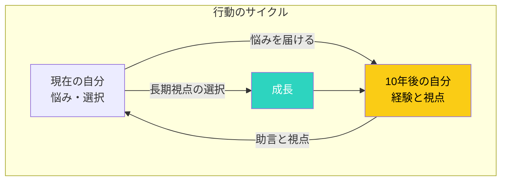

## はじめに：今の悩みは、10年後の自分にとってどう見える？

「転職すべきか迷っている」「今の仕事を続けるべきか」「このプロジェクトに本気で取り組む価値はあるのか」—人生の岐路で、私たちはしばしば迷います。

こんな時、「10年後の自分が今の自分に何と言うだろう？」と考えてみませんか？長期的な視点で今を見つめることで、迷いが晴れ、正しい選択が見えてくることがあります。

この記事では、未来の自分と対話する「長期思考の技術」を解説します。成功する人々が実践するこの思考法を、あなたも取り入れてみてください。

## 未来との対話ループ：時間軸を超えた自己対話

### なぜ「未来の自分」の視点が効果的なのか

**1. 感情のデトックス**

今の悩みは、多くの場合「今の感情」に色付けされています。不安、焦り、恐怖—これらが冷静な判断を妨げます。未来の視点を取ることで、感情から距離を置き、客観的に判断できるようになります。

**2. 優先順位の再評価**

今は「大変なこと」も、10年後には「小さな出来事」に見えるかもしれません。逆に、今は「小さなこと」に見えても、長期的には「大きな影響を与えること」もあります。

**3. 本当に大切なものの再発見**

日常に追われていると、「本当に大切なこと」を見失いがちです。未来の自分の視点は、価値観の羅針盤として機能します。

## 未来の自分と対話する3つの方法

### 方法1：「10年後の手紙」ワーク

10年後の自分から、今の自分への手紙を書いてみます。

**手順：**
1. 静かな場所でリラックスする
2. 「10年後の自分」になりきる
3. 今の自分に向けて手紙を書く
4. 「ありがとう」「あの時の選択は正しかった」「もっと〇〇すべきだった」など

**例：**
> 「今のあなたの悩みは、10年後には小さな思い出になっています。今は転職するか迷っているかもしれませんが、私から言えることは、『挑戦するか、後悔するか』のどちらかです。挑戦して失敗しても、それは学びになります。でも『やらなかった後悔』は、残りの人生を重くします。勇気を出して、新しい世界に飛び込んでください。」

### 方法2：「年の瀬の振り返り」予習

年末に「今年一年を振り返る」を、未来から現在に向けて行います。

**質問例：**
- 1年後の年末、自分は今年のどの選択を「よかった」と思っているか？
- どの選択を「もっと早くやればよかった」と後悔しているか？
- この選択が10年後の自分にどう影響しているか？

### 方法3：臨終のベッド思考

スティーブ・ジョブズが有名にした「臨終のベッド思考」です。

> 「毎朝、鏡を見て自分に問う。『もし今日が人生最後の日だとしたら、今日やろうとしていることを、私はしたいだろうか？』答えが『ノー』である日が続くなら、何かを変える時だと知る。」

この思考を10年後、あるいは人生の最後に拡張します。「このまま今の道を進んだ自分は、最後に何を思うだろうか？」

## 長期思考を日常に活かす3つの実践

### 実践1：選択の前に「10年ルール」を適用

重要な選択をする前に、「この選択が10年後の自分にどう影響するか」を考えます。

**具体例：**
- **転職の選択**：「この会社で10年働いた自分はどうなっているか」「今の会社に残った自分はどうか」
- **スキル習得の選択**：「このスキルを10年磨いた自分はどうか」「このスキルを身につけなかった自分はどうか」
- **人間関係の選択**：「この人と10年関係を続けた自分はどうか」

### 実践2：長期目標の「逆算計画」

10年後に「こうなっていたい」という姿を描き、そこから逆算して今の行動を決めます。

**手順：**
1. 10年後の理想的な姿を具体的に書き出す
2. その姿になるために必要な5年後のマイルストーンを設定
3. 3年後、1年後、6ヶ月後と逆算していく
4. 今月やるべきことを特定する

### 実践3：「未来の自分」を味方につける

未来の自分は「既に目標を達成している自分」として、今の自分を応援してくれています。

「10年後の自分は、この困難をどう乗り越えただろう？」と考えることで、解決策のヒントが見えてきます。「あの時はこうやって乗り越えた」という記憶を、未来から呼び起こすイメージです。

## 注意点：長期思考と現状肯定のバランス

### 長期思考の落とし穴

長期思考をしすぎると、「今の幸せ」を軽視してしまうことがあります。「10年後のためなら今は我慢」という考え方は、実は危険です。

### バランスの取り方

- **長期目標と短期の喜びの両立**：「10年後の自分に誇れる人生」でありつつ、「今日の自分も幸せ」であることを目指す
- **計画と柔軟性の両立**：長期計画を立てつつ、状況の変化に応じて柔軟に修正する
- **未来への投資と現在の充実の両立**：将来のための投資をしつつ、今を大切に生きる

## まとめ：未来の自分と仲良くなる

未来の自分と対話する技術は、迷いの多い現代において、強力な羅針盤となります。

**今日から始める3ステップ：**
1. **今週**：「10年後の自分からの手紙」を書いてみる
2. **今月**：重要な選択の前に「10年ルール」を適用してみる
3. **継続**：年に一度、長期目標を見直し、軌道修正する

未来の自分は、今のあなたの味方です。長期的な視点を持ちながら、今日を大切に生きていきましょう。
