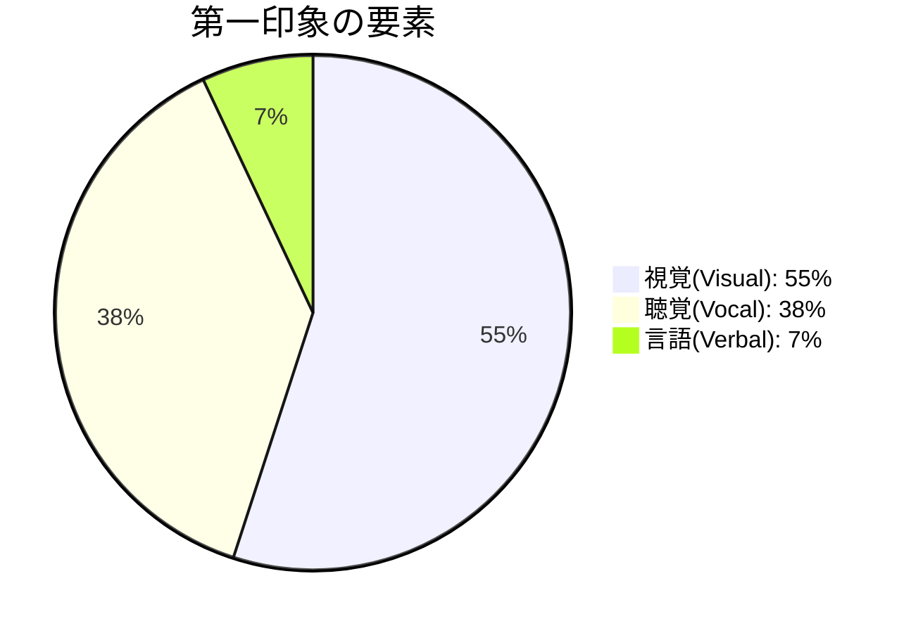

## はじめに：7秒で決まる、8回かけて覆す

「第一印象は長く残る」—この言葉、聞いたことがありますか？

心理学では「初頭効果」と呼ばれる現象があり、最初に得た情報が、その後の判断に大きな影響を与えます。悪い第一印象を覆すには、8回以上の良い印象が必要という研究もあります。

つまり、最初の7秒が、その後の関係を大きく左右するのです。

この記事では、科学的に裏付けられた第一印象の作り方を解説します。

## 第一印象を決めるメラビアンの法則

### 55%：38%：7%の黄金比

メラビアンの法則によると、第一印象は以下の要素で決まります：

驚くべきことに、何を言うか（言語情報）はわずか7%しか影響しません。どう見えるか（視覚情報）が55%、どう聞こえるか（聴覚情報）が38%を占めます。

つまり、「何を言うか」より「どう見えるか」「どう聞こえるか」が、はるかに重要ということです。

## 視覚的要素を整える5つのポイント（55%）

### 1. 清潔感—最低限のマナー

清潔感は第一印象の基本中の基本です。

**チェック項目：**
- 髪型は整っているか
- 服装は清潔か（シワ、汚れ、毛玉はないか）
- 靴は磨いているか
- 爪は整えているか
- 口臭、体臭は気にしていないか

清潔感は「その人が自分自身をどう大切にしているか」を示します。

### 2. 適切な服装—TPOを意識する

TPO（Time, Place, Occasion）に合った服装を選びます。

**基本原則：**
- 迷ったら、少しフォーマル寄りに
- 業界のドレスコードを調べる
- 相手より少し上げる（失礼がない程度に）

### 3. 姿勢—自信を見せるボディランゲージ

背筋を伸ばし、胸を張る。これだけで「自信がある人」に見えます。

**良い姿勢のポイント：**
- 背筋を伸ばす
- 肩を下げてリラックス
- 顔を上げて正面を向く
- 小刻みに動かず、落ち着いた動き

### 4. アイコンタクト—信頼を生む目線

目を見て話すことで、誠実さと自信が伝わります。

**適切なアイコンタクト：**
- 会話の70%程度は目を合わせる
- ただし、凝視しすぎない（不快感を与える）
- 3秒程度を目安に、時々目線を外す

### 5. 笑顔—親しみやすさの象徴

自然な笑顔は、親しみやすさを伝えます。

**笑顔のコツ：**
- 緊張していても、口角を意識的に上げる
- 目も笑わせる（口だけの笑顔は不自然）
- 相手の目を見て笑う

## 聴覚的要素を整える3つのポイント（38%）

### 1. 声のトーン—落ち着きと自信

落ち着いた、聞き取りやすい声で話します。

**意識すること：**
- 声のボリュームは適度に（大きすぎず小さすぎず）
- 声のトーンは下げ気味に（高すぎると不安に見える）
- リズムをつけて話す

### 2. 話すスピード—理解されやすいペース

適度なスピードで、間を取りながら話します。

**基本：**
- 1分間に200〜240文字程度（やや遅め）
- 重要な箇所で間を取る
- 相手の反応を見て調整する

緊張すると早口になりがちなので、意識的にゆっくり話す練習を。

### 3. 滑舌—はっきりと発音する

はっきり発音することで、自信と能力が伝わります。

**練習方法：**
-  tongue twister（早口言葉）の練習
- 録音して確認する
- 母音を大きく発音する

## 最初の7秒で意識すること

### 挨拶（0-2秒）

明るく、はっきりと。第一印象のスタートです。

**例：**
- 「はじめまして、本日はお時間いただきありがとうございます」
- 「お会いできて嬉しいです」
- 相手の名前を呼ぶ：「〇〇さん、よろしくお願いします」

名前を呼ばれると、人は自然と好感を持ちやすくなります。

### 握手（2-4秒）

握手をする場合は、しっかりと、でも強すぎず。

**握手のポイント：**
- 目を見ながら
- 手のひら全体を使う
- 2〜3秒程度
- 相手の力加減に合わせる
n
### 最初の言葉（4-7秒）

相手の名前を呼び、簡潔に自己紹介。

**例：**
- 「田中さん、はじめまして。ABC会社の山田です」
- 「今日はお忙しいところありがとうございます」

## 第一印象は練習できる

### 鏡の前での練習

鏡の前で笑顔や姿勢を確認します。自然に見えるか、不自然に見えるかをチェック。

### 動画撮影

スマートフォンで自分の話す様子を撮影し、客観的に確認します。思っている以上に、自分の癖や特徴が見えてきます。

### 信頼できる人からのフィードバック

友人や家族に「第一印象をどう思ったか」を聞きます。客観的な意見は貴重です。

## まとめ：次の大事な出会いに備えよう

第一印象は、意識的に管理できるものです。

**今日から始める3ステップ：**
1. **今**：鏡の前で笑顔と姿勢を確認する
2. **今週**：自己紹介の言葉を準備し、練習する
3. **次の出会い**：7秒間を意識して、準備して臨む

「何を言うか」より「どう見えるか」「どう聞こえるか」。この視点を持つだけで、あなたの第一印象は劇的に改善します。
