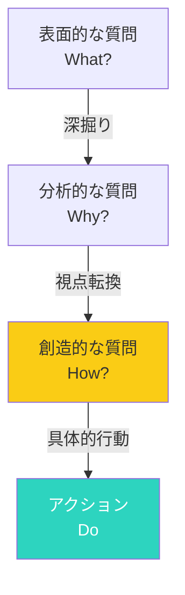

## はじめに：アインシュタインの55分

アインシュタインは言いました。

> 「もし私が問題を解くのに1時間を与えられたら、55分を質問を考えることに使い、5分で解く」

質問の質が、答えの質を決めます。しかし、私たちはつい「答えを探す」ことに急ぎがちで、「質問を考える」ことをおろそかにしがちです。

この記事では、質問の力を磨き、思考を深める方法を解説します。

## 質問の深掘りプロセス：4つのレベル

質問は深掘るほど、価値が高まります。

## 良い質問の4つの特徴

### 特徴1：オープンエンド

「はい/いいえ」で答えられない質問です。

**例：**
- 「なぜ？」
- 「どうすれば？」
- 「もし〜だったら？」
- 「どのように感じた？」

### 特徴2：深掘りする

表面的なことではなく、本質を探ります。

**深掘りの例：**
- 「それはなぜ？」
- 「その背景には何がある？」
- 「どうしてそう思った？」

### 特徴3：視点を変える

別の角度から見せます。

**視点転換の例：**
- 「逆に考えるとどうなる？」
- 「相手の立場から見ると？」
- 「5年後から見ると？」
- 「子供に説明するとしたら？」

### 特徴4：行動につながる

考えるだけでなく、次のステップが見えます。

**行動につながる質問：**
- 「具体的に何をすれば？」
- 「今日できる最小の一歩は？」
- "何があればうまくいく？"

## 自分への質問：目標達成と問題解決を促す

### 目標を明確にする質問

- 本当に達成したいことは何？
- なぜそれが重要？
- 達成したらどんな状態になる？
- それは誰のための目標？

### 問題を解決する質問

- 何が本当の問題？
- 誰が影響を受けている？
- 過去に似た状況をどう解決した？
- もし解決したらどうなる？

### 行動を促す質問

- 今日できる最小の一歩は？
- 何が障害になっている？
- 助けを求められる人は誰？
- もし失敗したらどうする？

## 他者への質問：理解と共感を深める

### 理解を深める質問

- 「もう少し詳しく教えてください」
- 「具体的にはどういうことですか？」
- 「なぜそう思いますか？」
- 「それはいつから？」

### 共感を示す質問

- 「それはどんな気持ちでしたか？」
- 「一番大変だったのはどの部分ですか？」
- 「その時、何を考えていましたか？」

### 解決を促す質問（コーチング的質問）

- 「理想的な状態はどんな状態ですか？」
- 「何があればうまくいきますか？」
- 「他の選択肢はありますか？」
- 「それを試すとどうなりそうですか？」

## 質問力を磨く3つのコツ

### コツ1：待つ

答えを急がない。相手が考える時間を与えます。

沈黙を恐れないことが重要です。質問した後、5秒、10秒待つことができますか？その沈黙の中で、深い答えが生まれます。

### コツ2：聴く

答えを聞いてから、次の質問を考えます。

次の質問を考えながら相手を聞いていると、相手の本当に伝えたいことを聞き逃します。まずは相手の言葉を受け止め、そこから次の質問を生み出します。

### コツ3：練習する

日常的に質問を意識します。

**練習法：**
- 会議で1つ深い質問をする
- 日記に「今日の問い」を書く
- 自分に5回「なぜ？」を繰り返す

## 質問の力が生み出す変化

質問力が高まると、以下の変化が生まれます：

- **問題解決能力の向上**：本質を突く質問で、解決策が見えやすくなる
- **人間関係の深化**：相手を理解する質問で、信頼関係が生まれる
- **創造性の向上**：視点を変える質問で、新しいアイデアが生まれる
- **自己理解の深化**：自分への質問で、本当に大切なことが見えてくる

## まとめ：今日、誰かに一つ深い質問をしよう

質問の質が、答えの質を決めます。

**今日から始める3ステップ：**
1. **今日**：誰かに一つ、深い質問をしてみる
2. **今週**：自分への質問を日記に書く習慣をつける
3. **継続**：「なぜ？」を5回繰り返す練習をする

良い質問は、良い答えを引き出します。質問の力を磨いて、思考を深めましょう。
