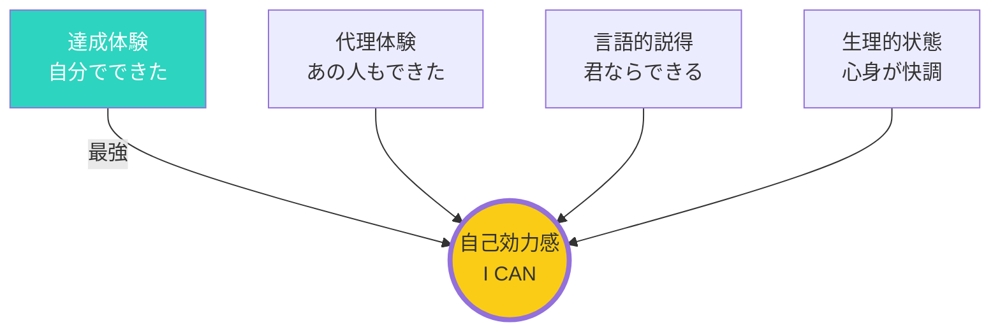

## はじめに：「できる」という感覚の力

心理学者アルバート・バンデューラが提唱した「自己効力感」—これは「自分にはそれができる」という確信のことです。

この感覚は、単なる「ポジティブシンキング」ではありません。実際の行動、結果、そして人生を大きく左右する、科学的に裏付けられた心理的要因です。

この記事では、自己効力感がなぜ重要か、そしてそれを高める方法を解説します。

## 自己効力感が重要な理由：行動を変えるメカニズム

### 自己効力感が高い人の特徴

自己効力感が高い人は：

- **挑戦的な目標を設定する**：「できないかも」と思わず、高い目標を掲げる
- **困難に直面しても粘り強く取り組む**：挫折しても諦めず、工夫を続ける
- **ストレスに強い**：困難を「乗り越える課題」として捉える
- **実際に高い成果を出す**：自信があるからこそ、行動でき、結果が出る

### 自己効力感が低い人の特徴

逆に低い人は：

- **挑戦を避ける**：「できないかも」と思って、チャンスを逃す
- **少しの困難で諦める**：「やっぱり自分には無理だ」と思い込む
- **否定的な結果を想像する**：失敗を予想して、不安に襲われる
- **結果として低い成果**：挑戦しないので、成長の機会を失う

## 自己効力感を支える4つの柱



バンデューラは、自己効力感を高める4つの源泉を提唱しました。

### 源泉1：達成体験（最も強力）

実際にうまくいった経験が、最も強力な自信の源となります。

**具体例：**
- 初めてプレゼンを成功させた経験
- 難しいプロジェクトを完遂した経験
- 目標を達成した経験

小さな成功の積み重ねが、自信を築きます。

### 源泉2：代理体験

他人がやっているのを見ることで、「あの人にできるなら、自分にもできそう」と感じます。

**具体例：**
- 同期が成功したのを見て「自分もできるかも」と思う
- ロールモデルの成功ストーリーに触発される
- 同じ境遇の人が乗り越えたのを知る

### 源泉3：言語的説得

他者からの励ましやフィードバックが、自信を高めます。

**具体例：**
- 「あなたならできる」という言葉
- 具体的な強みのフィードバック
- 過去の成功を指摘される

### 源泉4：情動的・生理的状態

ポジティブな感情状態や、良好な身体状態が、自信につながります。

**具体例：**
- リラックスしているときは、できそうな感覚が高まる
- 疲れていると、自信が低下する
- 適度な運動後は、ポジティブな感情が生まれる

## 自己効力感を高める6つの実践法

### 方法1：小さな成功を積み重ねる

いきなり大きな目標ではなく、達成可能な小さな目標から始めます。

**例：**
- 「毎日5分だけ英語の勉強をする」
- 「1日1つだけ新しいことを試す」
- 「週に1回だけ早起きする」

「できた」という経験を蓄積することで、自己効力感が高まります。

### 方法2：ロールモデルを見つける

自分と似た背景の人が成功しているのを見ることで、「自分にもできそう」という感覚が生まれます。

**方法：**
- 同業界・同年代の成功事例を調べる
- メンターを見つける
- 自叙伝や成功談を読む

### 方法3：成功をイメージする

具体的に成功した姿を思い描くことで、脳にとって疑似体験になります。

**ビジュアライゼーションの方法：**
- 目標達成時の姿を具体的にイメージする
- 成功した時の感情を感じる
- そのプロセスをステップバイステップで想像する

### 方法4：スキルを磨く

準備ができていると、自信が生まれます。

**実践：**
- プレゼンの練習
- 模擬面接
- シミュレーション

### 方法5：ポジティブなセルフトーク

「できる」「やれる」と自分に語りかけます。

**セルフトークの例：**
- 「過去にも乗り越えてきた」
- 「準備はできている」
- 「一歩ずつ進めばできる」

### 方法6：体調を整える

疲れていると、自己効力感は下がります。

**基本：**
- 十分な睡眠
- 適度な運動
- バランスの取れた食事

## 「できる」から始まる成功のサイクル

自己効力感は以下のサイクルを生み出します：

```
自信がある → 挑戦する → 行動する → 結果が出る → 自信が高まる → さらに挑戦する
```

このサイクルを回すために、まずは小さな成功体験を積み重ねることが大切です。

## まとめ：今日、一つ小さな目標を達成しよう

自己効力感は、行動を促し、結果を生み出します。

**今日から始める3ステップ：**
1. **今日**：達成できそうな小さな目標を1つ設定する
2. **今日中に**：その目標を達成し、「できた」という感覚を味わう
3. **明日から**：小さな成功を毎日積み重ねる

「できる」という感覚が、あなたを次のレベルに導きます。今日から一歩を踏み出しましょう。
