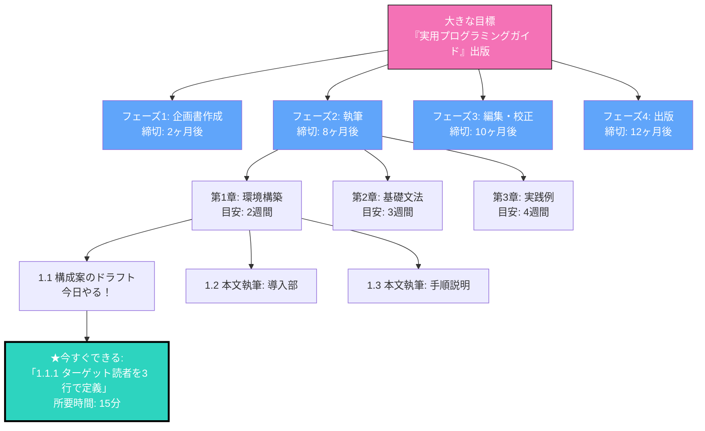

## 「本を書きたい」の一言で動けなくなる私

「本を書きたい」
「起業したい」
「資格を取りたい」

こういう大きな目標を持つのは素晴らしいことです。でも正直、大きすぎて何から始めればいいかわからないんですよね。

僕も「技術ブログを毎日書く」って決めた時、最初の1週間は「何を書こう」とPCの前で呆然としていました。キーボードをカタカタする音はするんだけど、書き始めるまでに30分、1時間...。結局その日は書けないまま終わる。なんて日もありました。

これがチャンクダウンしない人の典型的なパターンです。大きな目標の前に立ちすくんで、結局何も始まらない。

## チャンクダウンって何？一口サイズにする魔法

チャンクダウンって言葉、聞いたことありますか？

簡単に言えば「大きな固まりを小さく分割すること」です。食べきれない大きなステーキを一口サイズにカットするイメージ。そうすれば、一つずつ確実に食べられますよね。

### チャンクダウンの階層イメージ

この図を見てわかるように、大きな目標を「フェーズ→章→セクション→今日のタスク」とどんどん小さくしていきます。そして「今日これだけやればいいんだ」という具体的なアクションが見えてきます。

## チャンクダウンが効く4つの理由

### 1. 行動しやすくなる

「本を書く」→「今日は1ページだけ書く」

小さく分解すると、今すぐ始められます。僕が毎日ブログを書けるようになったのは、「今日は300文字だけ」という縛りを作ったから。実際に書き始めると、気づいたら1000字書けてることも多いです。

### 2. 進捗が見える

小さなタスクを完了するたびに「今日もできた！」という達成感が得られます。これがモチベーションの燃料になります。僕はTrelloで小さなタスクを管理して、完了したらパチパチ移動するのが好きです。見える形で進んでる感じが出ますよね。

### 3. 問題の特定がしやすい

どこで詰まってるか、明確になります。「第3章の実践例が書けない」じゃなくて、「3.2のサンプルコードでエラーが出て手が止まってる」まで分解できれば、解決策も見えてきます。

### 4. 見積もりが正確になる

「本を書くのにどれくらいかかる？」→ わかんない
「第1章の1セクションにどれくらいかかる？」→ 2時間

小さく分解すると、予測精度が上がります。これでスケジュール組みも楽になります。

## チャンクダウンの実践ステップ

### Step 1: ゴールを具体化する

「何が達成された状態か」をできるだけ具体的に定義します。

❌ 「本を書きたい」
✅ 「技術初心者向けのPython入門書（200ページ）を出版社から出す」

### Step 2: マイルストーンを設定

ゴールまでの中間地点を3〜5つ設定します。多すぎると管理が大変、少なすぎると分解しきれてません。

### Step 3: タスクに分解

各マイルストーンを、具体的なタスクに分解。1つのタスクは2時間以内で完了できるサイズが理想です。「第1章を書く」は大きすぎ。「第1章の導入を書く」ならOK。

### Step 4: 最初の一歩を決める

「今日」できる、最小のアクションを特定します。これが重要。「明日から本気出す」は絶対に無理。「今から15分だけやる」ならできる。

## 実例：サラさんの「フリーランス転向」プロジェクト

友達のサラさん（仮名）が会社員からフリーランスのWebデザイナーに転向した時の話です。

**最初のゴール**: 「フリーランスになる」→ ぼんやりしすぎ

**チャンクダウン後**:
- フェーズ1: ポートフォリオ制作（1ヶ月）
  - 今週: 過去の制作物3つを選定
  - 今日: 制作物1のケーススタディを書き始める（30分）
- フェーズ2: クライアント開拓（2ヶ月）
- フェーズ3: 案件獲得（3ヶ月目〜）

サラさんは「今日はポートフォリオのAboutセクションだけ書く」という小さなタスクを毎日こなしました。結果、3ヶ月後に最初のクライアントを獲得。今では安定的に仕事を回せています。

## 今日からできる「最初の一歩」

どんなに大きな目標も、最初の一歩から始まります。

今、何か「やりたいけど大きすぎて手が出ない」ことはありますか？

それを紙に書き出して、分解してみてください。そして「今日できる最小のアクション」を一つ見つけて、やってみてください。

その一歩が、大きな変化の始まりです。
