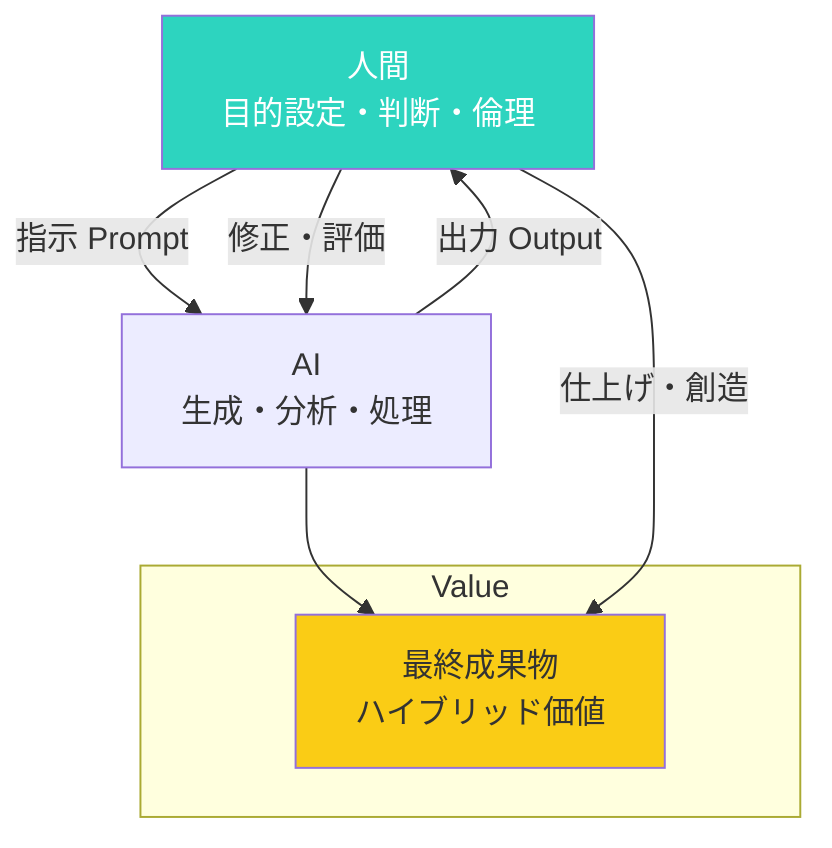

## インターネットの歴史が教えてくれたこと

かつてインターネットが登場したとき、「ネット脳」と揶揄する人がいました。「検索しなければ答えが出せない」と懸念され、本を読まなくなると危惧されました。でも今、誰もがスマホで検索するのは当たり前です。図書館で資料を探す時間より、Googleで即座に情報を引き出す方が合理的だと誰もが理解しています。

同じことがAIでも起きています。

2023年にChatGPTが登場して以来、仕事の現場は劇的に変わりました。私のクライアントである田中さん（35歳、マーケター）は、1年前までは企画書作成に丸3日かかっていました。アイデア出しから構成、文章化まで、すべて自らの頭脳に頼っていました。でも今はAIにアイデア出しをさせ、自分は戦略的な部分に集中。結果、同じクオリティの企画書を半日で仕上げられるようになりました。残った2.5日は、新規プロジェクトの立ち上げや顧客との関係構築に使えるようになりました。

「AIに頼るのは卑怯だ」という考え方もありますが、それは「電卓を使うのは卑怯だ」というのと同じくらい時代遅れです。道具は使いこなすもの。問題なのは、AIを使わないで競争相手に遅れを取ることです。

## AI時代に求められる3つの思考転換

AI時代に生きる私たちには、3つの大きな変化が求められます：

### 1. 効率化から創造化へのシフト

単純作業をAIに任せ、人間は創造的な価値を生む方向へ。

以前は「文章を書く能力」が重宝されました。でもAIが登場して、「文章を書く」という作業自体の価値は低下しました。代わりに価値を増したのは「どんな文章を書くべきか決める判断力」「読者の心を動かす共感力」「独自の視点や経験に基づく創造力」です。

例えば、法律事務所で働く山田さんは、以前は契約書の作成で夜遅くまで残業していました。AIに定型文の作成を任せるようになってからは、クライアントとの打ち合わせや戦略的な法的アドバイスに時間を使えるようになりました。仕事の質が向上し、顧客満足度も向上。残業は激減し、子供との時間も増えました。

### 2. 知識重視から思考力重視へのシフト

情報の暗記より、問いの立て方が重要になりました。

AIは、人間が一生かけて覚えられないほどの情報を瞬時に引き出せます。でも「どんな問いを立てるか」「どの情報が本当に必要か」「引き出した情報をどう組み合わせるか」は、人間の領域です。

医者の佐藤先生は、AIに症状を入力して診断の候補を出させています。でも最終的な判断は、患者の表情や声のトーン、過去の病歴との照らし合わせなど、人間的な観察に基づいて行います。AIは「知識の引き出し」、人間は「知識の使い方」という分担です。

### 3. 個人作業から協働へのシフト

AIをパートナーとした新しい協働スタイル。

これまでのパソコンは「道具」でした。指示すれば動く機械。でもAIは「パートナー」です。対話しながら、一緒に考え、一緒に作り上げていく存在。私たちは、AIという驚異的な能力を持つ「新人部下」や「万能アシスタント」と働き始めたのです。

## AIネイティブが持つ4つの特徴

AIを使いこなす「AIネイティブ」は、以下の4つの特徴を持っています。

### 1. 「自分でやる」にこだわらない委任のセンス

AIにできることは素直に任せる。人間にしかできないことに集中する。

営業のAさんは、以前は見積もり書の作成に毎回2時間かかっていました。顧客情報を整理し、テンプレートに当てはめ、数字を計算...地道な作業の連続でした。今はAIに顧客情報を入力させ、自分は顧客との関係構築に時間を使っています。売上は前年比150%に向上しました。

「自分でやらなきゃ」という思い込みを手放す。これが第一歩です。

### 2. プロンプト力：質問の質が答えの質を決める

AIに効果的に指示を出せる力が、新しいリテラシーになりました。

同じAIを使っても、「いいアイデアを出して」という曖昧な指示と、「ターゲットは30代女性、悩みは時間不足。解決策を3つ提案して」という具体的な指示では、得られる出力が天と地ほど違います。

プロンプト力のある人は、AIの能力を100%引き出せます。ない人は、せいぜい30%。この差は、今後の仕事の差になっていくでしょう。

具体例として、プロンプトエンジニアの鈴木さんは、AIに「マーケティング記事を書いて」と頼むのではなく、「30代の働く母親を対象に、時短レシピの記事を書いて。親しみやすいトーンで、箇条書きを含めて。導入部は200字程度で」という具体的な指示を出します。その結果、編集にかかる時間が70%減少しました。

### 3. アウトプットを精査する批評力

AIの出力を鵜呑みにせず、確認・修正する力が重要です。

実際にAIは間違った情報を「自信満々に」出力することがあります。「ハルシネーション」と呼ばれる現象です。AIネイティブは、出力を常に疑い、事実確認を行う習慣を持っています。

医療系ライターの田中さんは、AIに医療記事の作成を依頼しています。でもAIが書いた内容は必ず専門書で確認し、医師にレビューしてもらいます。「AIは下書き係。最終責任は人間が持つ」という意識です。

### 4. ハイブリッドで価値を生み出す組み合わせ力

AI × 人間の創造性
AI × 専門知識  
AI × 人間関係

この組み合わせで、これまでにない価値を生み出します。

デザイナーのBさんは、AIに10案のラフを作らせ、そこから自らの審美眼で2案を選び、さらに磨き上げる。「AIのアイデアの広さ」と「人間の選択眼」の組み合わせで、以前の3倍の成果を出しています。AIは「量」を、人間は「質」を担当する分工です。

### AIと人間の協働モデル

## 今日から始められる4つの実践ステップ

### 1. 日常業務にAIを取り入れる小さな一歩

メールの下書き、リサーチ、アイデア出し、翻訳。まずは使ってみる。

「毎日1つ、AIに任せるタスクを決める」から始めてみましょう。最初は雑でもいいんです。使いながら、あなたに合った活用法が見えてきます。デザイナーのCさんは、まず「メールの件名を考えてもらう」ことから始めました。小さな第一歩から、今では企画書の構成案までAIに任せるようになりました。

### 2. 得意なプロンプトを開発する

自分の仕事に使える、繰り返し使えるプロンプトを作る。

例えば：
- 「〜について、初心者にもわかるように3つのポイントで説明して」
- 「〜の課題について、原因と解決策を整理して」
- 「〜について、反対意見も含めてバランス良く説明して」

これらをテンプレート化し、自在に使いこなせるようになりましょう。営業のDさんは、「顧客の悩みを整理するプロンプト」「提案書の構成案を出すプロンプト」「反論に対する回答案を作るプロンプト」をテンプレート化し、仕事の効率が3倍になりました。

### 3. AIでできないことを磨く

人間関係、創造性、リーダーシップ、倫理的判断。これらは当面、AIに代替されにくい。

むしろ「AIにできないことを極める」という逆転の発想が有効です。クライアントとの信頼構築、複雑な交渉、創造的な直感、倫理的な判断——これらを意識的に磨きましょう。営業部長のEさんは、AIに資料作成を任せ、自分は顧客との対話に集中するようになりました。結果、大きな契約を3件獲得。「人間同士の信頼関係はAIには作れない」と言います。

### 4. 最新動向をキャッチアップする習慣

AI技術は日々進化しています。ニュースやSNSで動向を追う習慣を。

週に1回、30分だけでもいい。「今週のAIニュース」を調べる時間をカレンダーに入れてみてください。新しいツールが出たら試してみる。そんな好奇心を持ち続けることが、AI時代の生き残りにつながります。私の友人のFさんは、毎週日曜朝に「AIトレンドチェック」の時間を設けています。1年続けた結果、社内の「AIの人」として認知され、昇進のきっかけになりました。

## 恐れるより、使いこなすマインドセット

AIは脅威ではなく、味方です。

確かに、AIの登場で失われる仕事はあります。でも、AIを使いこなすことで新しく生まれる仕事もたくさんあります。歴史的に見ても、新しい技術の登場は、短期的には混乱をもたらしますが、長期的には新しい機会を創出してきました。

使いこなせる人と使いこなせない人の差は、これから広がります。でも、最初から完璧である必要はありません。私自身も、最初は戸惑い、間違いも犯しました。でも使い続けるうちに、AIの「相棒」としての魅力を実感するようになりました。

今日から、一つでも多くのタスクでAIを試してみてください。最初は違和感があっても、すぐに当たり前になります。

## AIが増すほど輝く人間らしさの4つの価値

AIが増えるほど、人間らしさの価値は上がります。

**共感**: 相手の気持ちに寄り添い、安心感を与える力。AIは「共感するフリ」はできますが、本当の共感は人間だけが持つ能力です。

**温かさ**: データでは測れない、人間のぬくもり。ビジネスも含め、人間関係は「ぬくもり」が潤滑油になります。

**信頼**: 一貫性のある行動で築く関係性。長期的な信頼関係は、一朝一夕には作れません。

**ユーモア**: 状況を柔らかくする、人間独特の発想。ユーモアは、緊張を和らげ、創造性を解放します。

これらを大切にしながら、AIと共に働く。それが、AI時代の正しい働き方です。

---

**まとめ**: AIネイティブになるために必要なのは、高い技術力ではなく、AIを「使いこなす柔軟さ」と「人間らしさを磨く意識」です。今日から一歩を踏み出しましょう。
