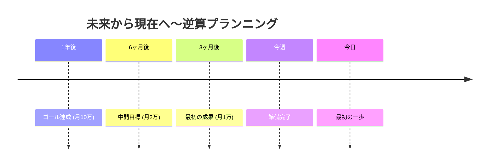

## なぜ計画通りにいかないのか〜順算思考の罠

目標を立てたのに、達成できない。頑張っているのに、結果が出ない。

それは、順算思考で考えているからかもしれません。

「今できること」から始めて積み上げていく順算思考は、以下の問題を抱えています：

- **方向がずれていく可能性**: 積み上げていくうちに、本来のゴールから外れてしまう。まるで羅針盤なしに歩き続ける旅人のように。
- **効率が悪い**: 本当に必要なことに気づかず、無駄な努力を続ける。地図なしに走り回って、目的地と逆方向に進んでいくようなもの。
- **ゴールに到達しない**: 積み重ねた結果、当初の目標とは違う場所にいる。「頑張った」けど「届かなかった」という悲しみ。

実例：「毎日英単語を10個覚える」という順算思考の計画。1年で3650語。でも、本当に必要だったのは「英語でプレゼンができること」だったら？単語を覚える努力は必要だけど、それだけではプレゼンはできません。発音練習、構造化の練習、実際に話す練習...違うスキルも必要だったんです。

もう一つの実例：Sさんは「ブログを毎日書く」ことにこだわり、3年間続けました。でも「なぜ書くのか」が不明確で、読者は増えず、収益化もできませんでした。ゴールが「書くこと」ではなく「情報発信で価値を提供し、収益を得ること」だったら、戦略は変わったはずです。

## 逆算思考 vs 順算思考〜2つの違い

### 順算思考：今から積み上げる

「今できること」から始めて、積み上げていく。

**問題点：**
- 方向がずれていく可能性：ゴールを見失いがち
- 効率が悪いことに時間を使う：本当に必要なことを見落とす
- ゴールに到達しないかもしれない：別の場所にたどり着く

### 逆算思考：ゴールから今日を決める

「達成したい状態」から逆算して、今日やることを決める。

**メリット：**
- 優先順位が明確になる：何が本当に必要かがわかる
- モチベーションが維持しやすい：ゴールが常に見えている
- 最短ルートでゴールに近づける：ムダを省いた効率的な道筋

有名なエクスペディアの創業者は、「旅行者が最短ルートを求めるように、目標達成も最短ルートを設計すべきだ」と語りました。逆算思考は、その最短ルートを見つける羅針盤です。

### 逆算思考のタイムライン

## 逆算思考を実践する4ステップ

### Step 1: ゴールを具体的に描く〜数値化の力

「いつまでに」「どんな状態になっている」を明確に。数値化できればベスト。

❌ 「英語ができるようになる」
✅ 「1年後に、英語で15分のプレゼンができる」

❌ 「副収入を得る」
✅ 「1年後に、月10万円の副収入を得ている」

❌ 「体を鍛える」
✅ 「3ヶ月後に、10km走れる体力をつける」

具体例：「フリーランスとして独立したい」という目標は漠然としています。逆算するには、「1年後に月50万円の安定した収入を得ている」「得意分野はWebデザイン」「クライアントは月3社」など、具体化が必要です。

### Step 2: マイルストーンを設定〜中間地点の重要性

ゴールから逆算して、中間地点を決める。

例：月10万円の副収入を目指す場合
- 12ヶ月後: 月10万円
- 9ヶ月後: 月5万円
- 6ヶ月後: 月2万円
- 3ヶ月後: 最初の1万円

これにより、「今がどのフェーズか」が明確になります。

実例：独立を目指す場合
- 12ヶ月後: 独立し、月50万円の収入
- 9ヶ月後: 副業で月20万円、独立準備
- 6ヶ月後: 副業で月5万円、実績作り
- 3ヶ月後: 副業第1号案件獲得

マイルストーンがあると、「今はこのフェーズなんだ」と安心して取り組めます。全てを同時にやろうとしないで、今のフェーズに集中できます。

### Step 3: 各期間でやるべきことを特定〜タスク分解

3ヶ月で1万円を達成するには？
- スキルを身につける
- 実績を作る
- 営業する

このレベルまで分解し、具体的なアクションに落とし込みます。

さらに分解すると：
- スキルを身につける → オンライン講座を受講する（週2回、計24回）
- 実績を作る → 無料で3件サポートする（ポートフォリオ用）
- 営業する → SNSで発信し、問い合わせを募る（週3投稿）

「何をするか」だけでなく「どのくらいの頻度で」まで落とし込むことが重要です。

### Step 4: 今週・今日にブレイクダウン〜実行可能な単位へ

今週やること：
- オンライン講座を完了させる
- ポートフォリオを1つ作る

今日やること：
- 講座の第1章を見る

「今週何をするか」まで分解できれば、あとはカレンダーに入れるだけです。

実践例：副業を始めたい場合の今日のタスク
- 19:00〜19:30：Udemyで講座の導入動画を視聴
- 19:30〜20:00：学んだことをNotionにメモ
- 20:00〜20:30：Twitterで学びをシェア

具体的に「いつ」「何をするか」まで落とし込むと、実行率が飛躍的に上がります。

## 逆算思考の3つの注意点

### 1. 柔軟性を持つ〜計画は生き物

計画通りにいかないことも多い。修正しながら進むことを想定しておく。

毎月の振り返りで、目標と現実のギャップを確認し、軌道修正を行いましょう。

例：予定より早く成果が出た → 目標を上げる
例：思ったより時間がかかる → 期限を延ばす、または目標を下げる

計画は「鉄則」ではなく「指針」です。GPSのように、進みながら最適ルートを再計算しましょう。

### 2. 前提を疑う〜現実的かの検証

逆算した計画が現実的か、検証する。無理があれば、ゴールや期限を調整。

「1年で月100万円」という目標が、現実的でないと分かったら、「2年で月50万円」に修正するのは全く問題ありません。

一方で、「難しいから無理だ」と早合点するのも要注意。実際に小さく試してみて、「無理」か「まだ努力が足りないだけ」かを確認しましょう。

### 3. 行動を最優先〜計画より実行

計画に時間をかけすぎない。80%の計画で走り出し、走りながら修正する。

完璧な計画を立てるより、不完全でも実行を始める方が成果は出ます。

「計画に3ヶ月、実行に3ヶ月」より「計画に1週間、実行に5ヶ月3週間」の方が、圧倒的に学びも成果も多く得られます。

## ゴールが道を照らす〜逆算思考の本質

ゴールがなければ、どの道が正しいかわからない。

船乗りの格言に「羅針盤がなければ、どの風も間違った風だ」というものがあります。ゴール（行き先）が決まっていれば、今の風（環境）をどう活かすかがわかります。

今夜、まず1年後のゴールを紙に書いてみてください。そこから逆算すれば、明日やることが見えてきます。

**あなたの次のアクション**: 今週1つ、逆算思考で目標を立ててみましょう。1年後の姿を想像し、今日やるべきことを書き出すだけでOKです。
