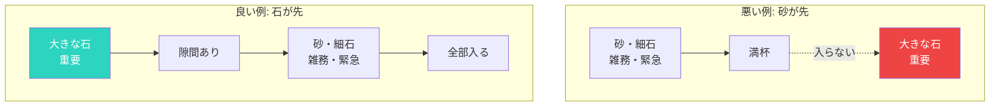

## 大きな石の法則〜瓶に入れる順番が人生を決める

有名なたとえ話があります。

瓶に大きな石、小さな石、砂を入れる順番の話。

もし砂を先に入れると、大きな石が入らなくなる。でも、大きな石を先に入れれば、隙間に小さな石と砂も入る。

人生も同じです。

実際の例：ある経営者は、「忙しい」を理由に家族の時間を削っていました。毎日深夜帰宅、週末も出張か会議。ある日、子どもが「パパはいつも仕事ばっかり」と言ったのをきっかけに、週末は完全に家族の時間に。スマホはオフにして、子供と公園に行き、妻と話す時間を作りました。

驚くべきことに、仕事の生産性が上がったんです。平日の集中力が高まり、部下の成長も加速しました。「家族との時間」を守ることで、逆に仕事も良くなったのです。

## 大きな石とは〜本当に大切なことの特定

本当に大切なこと：

- 家族との時間
- 健康
- 長期的な目標
- 自己成長
- 大切な人間関係

これらは「緊急」ではないことが多い。だから後回しにされがち。

でも、これらこそが人生の質を決める「大きな石」なのです。

ある癌になった経営者は、「後悔していること」として「もっと家族との時間を作ればよかった」と語りました。「会社の業績はもうどうでもいい。家族との時間こそが、本当に大切だった」。彼の言葉は多くの人の心を打ちました。

## 砂と小さな石とは〜緊急だけど重要でないこと

日常の雑務、緊急だけど重要でないこと：

- メールの返信
- SNSのチェック
- ダラダラとしたテレビ
- 他人の都合に合わせた予定

これらは「緊急」に見えるので、先に対応してしまいがち。

でも、これらは人生の質を左右するものではありません。

メールは毎日来るし、すぐに返さなくても大丈夫なものも多い。SNSは見始めると止まらない。でも、これらに時間を取られて「大きな石」の時間が失われると、人生は豊かにはなりません。

ある調査によると、ビジネスパーソンは1日平均2時間をメールに費やしています。でもそのうちの多くは、本当に重要なメールではありません。

### 優先順位の入れ方

## 大きな石を先に入れる4ステップ

### Step 1: 自分の「大きな石」を特定する

何が本当に大切か？3〜5つ書き出してみてください。

例：
1. 家族との時間
2. 健康（運動・睡眠）
3. キャリアの成長
4. 親しい友人との関係
5. 趣味・創作活動

「緊急」ではないけれど「重要」なもの。これを選ぶのがポイントです。

あるクライアントは、「家族、健康、学習、友人」という4つの大きな石を選びました。「キャリア」は選びませんでした。「キャリアは、これらが整ってから自然と良くなる」と彼は気づいたのです。

### Step 2: 先にカレンダーに入れる〜時間ブロッキング

「空いた時間にやる」ではなく、先に予約する。

週の始めに、大きな石の時間をブロック。

- 土曜日の午前中：家族との時間（予約済み）
- 朝6時〜7時：運動の時間（予約済み）
- 毎週水曜日の夜：友人との夕食（予約済み）

「予約した」という意識が重要です。予約した歯医者には行きますよね？同じように、大きな石の時間も予約された大切な予定として扱います。

作家のハリウッド・ゴールドスミスは、「朝の4時から8時までを執筆時間にしている」と語っていました。家族が起きる前の静かな時間。これを守ることで、年に2冊の本を書き続けています。

### Step 3: 砂を減らす〜断捨離の実践

本当にやる必要があることか？

やめる、減らす、任せる、を検討。

- 不要な会議への出席を断る
- SNSのチェック時間を制限する（1日15分に）
- 雑務をアシスタントに任せる
- メールの返信時間を固定する（1日2回、午前と午後）

「断る」ことの練習も必要です。「その会議には出席しません。議事録を共有してください」と言える勇気。

あるCEOは、会議の出席要請の80%を断るようにしたと言います。「部下に任せればいい。私が出なくても回る」。結果、戦略的な思考の時間が増え、会社の成長が加速しました。

### Step 4: 境界線を引く〜守り抜く勇気

大きな石の時間は、他のことで侵食しない。

「予定があります」と言える勇気を持つ。

「土曜日の午前中は家族の時間なので、その時間は仕事をしません」。この一言が、家族との絆を深め、自分の心の充実にもつながります。

あるコンサルタントは、客先からの「週末に打ち合わせを」の要請を断りました。「家族の時間を守るためです」。すると意外なことに、クライアントはそれを尊重し、「この人は自分の価値観を持っている」と評価しました。

## 優先順位は行動でわかる〜言葉ではなく実践で

「家族が大切」と言いながら、仕事で毎日遅くまで働いている。
「健康が大切」と言いながら、運動する時間を作っていない。

本当の優先順位は、行動に表れます。

1週間の行動を記録してみましょう。実際にどこに時間を使っているかが見えてきます。

「時間監査」を試してみてください：
- 1週間、15分単位で何をしたか記録する
- カテゴリー分けする（仕事、家族、SNS、雑務など）
- 理想とのギャップを分析する

この作業をすると、「思っていたよりSNSに時間を使っている」「会議がこんなに多かった」と気づくことが多いです。

## 週の始めに問う〜3つの質問

毎週、自分に問いかけてください。

1. 「今週、大きな石に時間を使えているか？」
2. 「何に時間を使った結果、1週間が過ぎたのか？」
3. 「来週はどう調整するか？」

人生は有限です。大切なことから先に、時間を使いましょう。

ある臨床心理学者は、死を目前にした人々の「後悔」を調査しました。一番多かったのは「もっと家族や友人と時間を過ごせばよかった」。逆に、「もっと働けばよかった」という人はほとんどいませんでした。

「忙しい」は、往々にして「優先順位をつけていない」ことの言い訳です。本当に大切なことを見極め、そこに時間を使う。それが充実した人生への道です。

**あなたの次のアクション**: 今週のカレンダーに、大きな石を1つ入れてみましょう。そして絶対に守ってみてください。違いを実感できますよ。
