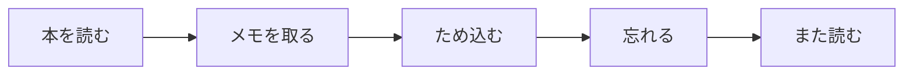
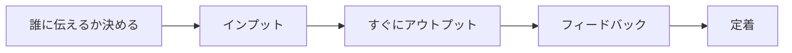
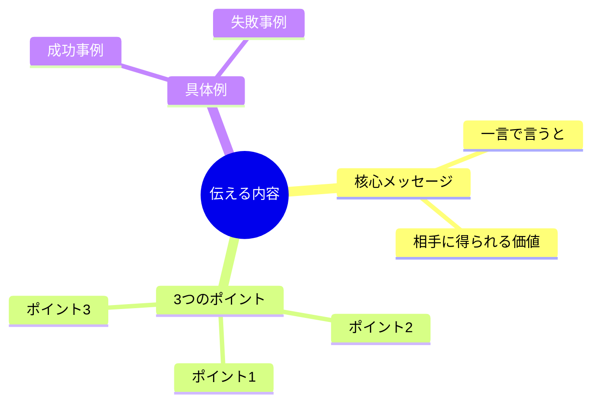
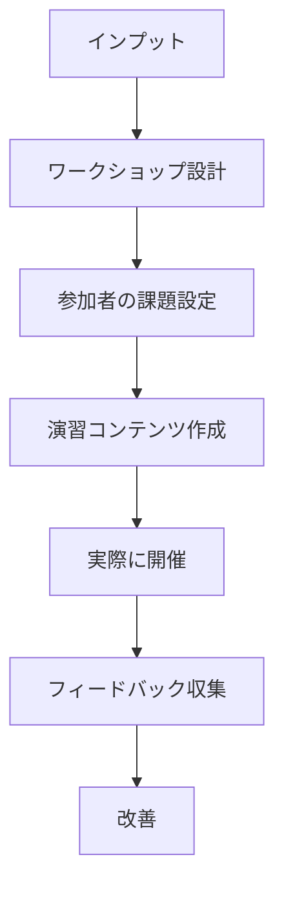

## はじめに

本を読んでも、セミナーに行っても、なかなか知識が定着しないと感じたことはありませんか？

実は、問題は「インプットの仕方」にあります。私たちは無意識に「ため込む」ことに集中しがちですが、**本当に効果的な学習は「出す」ことを前提にしたインプット**から始まります。

## アウトプット前提のインプットが生む3つの変化

### 従来の学習の落とし穴

多くの人が陥るパターンがあります。

このサイクルは永遠に続きます。なぜなら、脳は「使わない情報」を不要と判断し、優先的に削除するからです。

### 脳の仕組みを逆手に取る

アウトプット前提のインプットは、この仕組みを逆手に取ります。

**「この知識、誰かに説明できるか？」**この問いが、学習の質を劇的に変えます。

## 成功者の習慣：バッファロー大学の実験

ニューヨーク州立大学バッファロー校で行われた実験で、学習効果に大きな差が出ました。

**実験内容**：
- Aグループ：2回読む（インプットのみ）
- Bグループ：1回読んで、1回説明する（アウトプットあり）

**結果**：Bグループの記憶定着率はAグループの**2倍以上**でした。教えるつもりで学ぶことで、脳は「この情報は重要だ」と判断し、深く処理するのです。

著名な経営者の孫正義氏も「教えることで学ぶ」を実践しています。新しい知識を得たら、すぐに周囲に説明し、疑問点を洗い出していたと言います。

## 実践フレームワーク：「3Sメソッド」

### 1. Select（選ぶ）

まず、誰に何を伝えるかを明確にします。

- 後輩に教える技術書
- 友人に勧める自己啓発本
- チームに提案するビジネス書

相手を具体的にイメージすると、**必要な情報の「取捨選択」が自然にできる**ようになります。

### 2. Structure（構造化）

インプットしながら、「どう説明するか」の構造を考えます。

### 3. Share（共有）

インプット後、**24時間以内**に何らかの形でアウトプットします。

- SNSに3行で要約
- 友人に話す
- ブログ記事を書く
- 社内で共有

## レベル別アウトプットの形

### レベル1：「教える」つもりで読む

本を開く前に、「この本を読んだら、誰かに教えよう」と決めます。

読みながらメモを取る際、**「ここはどう説明しよう？」**と考えながら書き留めます。

### レベル2：「ブログ記事」として書く

読み終わったら、800〜1000字のブログ記事を書きます。

自分の言葉で噛み砕くことで、**表面的な理解ではない「血肉化」**が起こります。

**30代マーケターMさんの例**：
「月に2冊ビジネス書を読んで、noteにまとめています。最初は大変でしたが、1年で300人以上のフォロワーがつき、会社でも『調べ物はMさんに聞け』と言われるようになりました」

### レベル3：「ワークショップ」として設計する

最も深いレベルです。

人に教える準備をすることで、自分の理解の穴が明確になります。

## アウトプットで変わった人々のストーリー

**ケース1：コンサルタントKさん（42歳）**
「これまで年100冊本を読んでいましたが、内容を覚えているのはほんの数冊。アウトプット前提に切り替えてからは、読書量は半分になりましたが、『あの本のこの部分』が即座に引き出せるようになりました。クライアントへの提案の引き出しが増え、売上が1.5倍に」

**ケース2：大学院生Tさん（26歳）**
「研究内容をSNSで週1回発信するようにしたところ、分からない部分が明確になり、指導教官から『最近整理が進んだね』と言われました。学会発表でも自信を持って話せるようになりました」

## 実践できること

今日から始められる3つのステップ：

**① 明日読む本の「伝える相手」を決める**
家族、友人、同僚。誰でも構いません。

**② 読み終わったら「3行要約」をSNSに投稿**
完璧を求めず、まずは出すこと。

**③ 週に1回「学びの共有会」を開催**
オンラインでもオフラインでも。教える場を持つことで、学習が加速します。

## まとめ

アウトプット前提のインプットは、単なる「効率的な学習法」ではありません。

**「自分の頭で考え、自分の言葉で表現する」**この力こそが、知識を「知恵」に変える鍵です。

インプットの量を追い求めるのではなく、一つのアイデアを深く噛み砕き、誰かに伝えられるまで仕上げる。

その繰り返しが、真の学びを生み出します。

---

## セッションでできること

コーチングセッションでは、あなたの「学び方」を一緒に見直します。

- 今のインプットの習慣の分析
- アウトプットの場の設計
- 教えることで深まる「理解の質」の体験

**「知っている」ことと「できる」ことの間には、アウトプットという大きな溝があります。**

その溝を埋めるお手伝いをさせてください。
