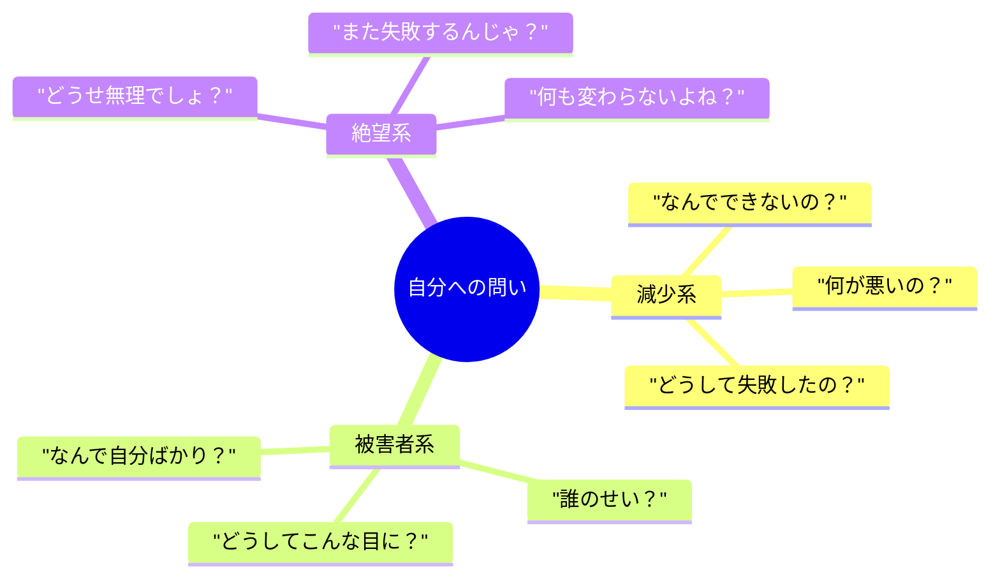
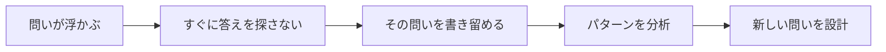
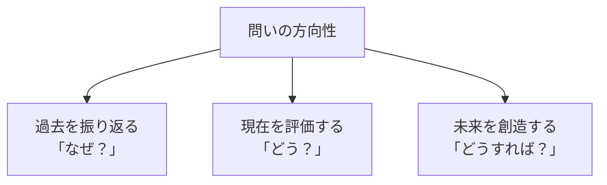
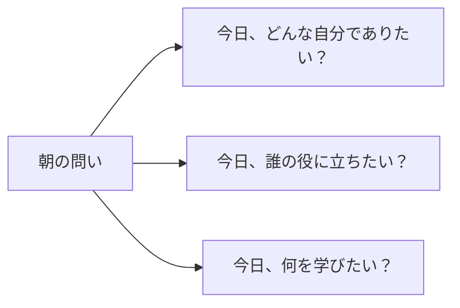

## はじめに

朝起きてから今まで、
自分に何回「問い」を投げかけましたか？

「今日は何しよう？」
「あの仕事、どうしよう？」
「なんでこんなに疲れてるんだろう？」

実は、私たちは1日に何百回も
自分に問いかけています。

そして**その「問い」の質が、
答えの質、そして人生の質を決めています。**

---

## 問いのパターンを可視化する

### 破壊的な問いの例

無意識に繰り返している問いを
書き出してみてください。

これらの問いには共通点があります。
**答えが「否定的」になるように設計されている**のです。

### 建設的な問いへの転換

同じ状況でも、
問いを変えるだけで答えが変わります。

| 破壊的な問い | 建設的な問い |
|------------|------------|
| なんでできないの？ | どうすればできるか？ |
| どうして失敗したの？ | 次はどう改善するか？ |
| なんで自分ばかり？ | この状況から何を学べるか？ |
| どうせ無理でしょ？ | まずどこから始められるか？ |

---

## 質問のアップデートフレームワーク

### ステップ1：現在の問いを観察する

1週間、自分が投げかけている問いを
意識的に記録してみましょう。

驚くべきことに、
**同じネガティブな問いを繰り返している**ことに気づきます。

### ステップ2：問いの「方向」を変える

問いは大きく3つの方向を向きます。

**未来志向の問い**に切り替えるだけで、
エネルギーの向きが変わります。

### ステップ3：問いを「大きく」する

日常の小さな悩みに対して、
**もっと本質的な問い**を投げかけます。

- 「この仕事、何時までに終わる？」
  → 「この仕事を通じて、何を学びたい？」

- 「あの人、どう思ってるんだろう？」
  → 「どう関われば、お互いに成長できる？」

- 「今日何食べよう？」
  → 「体にとって最適な選択は何？」

---

## 朝と夜の「問いの儀式」

### 朝の問い：方向を定める

目覚めた瞬間に、
自分に問いかけます。

答えを出す必要はありません。
**問いを意識にのせる**だけで、
脳がその方向に情報を集め始めます。

### 夜の問い：学びを深める

寝る前に、
振り返りの問いを投げかけます。

- 「今日、最も学んだことは何？」
- 「明日、もし1つだけ変えるとしたら何？」
- 「今日、感謝できることは何？」

この問いが、
睡眠中の脳の整理を助けます。

---

## 実践できること

**① 問いの日記を始める**
答えを書くのではなく、
「今日、自分に投げかけた問い」を記録する。

**② 3つの問いを選ぶ**
毎日使う「定番の問い」を3つ決める。
例：
- 今、何が最も重要か？
- これを10年後の自分はどう見るか？
- どうすれば、もっと楽しめるか？

**③ 問いの「クオリティチェック」**
問いを投げる前に、
「この問いに答えたら、
　自分はエネルギーを得るか、失うか？」
と確認する。

---

## まとめ

問いとは、
**脳への「検索ワード」**です。

「なんでダメなの？」と問えば、
ダメな理由を探しに行きます。

「どうすればできるか？」と問えば、
解決策を探しに行きます。

同じ脳でも、
**問いの質で、全く異なる答え**を引き出します。

今日から、
自分が使っている問いに意識を向けてみてください。

そして、
もっと建設的な問いに、
一つずつ置き換えていく。

それが、人生の質を変える
最も確実な方法です。

---

## セッションでできること

コーチングセッションでは、
あなたの「無意識の問い」を一緒に探ります。

- 繰り返しているネガティブな問いの特定
- 未来志向の問いへの書き換え
- 朝と夜の「問いの儀式」の設計

**あなたが使っている問いが、
あなたの人生を作っています。**

より良い問いを見つけるお手伝いを、
ぜひさせてください。
