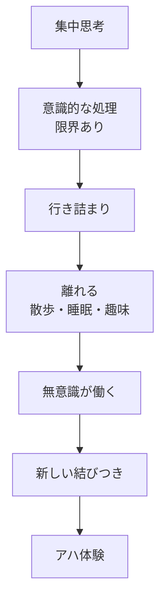
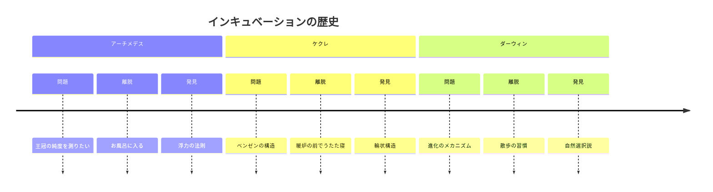
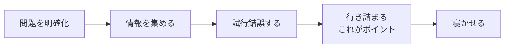
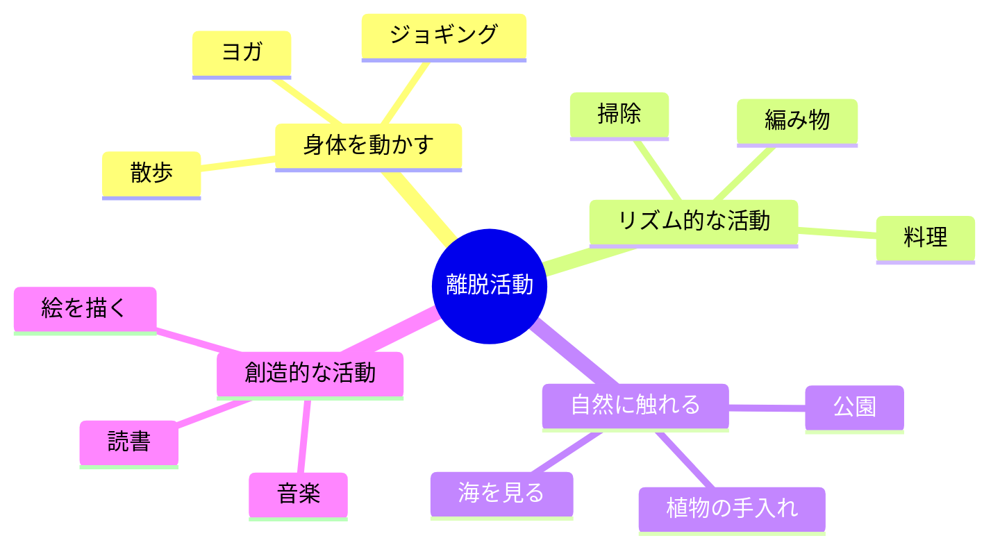
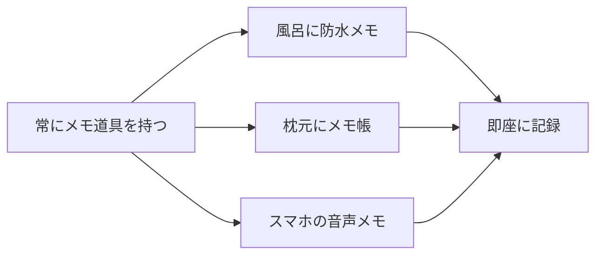
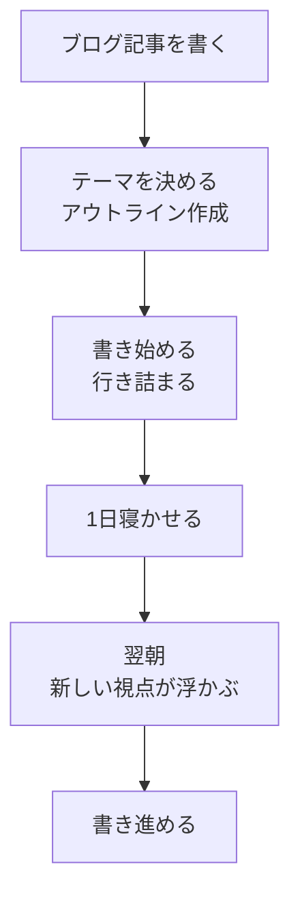
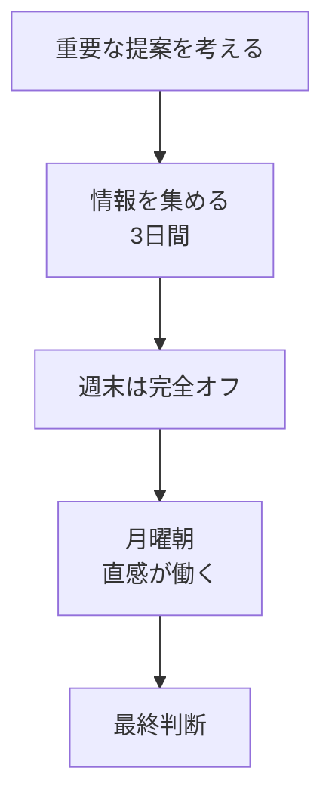
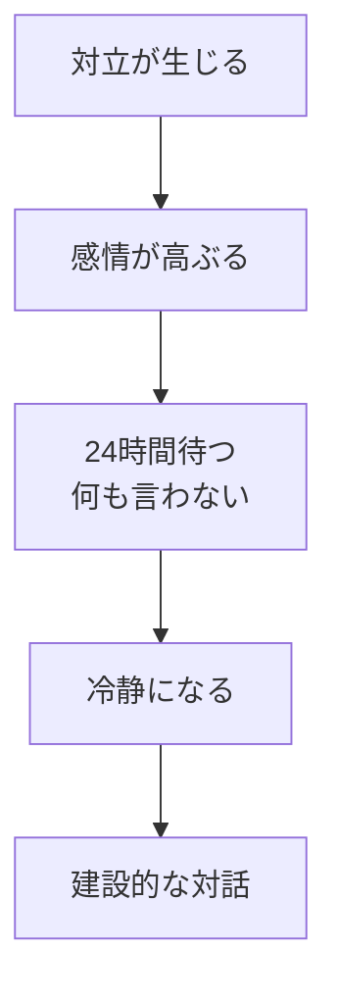

## はじめに

「この問題、どう解決しよう？」

必死に考えて、
紙に書き出して、
頭を抱えて...

でも答えが出ない。

そんな経験、ありませんか？

実は、**考えすぎると答えは遠ざかります**。
脳には「寝かせる」ことで
動き出す仕組みがあるのです。

---

## インキュベーションの科学

### なぜ「離れる」ことが有効か

意識的な思考は、
**論理的で直線的**です。

一方、無意識は
**並列的で創造的**です。

問題から離れた時、
脳はバックグラウンドで
情報を組み替え続けています。

### 歴史的事例

---

## 効果的なインキュベーションの方法

### ステップ1：十分に「詰める」

寝かせる前に、
**問題を十分に理解**しておく必要があります。

「何も考えずに寝かせる」
ではなく、
「考え尽くしてから寝かせる」
のが重要です。

### ステップ2：意図的に「離れる」

問題から離れる活動を選びます。

**重要なのは、
同じ問題を考えないこと**。

### ステップ3：「捕まえる」準備

アイデアは突然やってきます。

朝起きた瞬間、
シャワー中、
電車の中...

**準備ができていないと、
貴重なアイデアが消えます**。

---

## インキュベーションの実践例

### 創造的な仕事

### ビジネスの意思決定

### 人間関係の問題

---

## 実践できること

**① 「寝かせるリスト」を作る**

悩んでいる問題を書き出し、
「これは寝かせる」と決める。

**② 散歩を「思考の時間」に**

毎日30分、
問題を意識的に離れる散歩。
スマホはポケットに。

**③ 朝の「アイデアキャッチ」**

目覚めた瞬間、
夢や閃きをメモする習慣。
無意識からの贈り物です。

**④ 「強制インキュベーション」**

大きな決断をする時は、
必ず1晩寝かせるルールを作る。

---

## まとめ

思考の整理学とは、
**「考える」と「離れる」のリズム**です。

常に考え続けるのではなく、
考えて、離れて、
また戻ってくる。

このサイクルが、
**深い洞察と創造的なアイデア**を
生み出します。

焦らず、
信頼して、
時間を味方につける。

それが、
思考の質を高める
秘訣です。

---

## セッションでできること

コーチングセッションでは、
あなたの「考えすぎ」のパターンを
一緒に見直します。

- 問題を「寝かせる」タイミングの設計
- 無意識からのメッセージの受け取り方
- 創造的なリズムの作り方

**時に、答えは「考える」ことより、
「考えるのをやめる」ことで
見えてきます。**

そのバランスを見つけるお手伝いを、
ぜひさせてください。
