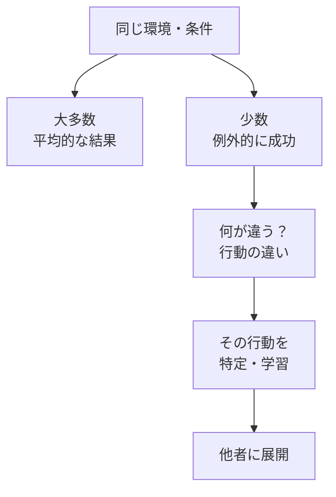
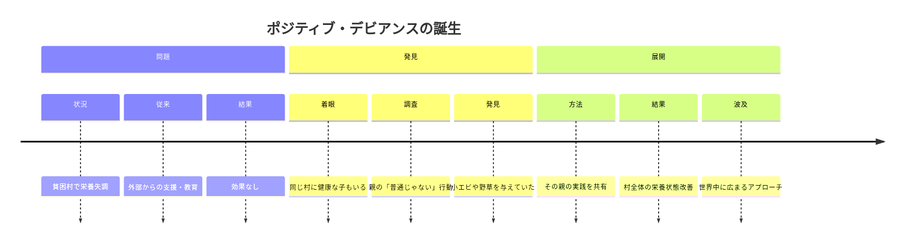
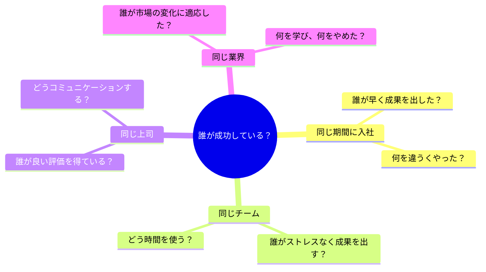
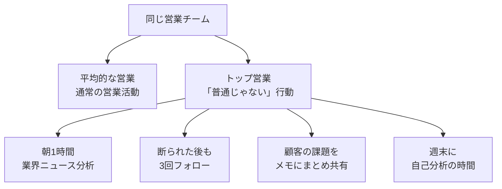
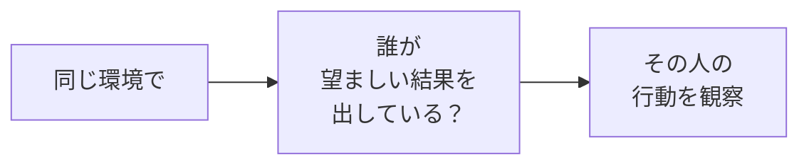
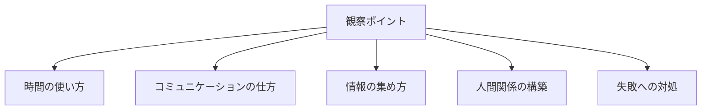
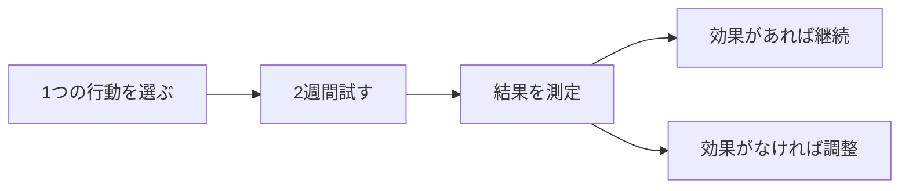

## はじめに

同じ職場で、
同じ条件で、
同じ制約の中で...

なのに、
**ある人だけが驚くほど成果を出している**。

なぜでしょう？

彼らは特別な才能があるわけでも、
特別なリソースを持っているわけでもありません。

**「普通じゃない」行動をしている**だけです。

これが「ポジティブ・デビアンス」、
前向きな逸脱の力です。

---

## ポジティブ・デビアンスとは

### 概念の理解

従来のアプローチ：
「問題を分析して解決策を導入する」

ポジティブ・デビアンス：
**「すでに解決している人から学ぶ」**

### 歴史的背景

1990年代、ベトナムの貧困村で
栄養失調の子どもたちがいました。

**解決策は外部にあったのではなく、
すでにその場にあった**のです。

---

## 職場でのポジティブ・デビアンス

### 観察の視点を変える

### 具体的な違いの例

これらは特別な才能ではなく、
**誰でもできる「行動の違い」**です。

---

## ポジティブ・デビアンスの実践ステップ

### ステップ1：「誰が？」を特定する

- 同じ部署で評価が高い人
- 同じ時期に入社したのに早く昇進した人
- 同じ業務量なのに残業が少ない人

### ステップ2：「何が違う？」を分析する

**「特別なこと」ではなく、
「小さな違い」**に注目します。

### ステップ3：「自分に適用」を試す

---

## 実践できること

**① 「成功マップ」を作る**

自分の周りの「同じ環境で成功している人」を
3人リストアップする。

**② 「行動観察日記」をつける**

1週間、その人の
「普通じゃない行動」を記録する。

**③ 「1つだけ真似する」**

全てを真似るのではなく、
1番取り入れやすい行動から始める。

**④ 自分が「ポジティブ・デビアント」になる**

困難な状況でうまくいった時、
自分の「普通じゃない行動」を分析し、
他の人に共有する。

---

## まとめ

ポジティブ・デビアンスは、
**「外部の専門家」に答えを求めるのではなく、
「身近な成功者」から学ぶ**姿勢です。

特別な才能やリソースは不要。
**観察する目と、真似する勇気**だけで、
結果は変わります。

同じ環境の中で、
誰かがすでに解決している。

その事実を見つけ、
その行動を学び、
自分に適用する。

それが、
**最も現実的で確実な成長の方法**です。

---

## セッションでできること

コーチングセッションでは、
あなたの周りの「ポジティブ・デビアンス」を
一緒に探します。

- あなたの環境での成功パターンの発見
- 「普通じゃない行動」の特定と分析
- 自分に適した行動の選択と実践計画

**あなたの周りには、
すでに答えが転がっています。**

それを見つけて、
あなたのものにするお手伝いを、
ぜひさせてください。
