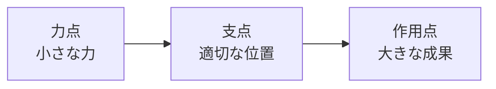
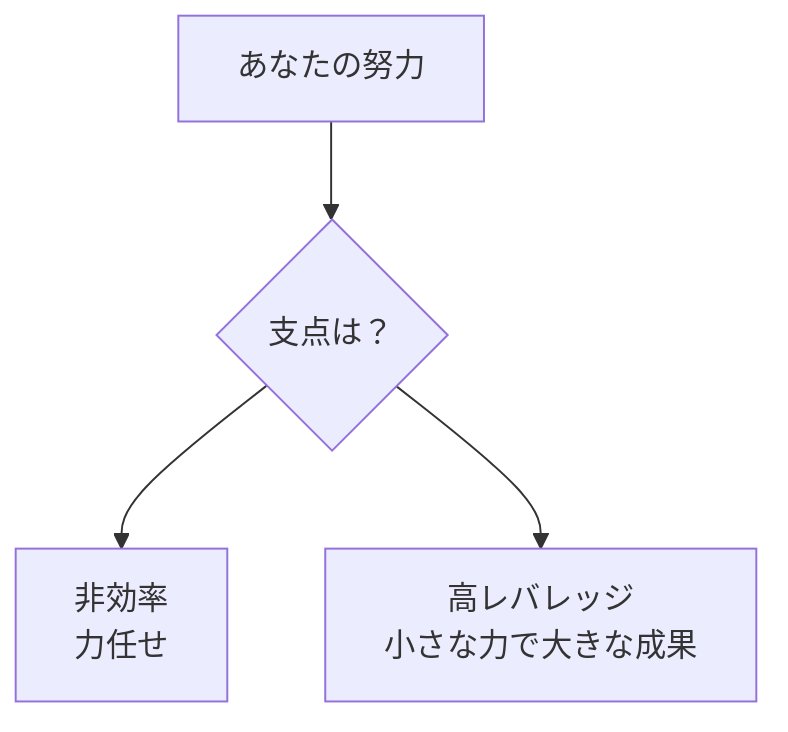
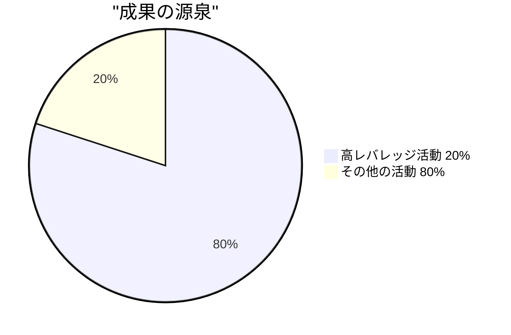
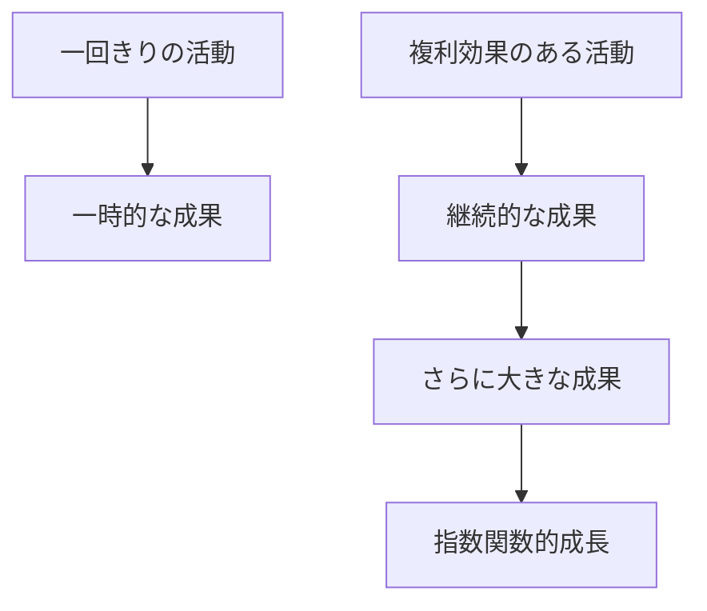
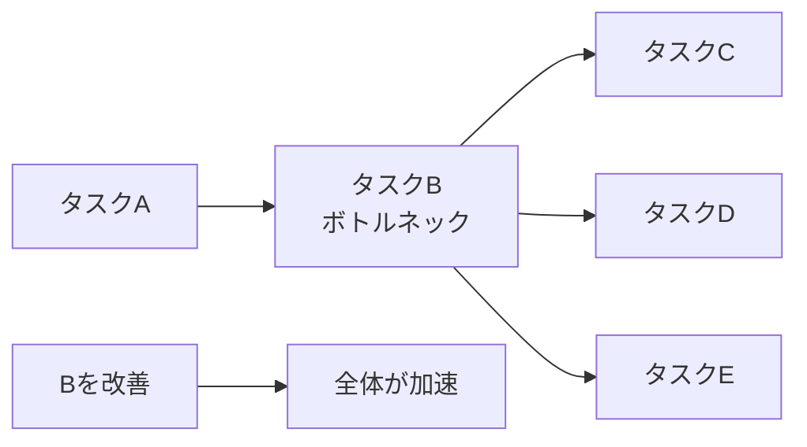
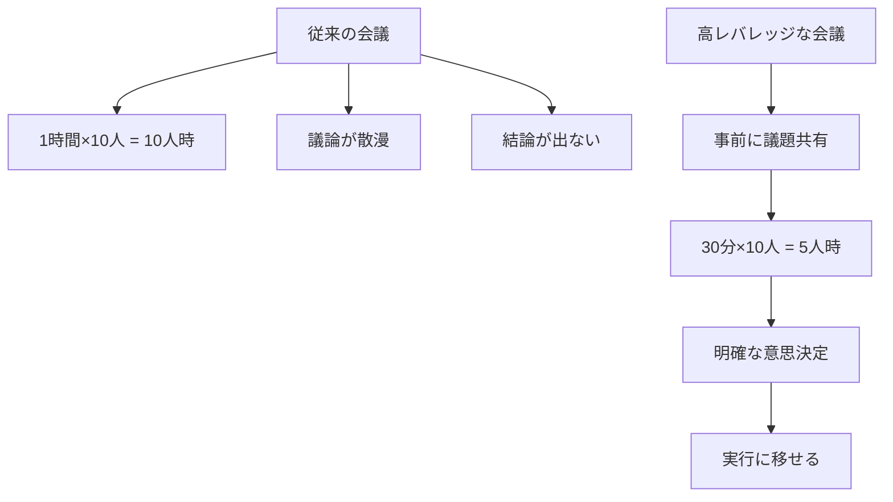
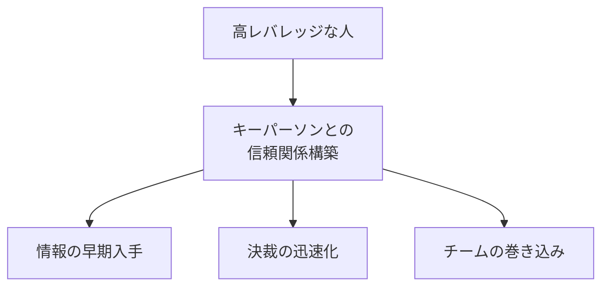
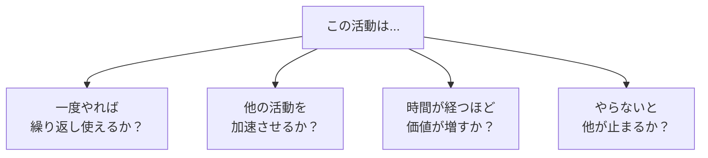
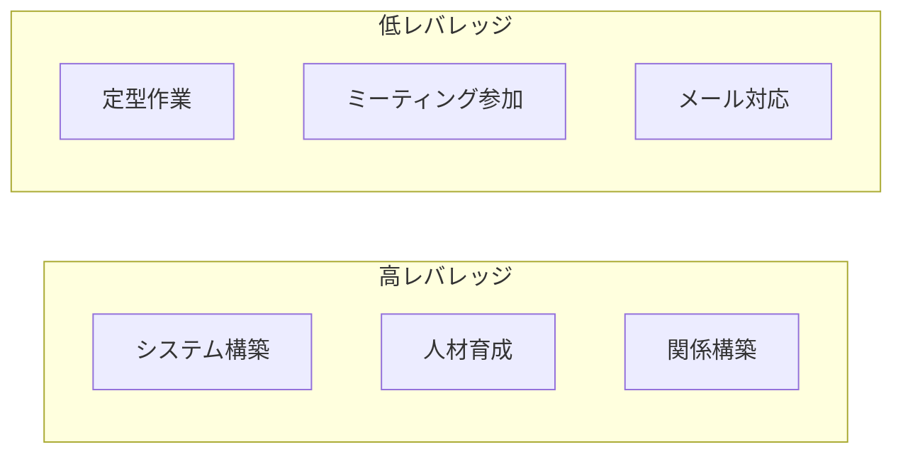

## はじめに

「頑張っているのに、
成果が出ない...」

そんな経験、ありませんか？

実は、問題は「頑張り足りない」ことではなく、
**「どこに力を入れているか」**にあります。

物理でいう「レバー」の原理。
小さな力でも、
支点の選び方で大きなものを動かせます。

思考にも同じ原理が働きます。

---

## レバレッジとは何か

### 物理的な理解

**「力を入れる場所」と「支点」の選び方**で、
同じ努力でも全く異なる結果が生まれます。

### 思考への応用

---

## 高レバレッジ活動の見つけ方

### 1. 80/20の法則を意識する

**20%の活動が80%の成果を生む**。
その20%を見つけることが鍵です。

### 2. 「複利効果」を考える

高レバレッジな活動の特徴：
- 一度やれば繰り返し使える
- 時間が経つほど価値が増す
- 他の活動を加速させる

### 3. 「ボトルネック」を解消する

全体の流れを遅らせている
**一つの障害を取り除く**ことで、
全体が動き出します。

---

## 職場でのレバレッジ活用

### 会議の例

**「会議の仕組み」を変える**だけで、
全員の時間が解放されます。

### 人間関係の例

全員と浅く関わるより、
**重要な人と深く信頼関係を築く**方が、
遥かに大きな影響力を持ちます。

---

## レバレッジ診断フレームワーク

### 4つの質問

4つとも「Yes」なら、
**最優先で取り組むべき高レバレッジ活動**です。

### 自分の活動の棚卸し

---

## 実践できること

**① 今週の活動を「レバレッジ度」で分類**

高レバレッジ・中・低の3つに分け、
時間配分を見直す。

**② 「もしこれを改善したら？」の問い**

今の課題の中で、
「これを改善したら全体が楽になる」
ものを1つ選ぶ。

**③ 「自動化・委任化」の検討**

低レバレッジな作業を
どう自動化・委任できるか考える。

**④ 朝の「高レバレッジ時間」**

1日の始まりに、
最もレバレッジの高い活動を
1つだけやる。

---

## まとめ

レバレッジ思考は、
**「もっと頑張る」ことではなく、
「もっと賢く働く」**ことです。

小さな力で大きな成果を出す。
それが可能なのは、
**支点を正しく選ぶ**からです。

忙しさに追われて、
低レバレッジな活動に没頭していませんか？

立ち止まって、
**「どこに力を入れるべきか」**
を問い直す。

その一問が、
あなたの成果を
劇的に変えるかもしれません。

---

## セッションでできること

コーチングセッションでは、
あなたの「レバレッジポイント」を
一緒に探します。

- 今の活動のレバレッジ診断
- 高レバレッジ活動の特定と優先順位付け
- 低レバレッジ活動の削減・自動化計画

**同じ時間を使うなら、
10倍の成果を生む使い方を。**

その設計を一緒にしましょう。
