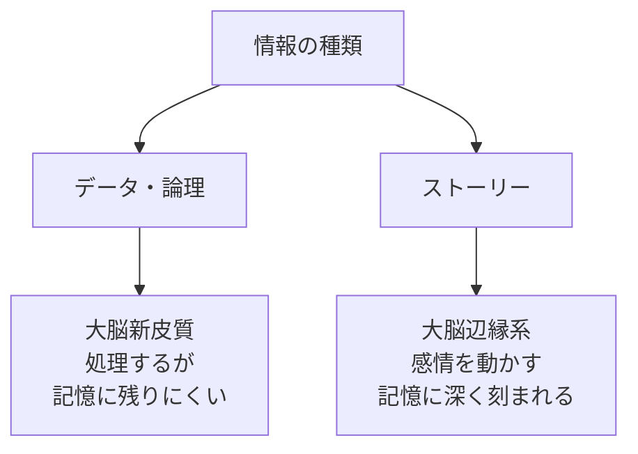
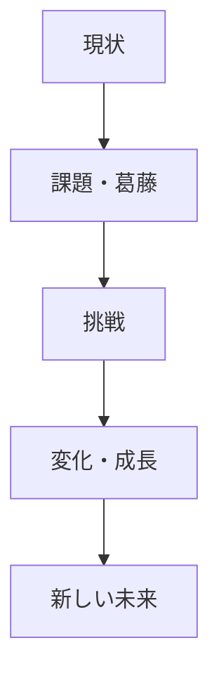
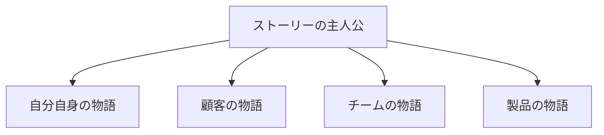
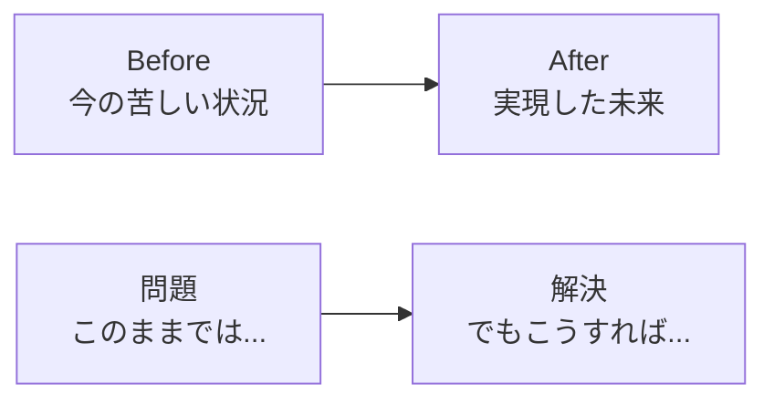
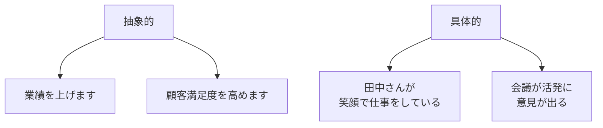
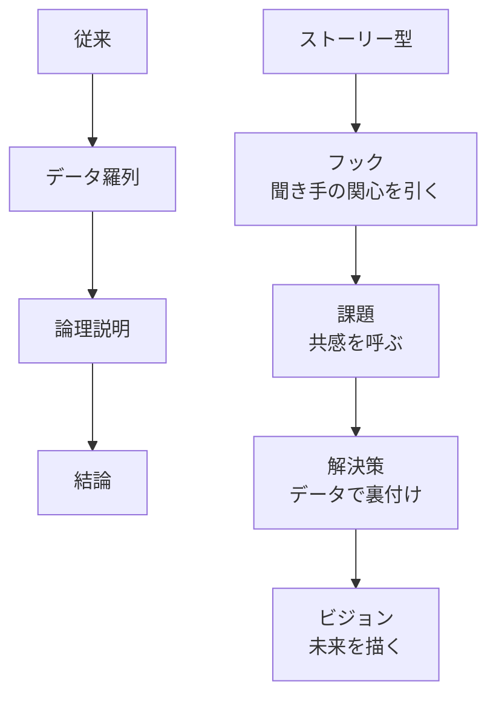
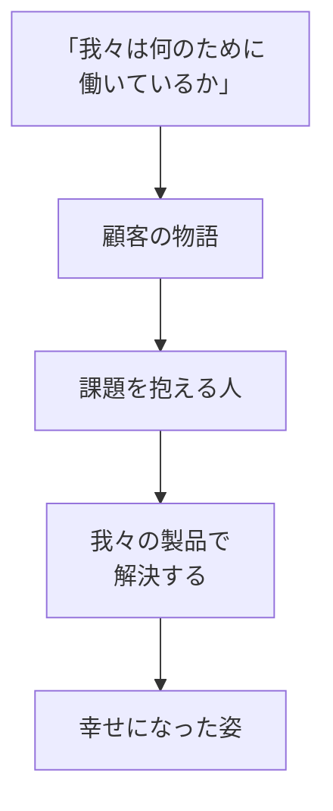

## はじめに

「データは完璧なのに、なかなか人が動いてくれない...」「論理的に説明したのに、相手が納得してくれない...」

そんな経験、ありませんか？

確かに、データと論理は大切です。でも、**人を動かすのは「感情」**です。そして感情を動かすのが、**「ストーリー」**の力です。

## なぜストーリーが必要か

### 人間の脳の仕組み

**事実は忘れても、ストーリーは覚えている**。それが人間の脳です。

## ジョブズと「1000曲」

2001年、iPodの発表会。スティーブ・ジョブズはこう言いました。

「iPodには5GBのハードディスクが入っています」— いや、こうは言いませんでした。

「**1000曲をポケットに入れられます**」

技術スペックではなく、**人の生活を変える物語**を語りました。この一文が、iPodの革命を加速させました。

## ストーリーの基本構造

### 英雄の旅

全ての良いストーリーに共通する構造です。

### ビジネスへの応用

**あなたのビジョンをこの構造で語る**と、人の心が動きます。

## 実践者の声：起業家Sさんのピッチ

Sさんは社会課題解決のスタートアップを立ち上げました。初期投資家へのピッチで、こう変えました。

**Before**：「私たちのプラットフォームは、AIを活用したマッチングシステムで、参加者の83%に満足度の向上が見られました」

**After**：「田舎に帰った大学生の太郎さん。地元に良い出会いがなく、都市部に出るしかないと諦めていました。私たちのアプリで地元の仲間と出会い、今では地域で起業しています。太郎さんのような『もう一つの選択肢』を、全国の若者に届けたい」

結果：**投資額は3倍に**。数字も伝えましたが、物語が心を動かしたのです。

## ストーリー思考の実践

### 1. 「誰の物語か」を明確に

自分語りになりすぎず、**聞き手が主人公になれる物語**を。

### 2. 「対比」を使う

**「今」と「未来」のギャップ**が、変化へのエネルギーを生みます。

### 3. 「具体的な细节」を入れる

**「誰が、どこで、何を」**具体的に描くと、人の想像力が働きます。

## 職場でのストーリー活用

### プレゼンテーション

### チームビルディング

**「お金のため」ではなく、「誰かの物語を変えるため」**この意味づけが、チームの熱量を変えます。

## 実践できること

**① 「なぜ？」をストーリーで答える**

「なぜこのプロジェクトを？」→ データではなく、「誰かのための物語」で語る。

**② 会議の始めに「小さな物語」**

数字の前に、顧客の声や現場のエピソードを1つ話す。

**③ 自分のキャリアを物語として語る**

「どうしてこの仕事を？」→ 単なる経歴ではなく、「転機と成長の物語」として語る。

**④ 週に1回「ストーリータイム」**

チームで、今週の「良かった物語」を1つ共有する時間を作る。

## まとめ

ストーリー思考は、**「嘘をつく」ことではありません**。

データと論理を、**人の心に届く形に翻訳する**ことです。

人は事実では動きません。**意味と感情**で動きます。あなたのビジョンを、誰かの物語として語る。その力が、人を巻き込み、変化を生み出します。

---

## セッションでできること

コーチングセッションでは、あなたの「物語」を一緒に紡ぎます。

- あなたのキャリアストーリーの再構成
- ビジョンのストーリー化
- 人を動かすプレゼンの設計

**あなたの言葉に、もっと力を宿しましょう。**

データと共に、心を動かす物語を。
