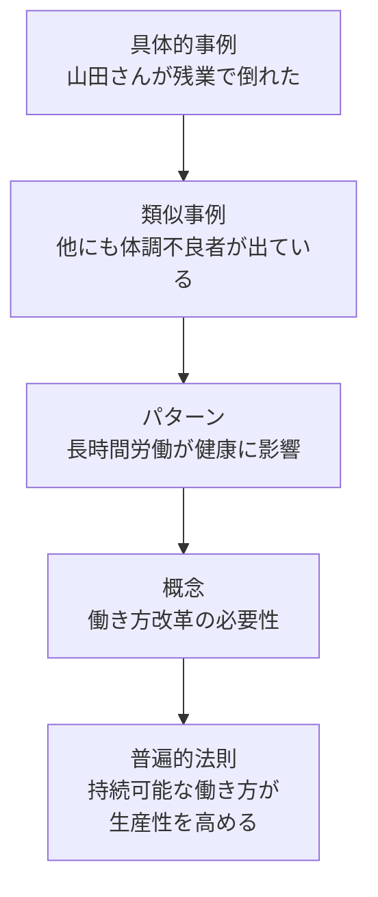
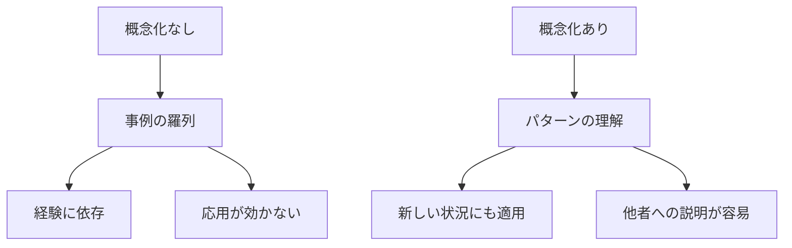
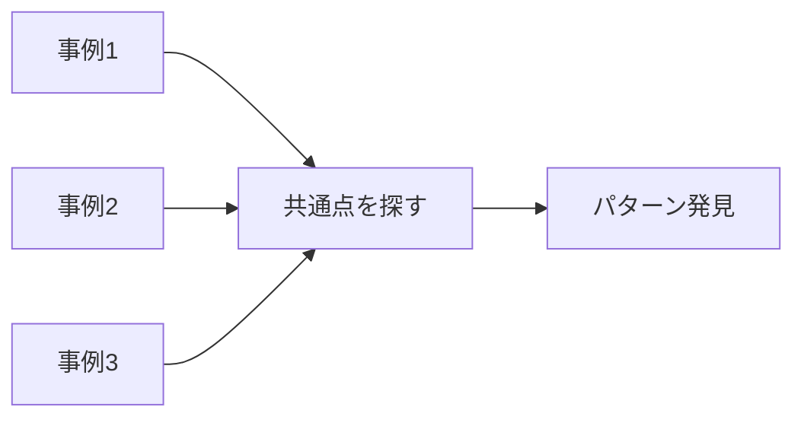
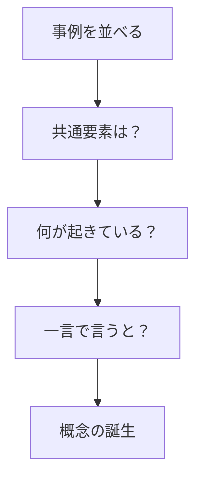
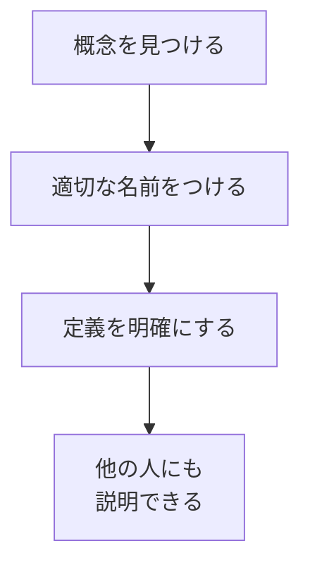
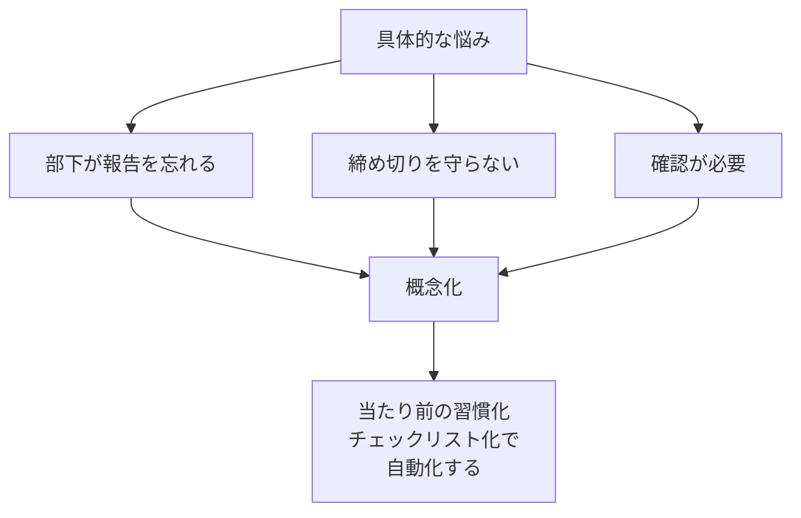
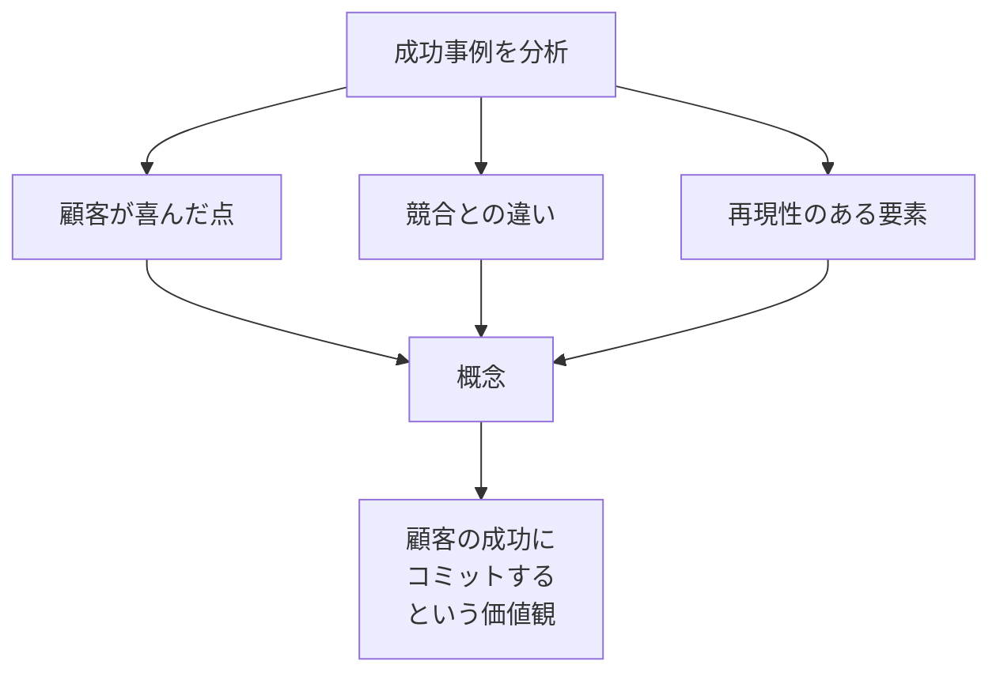
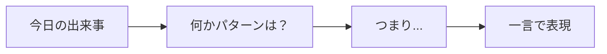
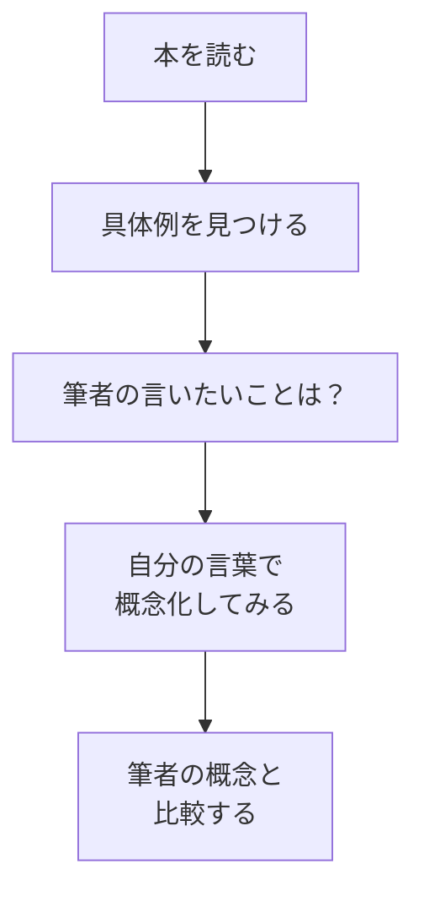
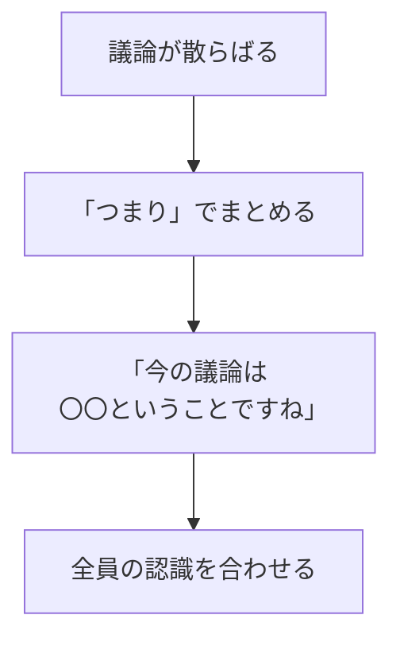

## はじめに

「いろいろな事例を見てきたけど、
なかなかパターンが見えない...」

「経験はあるのに、
それを言語化して伝えるのが難しい...」

そんな悩み、ありませんか？

経験を「知恵」に変えるのが、
**「概念化」の力**です。

個別の出来事から、
普遍的な法則を引き出す。

このスキルが、
リーダーとフォロワーを分けます。

---

## 概念化とは何か

### 具体と抽象の階段

**具体的事例 → 概念 → 普遍的法則**

この階段を上る力が、
概念化スキルです。

### なぜ概念化が重要か

---

## 概念化の実践ステップ

### ステップ1：事例を集める

同じような状況が3つ以上あったら、
**偶然ではなく「パターン」**です。

### ステップ2：「つまり」を探す

**「つまり、これは〇〇ということだ」**

この一言が概念です。

### ステップ3：名前をつける

名前があると、
**議論の共通言語**になります。

---

## 職場での概念化例

### マネジメントの概念化

### ビジネスの概念化

---

## 概念化スキルのトレーニング

### 日常の練習

毎日1つ、
経験を概念化してみましょう。

### 読書での練習

### 会議での練習

---

## 実践できること

**① 「つまりノート」をつける**

毎日の経験から、
「つまり、これは〇〇だ」
を1つ書き出す。

**② 本の「概念」を抜き出す**

読んだ本から、
著者の核心的な概念を
3つ抜き出してみる。

**③ 会議で「まとめ役」を担う**

議論が散らばった時、
「つまり、今の話は...」
と概念化してみる。

**④ 自分の仕事に「名前」をつける**

自分がやっている独自の方法に、
オリジナルの名前をつけてみる。

---

## まとめ

概念化とは、
**「見えているのに見えないもの」を
見える形にする**力です。

個別の経験を、
普遍的法則に昇華する。

その力が、
**リーダーの判断力**となり、
**組織の共通言語**となり、
**新しい価値**を生み出します。

経験をため込むのではなく、
経験を概念化して、
知恵に変えていく。

それが、
成長の加速器となります。

---

## セッションでできること

コーチングセッションでは、
あなたの経験を一緒に概念化します。

- あなたの成功パターンの概念化
- 課題の本質的な定義
- オリジナルフレームワークの開発

**あなたの経験は、
すでに素晴らしい知恵を秘めています。**

それを言語化し、
形にするお手伝いを、
ぜひさせてください。
