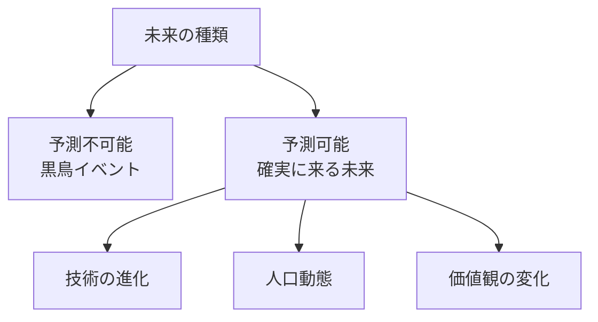
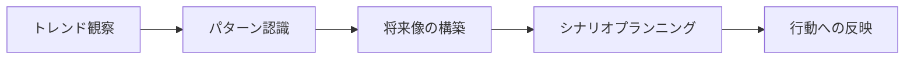
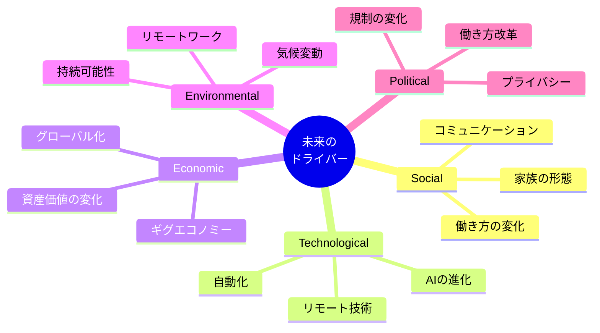
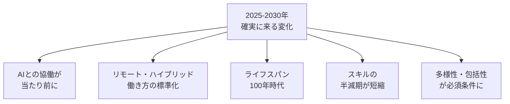
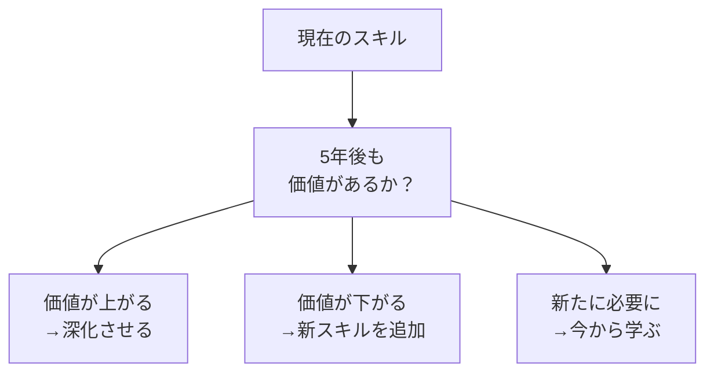
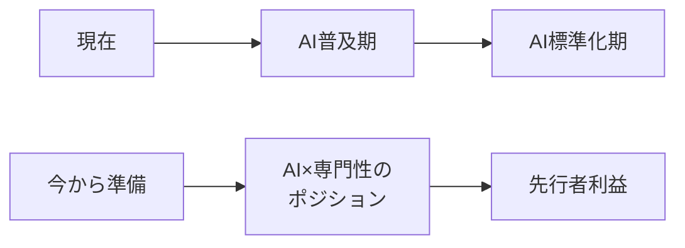
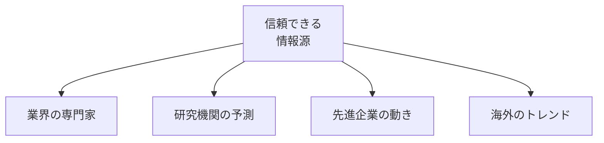
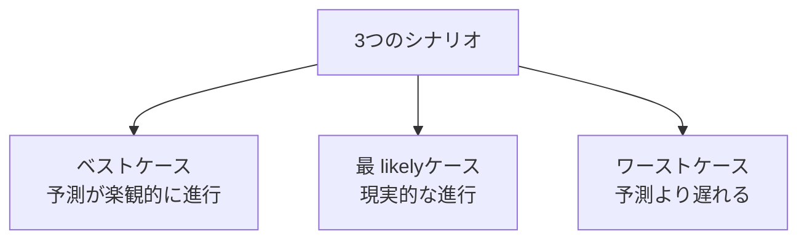
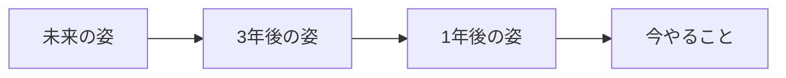

## はじめに

「どんなスキルを身につければいい？」

「この業界、将来どうなる？」

「何を準備しておけばいい？」

未来は不確かで、
誰にも正確にはわかりません。

でも、**「確実に来る未来」**は
予測できます。

そこに先んじて自分を配置すれば、
**波に乗るのではなく、
波を作る側**になれます。

---

## 未来予測の基本

### 予測可能な未来

**「いつ起きるか」は不明でも、
「起きること」は予測できる**。

### 予測のレベル

---

## 予測のためのフレームワーク

### STEEP分析

### 確実に来る未来の例

---

## 自分のキャリアへの応用

### スキルの予測

### ポジショニングの例

---

## 未来予測の実践ステップ

### ステップ1：情報源を選ぶ

### ステップ2：シナリオを描く

### ステップ3：逆算して行動

---

## 実践できること

**① 「未来ニュース」を書く**

「2028年の新聞記事」を
自分で書いてみる。

**② 年に1回「トレンドレビュー」**

自分の業界の
確実に来る変化を
5つリストアップ。

**③ 「逆算キャリアプラン」**

5年後の自分を具体的に描き、
今必要なスキルを特定。

**④ 異業種の動きに注目**

自分の業界以外で、
先進的な変化が
起きている分野を追う。

---

## まとめ

未来は予測できない、
とは言いますが、
**「確実に来る未来」**は
予測できます。

技術の進化、
人口動態、
価値観の変化...

これらは
**急には変わりません**。

そこに先んじて
自分を配置すれば、
**準備万端で未来を迎えられます**。

未来を恐れるのではなく、
未来を予測し、
今から準備する。

それが、
不確実な時代の
**確実な生存戦略**です。

---

## セッションでできること

コーチングセッションでは、
あなたの「未来予測」を
一緒に立てます。

- あなたの業界・専門性の未来予測
- 3つのシナリオの構築
- 逆算キャリアプランの設計

**未来は予測するものではなく、
創るもの。**

[→ 体験セッションの詳細を見る](/sessions)
一緒に、
あなたの未来を
描きましょう。
