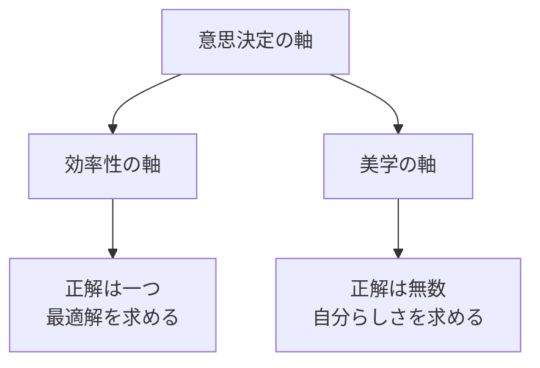
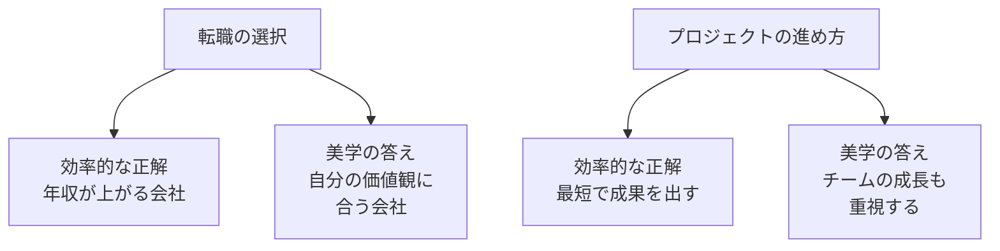
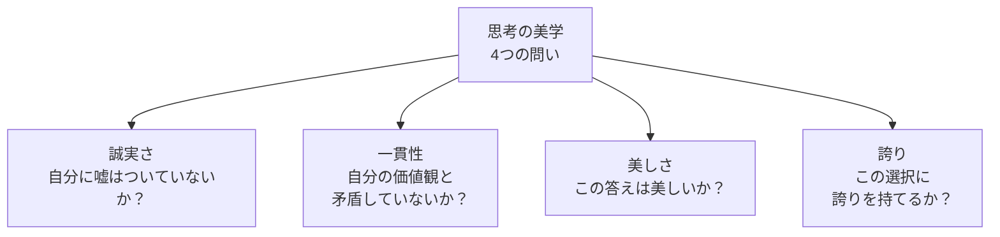
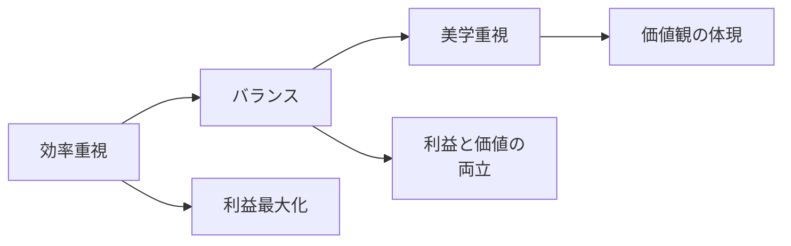
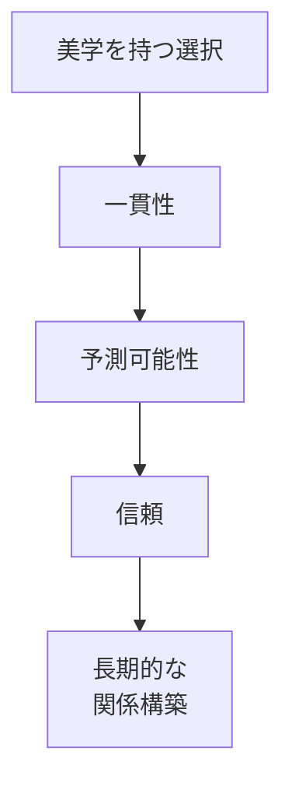
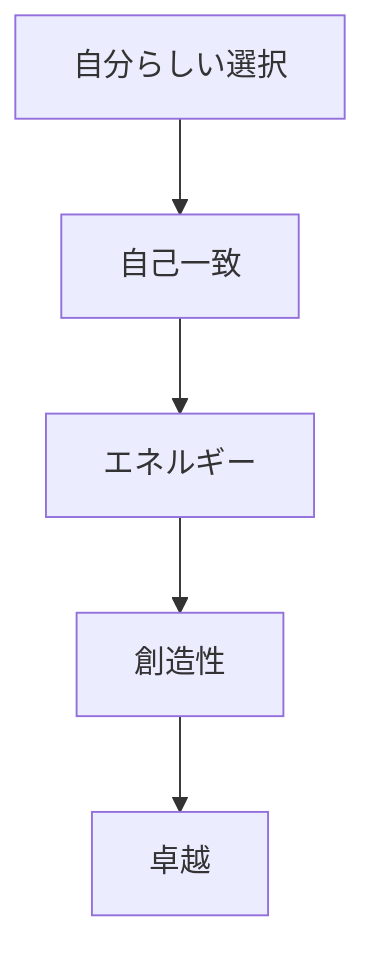
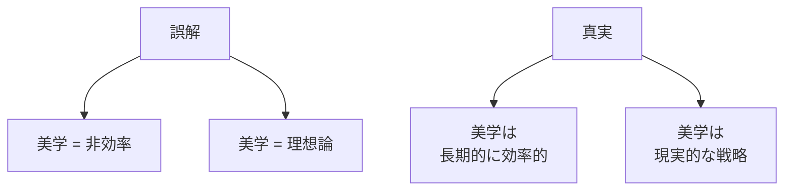
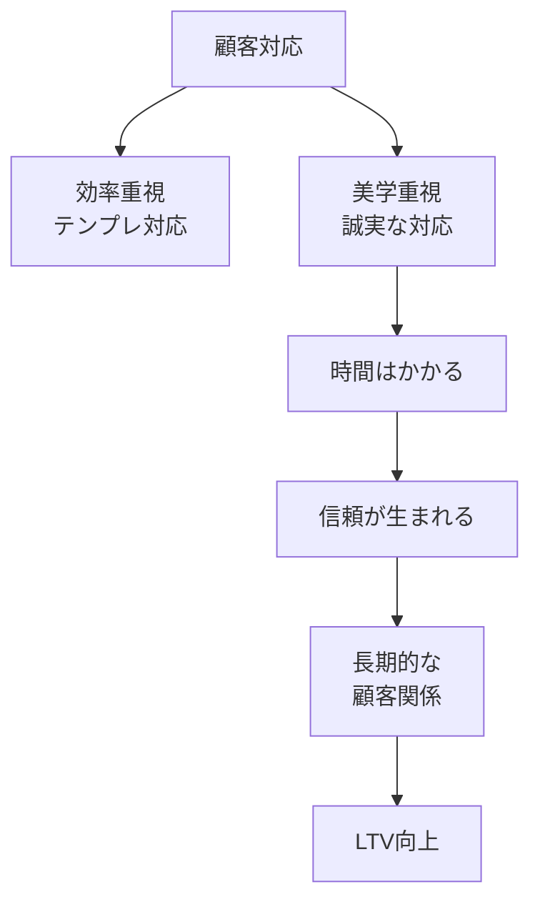

## はじめに

「正解はわかるけど、
なぜか納得できない...」

「効率的なやり方があるのに、
それを選びたくない...」

そんな経験、ありませんか？

ビジネスでは、
効率や利益が正義とされます。

でも、人生において
**本当に大切な決断**は、
そんな単純な計算では
決められないものです。

思考の美学とは、
**「自分らしさ」を大切にしながら、
答えを導き出す力**です。

---

## 正解 vs 自分らしい答え

### 二つの軸

### 具体例

---

## 思考の美学の要素

### 4つの問い

### 美学のレベル

---

## 美学を持つことの価値

### 長期的な信頼

### 自己実現

---

## 美学と効率の両立

### 誤解を解く

### 両立の例

---

## 実践できること

**① 「なぜこの選択を？」の問い**

効率的な選択をする時、
「本当にこれでいいのか？」
と立ち止まる。

**② 「美しい答え」はどれか**

複数の選択肢がある時、
「どれが最も美しいか」
という視点を加える。

**③ 過去の選択を振り返る**

「効率を選んだけど、
　後悔した選択」と
「美学を選んで、
　良かった選択」を
リストアップする。

**④ 「自分の美学」を言語化**

「私は〇〇を
　最も大切にする」
という自分の美学を
1文で書く。

---

## まとめ

思考の美学は、
**非合理的な理想論ではありません**。

長期的に見れば、
**最も合理的な選択**でもあります。

自分らしさを大切にし、
誇りを持てる選択をする。

それが、
**持続可能な成功**と
**内なる充実**を
もたらします。

正解を追い求めるのではなく、
自分らしい答えを追い求める。

それが、
**あなただけの
独自の価値**を
生み出します。

---

## セッションでできること

コーチングセッションでは、
あなたの「思考の美学」を
一緒に探ります。

- あなたの価値観の明確化
- 効率と美学のバランス設計
- 自分らしい意思決定の習慣化

**正解は一つではありません。
あなたの正解を、
一緒に見つけましょう。**
