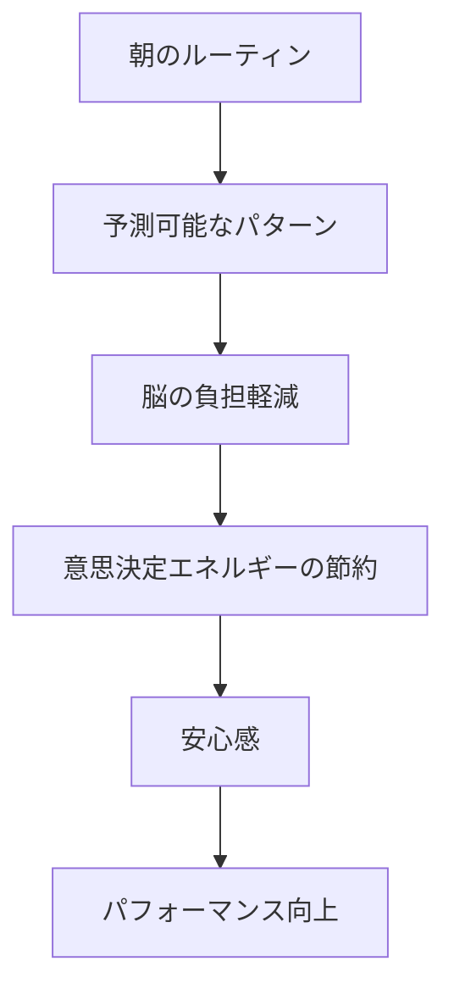
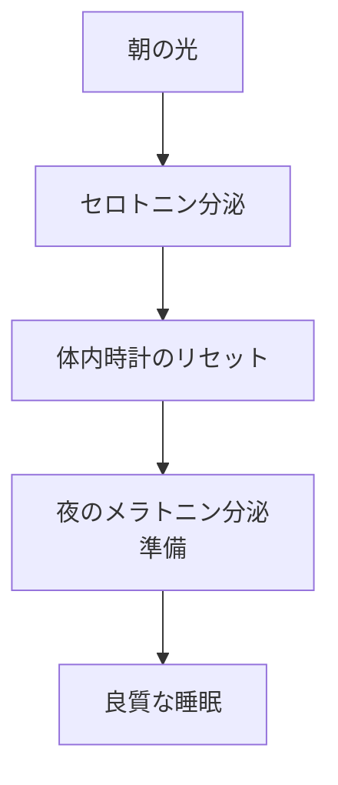
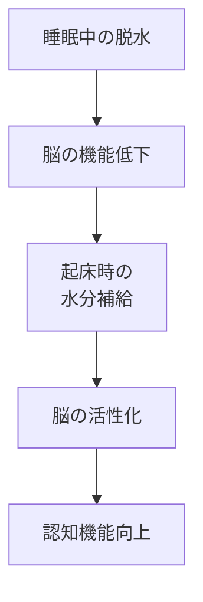
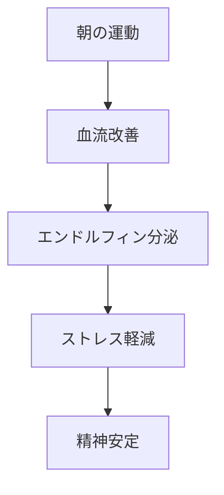
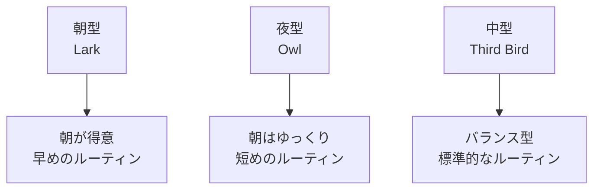
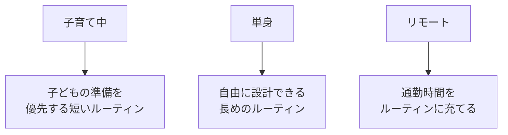

## はじめに

朝、目覚めた時、
あなたは何をしますか？

スマホを見る？
そのまま二度寝？
それとも、決まった動作を？

実は、朝の最初の1時間が、
**その日のメンタル状態を決めています**。

モーニングルーティンは、
単なる「効率化」のためだけではなく、
**脳に「安心」と「予測可能性」**を
与える強力なツールです。

---

## なぜルーティンが効くのか

### 脳の仕組み

**決断疲れを防ぐ**

朝から「何を着よう？」
「何を食べよう？」と
考える必要がない。

その分のエネルギーを、
**重要なことに使える**。

### ドーパミンの分泌

小さな成功体験の積み重ねが、
**ポジティブなサイクル**を作ります。

---

## 科学的に効果のある要素

### 1. 光を浴びる

**15〜30分の自然光**が理想です。

### 2. 水分補給

寝ている間に
**水分が失われている**のを
補給します。

### 3. 軽い運動

**10分でも効果あります**。

---

## 実践的なモーニングルーティン

### ベーシック版（30分）

### 充実版（60分）

---

## 個人差を尊重する

### クロノタイプ

**自分の体質に合わせる**ことが重要。

### ライフステージ

---

## 実践できること

**① 今の朝の動作を記録**

1週間、朝何をしているか
書き出してみる。

**② 「3つの定番」を決める**

朝必ずやることを
3つだけ決める。
（例：水を飲む、カーテン開ける、深呼吸）

**③ スマホは後回し**

起きてから30分は
スマホを見ないルール。

**④ 週末も維持**

週末だけ崩すと
**リズムが乱れる**。
少し短縮する程度に。

---

## まとめ

モーニングルーティンは、
**「効率化」のためだけではありません**。

脳に安心感を与え、
1日のスタートを
**予測可能で安定したもの**にする。

それが、
メンタルの安定と
パフォーマンスの向上に
繋がります。

完璧を求めすぎず、
**自分に合った形**で、
毎朝の小さな儀式を。

それが、
人生の質を変える
一歩となります。

---

## セッションでできること

コーチングセッションでは、
あなたに最適な
モーニングルーティンを
一緒に設計します。

- あなたのライフスタイル分析
- 朝の時間の最適化
- 継続可能なルーティンの構築

**1日の始まりを変えると、
人生が変わります。**

一緒に、
あなたの最高の朝を
作り上げましょう。
