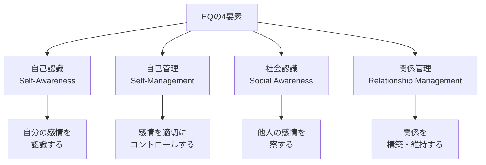
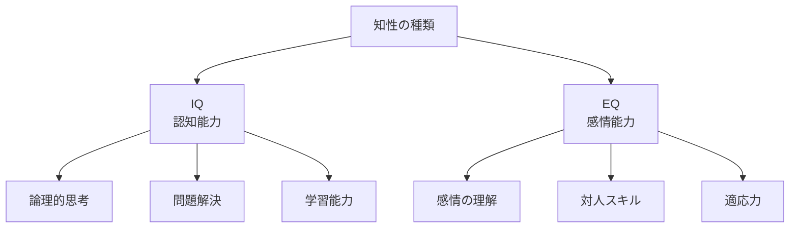
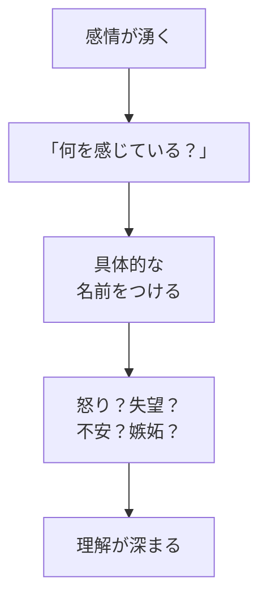
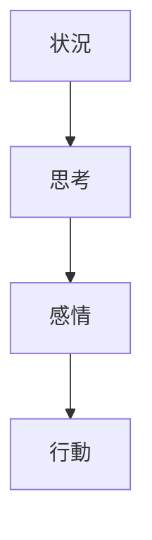
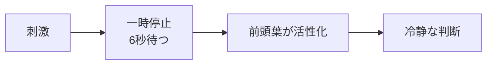
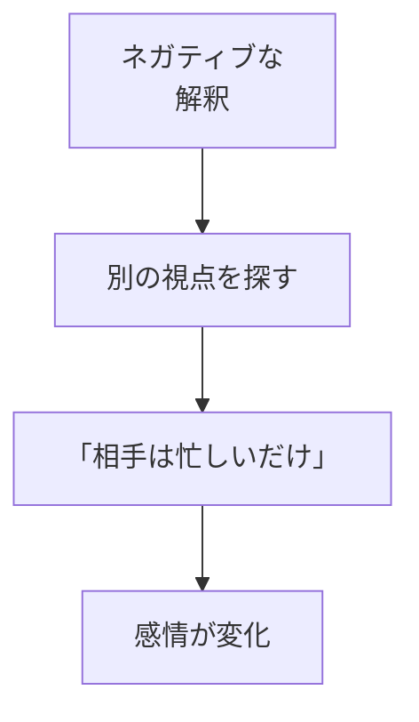
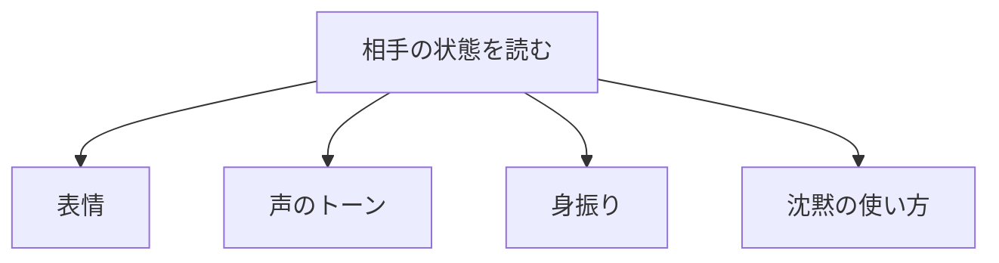
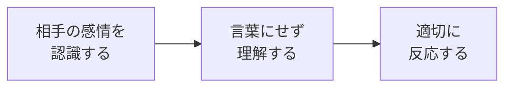

## はじめに

「もっと冷静になれれば...」

「相手の気持ちがわからない...」

感情は、
制御すべき「敵」のように
思われがちです。

でも、本当のEQ（感情知能）は、
**感情を抑えることではありません**。

**感情を理解し、
味方につけること**です。

---

## EQとは何か

### 4つの要素

### IQとの違い

**EQはトレーニングで高められます**。

---

## 自己認識を高める

### 感情のラベリング

**「なんとなくイライラ」ではなく、
「失望している」と名付ける**。

### 感情のトリガー

**何がその感情を引き起こしたか**
を探ります。

---

## 自己管理の技術

### 一時停止

**感情が高ぶったら、
6秒待つ**。

### 再評価

**状況の解釈を変える**と、
感情も変わります。

---

## 社会認識を磨く

### 非言語コミュニケーション

**言葉よりも、
言葉以外の情報**が多い。

### 共感のステップ

---

## 実践できること

**① 感情日記をつける**

1日3回、
自分の感情を記録。

**② 「6秒ルール」**

イライラしたら、
必ず6秒待つ。

**③ 相手の感情を推測**

会話中、
「今、この人は何を感じている？」
と意識する。

**④ 感情の語彙を増やす**

「嬉しい」だけでなく、
「誇り」「感謝」「充足」など
細かい言葉を使う。

---

## まとめ

EQは、
**生まれつきの才能ではなく、
育てられるスキル**です。

感情を敵ではなく、
**情報として受け取り、
適切に活用する**。

それが、
充実した人間関係と
成功への鍵となります。

---

## セッションでできること

コーチングセッションでは、
あなたのEQを
一緒に高めていきます。

- 感情パターンの分析
- トリガーの特定と対処法
- 対人関係の改善

**感情を味方につけて、
もっと自由に生きましょう。**
