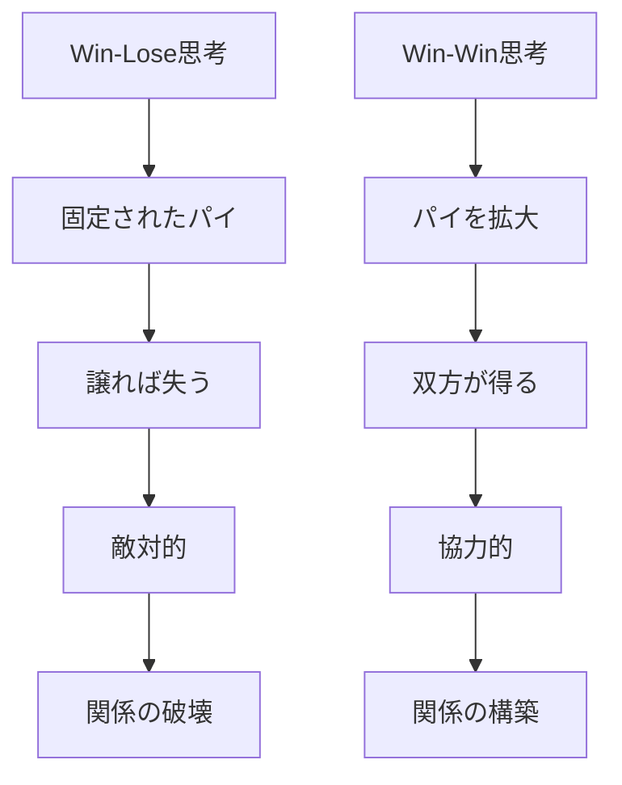
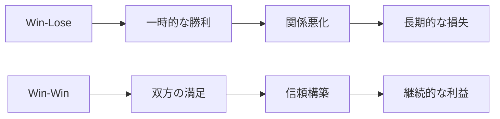
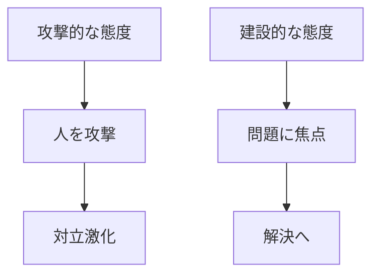
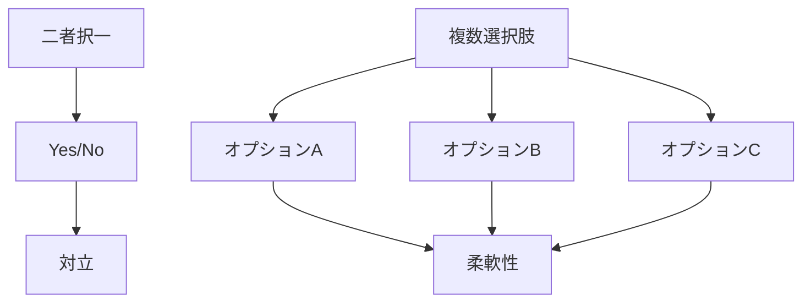
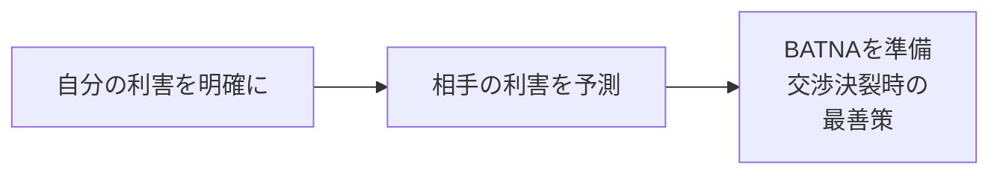
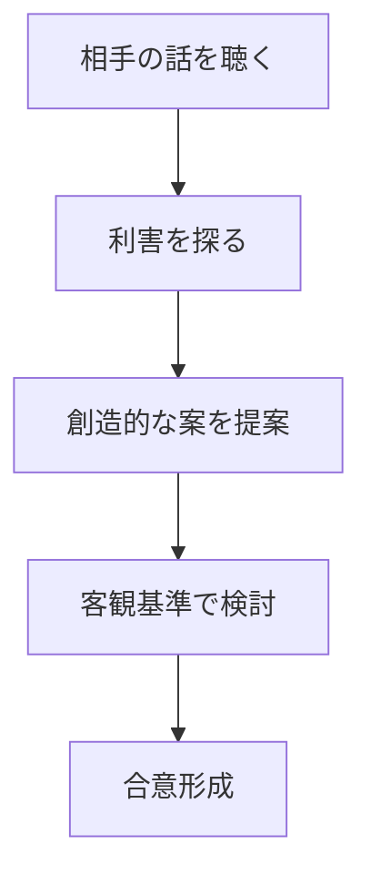

## はじめに

「交渉は勝負だ」

「譲るのは負けだ」

そう思っていませんか？

でも、本当に効果的な交渉は、
**相手を倒すことではありません**。

**お互いにとって最善の合意を
作り出すこと**です。

これが「Win-Win」の
交渉メンタルモデルです。

---

## Win-Lose vs Win-Win

### 違いの本質



### 長期的な視点



---

## Win-Win交渉の4原則

### 1. 人と問題を分離する



**「あなたは間違っている」ではなく、
「この問題を解決しましょう」**。

### 2. 利害に焦点を当てる

```mermaid
graph TD
    A[立場<br/>"これが欲しい"]
    A --> B[表層的]
    B --> C[対立しやすい]
    
    D[利害<br/>"なぜそれが必要か"]
    D --> E[本質的]
    E --> F[創造的解決の余地]
```

### 3. 選択肢を生み出す



### 4. 客観的基準を使う

```mermaid
graph TD
    A[主観的議論]
    A --> B["高すぎる""安すぎる"]
    B --> C[平行線]
    
    D[客観的基準]
    D --> E[市場相場]
    D --> F[業界標準]
    D --> G[専門家の意見]
    E --> H[納得]
```

---

## 実践ステップ

### 準備段階



### 交渉中



---

## 実践できること

**① 交渉前に「利害リスト」を作る**

自分と相手の
本当に大切にしていることを
書き出す。

**② 「なぜ？」を5回繰り返す**

「これが欲しい」→
「なぜ？」→
「なぜ？」...

本質的な利害が見えてくる。

**③ 3つ以上の選択肢を用意**

二者択一を避け、
複数のWin-Win案を考える。

**④ 客観的基準を調査**

市場データ、
業界標準などを
事前に調べておく。

---

## まとめ

Win-Winの交渉は、
**甘い理想論ではありません**。

長期的に見れば、
**最も効果的な戦略**です。

相手を倒すのではなく、
一緒に答えを作る。

それが、
持続可能な関係と
真の成功を生みます。

---

## セッションでできること

コーチングセッションでは、
あなたの交渉スタイルを
見直し、
Win-Winの技術を
身につけます。

- 交渉パターンの分析
- 利害の明確化ワーク
- 実践的なロールプレイ

**交渉を「戦い」から
「協働」に変えましょう。**

[→ 体験セッションの詳細を見る](/sessions)
