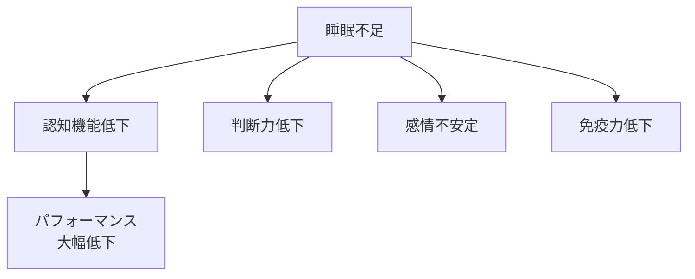
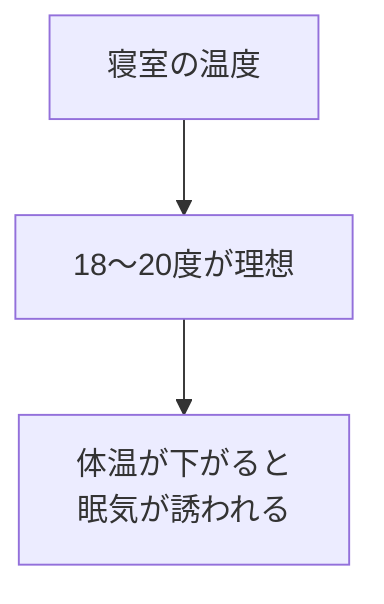
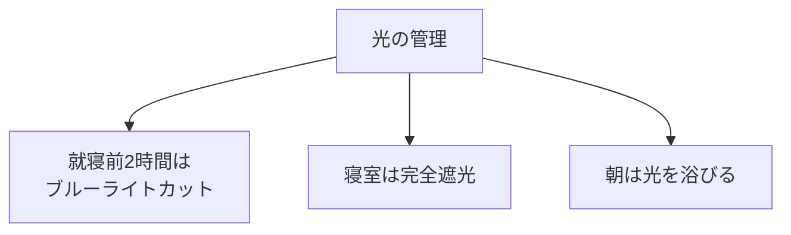
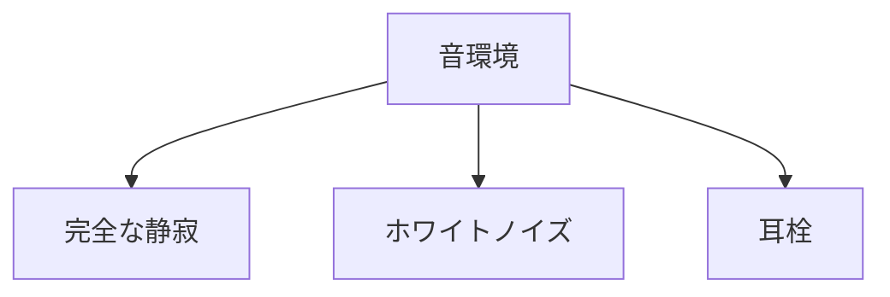
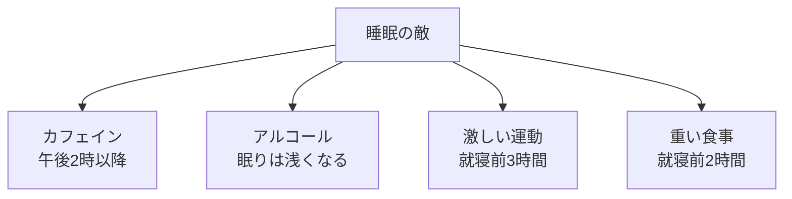

## はじめに

「眠れない...」「朝、スッキリしない...」

睡眠は、「ただ横になる」ことではありません。**「技術」**です。

適切な知識と環境設計で、睡眠の質は劇的に変わります。

## 睡眠の科学

### 睡眠サイクル

**深い睡眠**が身体の回復を、**レム睡眠**が脳の整理を担います。

### 睡眠負債の恐怖

**睡眠は投資です**。

## 実例：睡眠改善が生んだ「別人」

35歳のエンジニアKさん。慢性の睡眠不足で、日中の集中力が続かず、ミスも多い日々が続いていました。

睡眠専門家のアドバイスで環境を整えたところ：

**改善前**：
- 寝付き：1時間以上かかる
- 睡眠時間：6時間未満
- 朝の目覚め：スッキリしない
- 日中の眠気：激しい

**改善後（2ヶ月後）**：
- 寝付き：15分以内
- 睡眠時間：7.5時間
- 朝の目覚め：スッキリ
- 日中の集中力：大幅向上

Kさん：「同じ仕事をしていても、ミスが減り、創造的なアイデアが出やすくなりました。睡眠が人生を変えたと言っても過言ではないです」

## 最適な睡眠環境

### 温度

### 光

### 音

## 睡眠のための行動

### 就寝前のルーティン

### 避けるべきもの

## 実践者の声：マネージャーSさんの「睡眠改革」

「以前は『睡眠は時間の無駄』と思っていました。スリープテックを導入し、睡眠環境を整えたところ、睡眠時間は同じでも質が全く違いました。朝が変わると、1日が変わりました。今では睡眠を『パフォーマンス投資』として捉えています」

## 実践できること

**① 寝室を「睡眠専用」に**

寝室で仕事や食事をしない。

**② 就寝・起床時間を固定**

週末も同じ時間帯に。

**③ 睡眠日記をつける**

眠りの質を1〜10で記録。

**④ 昼寝は15〜20分**

それ以上は深い睡眠に入り、逆に眠くなる。

## まとめ

睡眠は、**「ただ寝る」ことではなく、「設計する」こと**です。

環境を整え、習慣を作る。それが、最高のパフォーマンスへの最短ルートです。

---

## セッションでできること

コーチングセッションでは、あなたの睡眠習慣を分析し、最適化プランを作成します。

- 睡眠環境の診断
- パーソナライズされた睡眠計画
- 継続のサポート

**良い睡眠は、良い人生の始まりです。**
