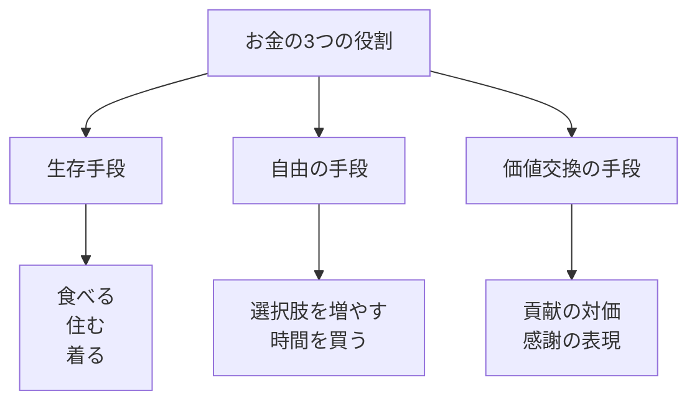
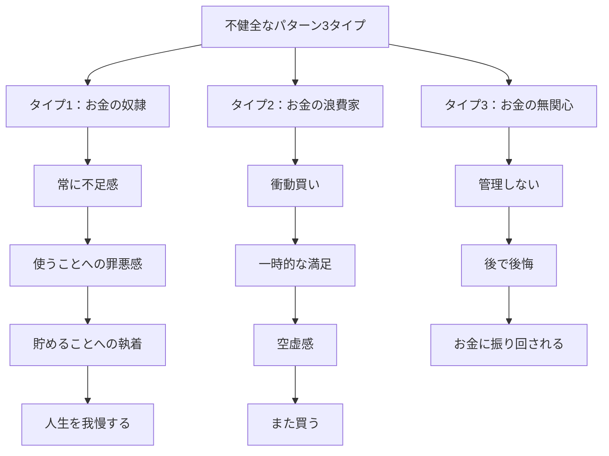
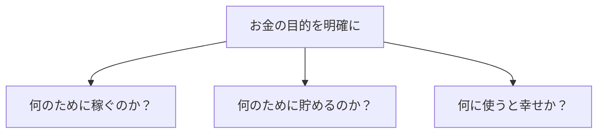
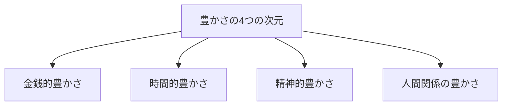

## はじめに：お金との「苦しい関係」を終わらせる

「もっと稼がなきゃ...」

「お金がないと不安で眠れない...」

「お金のこと、わからないし考えたくない...」

こんな声、よく聞きます。実は私も30歳まで、お金との関係で相当苦労しました。貯金が増えれば増えるほど「もっと貯めなきゃ」という焦燥感に襲われ、使うたびに罪悪感を感じる。それでいて、いざ何か買おうとすると「本当に必要か？」と自分に問い詰めてしまい、結局何も買えない。そんなループをずっと繰り返していました。

ある時、年収3000万の経営者から「俺、お金が怖くてパスタ一皿も注文できないんだよね」って打ち明けられて衝撃を受けました。お金があっても、お金との関係が健全でなければ幸せになれない。むしろお金が増えても不安が増えることだってあるんです。

お金は私たちの人生に深く関わっています。でも、多くの人は**お金との健全な関係**を持てていません。お金を「敵」にしたり、「主人」にしたり... 本来、お金は**「道具」**なのです。この記事では、お金との健全な関係を築き、不安から解放されて自由に使えるようになる具体的な方法をお伝えします。

---

## お金がもたらす3つの本質的役割

お金って何のためにあるんだろう？ 深く考えたことありますか？お金には、見た目以上に多層的な役割があります。

### ① 生存手段としてのお金

これは最も基本的な役割です。食べる、住む、着る、治療を受ける。生きていくために必要なものを得るための手段。でもここで重要なのは、「生きるために必要な額」って案外少ないってこと。私がフリーランスになった時に計算してみたんですが、本当に必要な生活費は月15万程度でした。それ以下になると不安だけど、それ以上あれば「生きていける」。この基準を知ると、お金への恐怖が少し和らぎます。

### ② 自由の手段としてのお金

お金があれば「選択肢」が増えます。「仕辞めたい」時に辞められる余裕。「勉強したい」時にスクールに行ける自由。実際に私のクライアントのSさん（34歳・会社員）は、半年分の生活費を貯めただけで「毎日が楽になった」と言っていました。お金があることで「今すぐ辞めなきゃ」という焦りから解放され、冷静にキャリア選択できるようになったんです。

### ③ 価値交換の手段としてのお金

お金は「貢献の対価」としても機能します。誰かの役に立った分、対価として受け取る。逆に誰かに感謝を伝えたい時、お金を使ってギフトを贈る。お金は「価値の循環」の潤滑油なんです。私は毎月、お世話になっている人に対して「感謝のお金」を意識的に使っています。そうすることで、お金が「冷たい数字」じゃなくて「人と人をつなぐ温かいもの」に変わります。

---

## お金との不健全な関係：あなたはどのパターン？

お金との関係で苦労している人は、だいたい3つのパターンに分かれます。どれか一つに当てはまるかもしれませんし、状況によって行き来するかもしれません。

### タイプ1：お金の奴隷になる

「貯金が増えれば増えるほど不安になる」という人です。お金を使うことに罪悪感を感じて、結局何も使えない。貯めることが目的化して、「いくらあれば安心できるのか」わからなくなる。私の知人で5000万円貯めた人がいますが、「1億円ないとダメだ」と言ってました。これは典型的な「お金の奴隷」パターン。

### タイプ2：お金の浪費家になる

ストレスが溜まると買い物をしてしまう。SNSで「いいね！」がもらえる物を買う。でも買った後は空虚感だけが残る。また買う。そんなループ。一見自由に見えますが、実は「感情に振り回されている」状態です。

### タイプ3：お金に無関心になる

「お金のことは汚い」「考えたくない」と逃避して、全く管理しない。結果、いざという時に後悔する。これも一種の防衛機制ですが、結局お金に振り回されることになります。

どのパターンも「お金が主人で、人が奴隷」という構図です。健全な関係にするには、この構図をひっくり返す必要があります。

---

## 健全な関係を築く3つのステップ

じゃあどうすればいいの？ ここからが具体的な方法です。

### ステップ1：「お金の目的」を明確にする

お金に「目的」を持たせましょう。

私は毎年「この1年でお金を何のために使うか」を3つ書き出しています。例えば「スキルアップのためのスクール代」「両親への感謝の旅行」「体を休めるための温泉」。お金に目的があれば、「使う」ことも「貯める」ことも意味を持ちます。

クライアントのKさん（28歳・デザイナー）は「海外留学のため」という明確な目的ができただけで、無駄遣いが3分の1に減りました。目的があれば、無関心にも浪費にもならないんです。

### ステップ2：「豊かさ」を再定義する

お金だけが豊かさじゃありません。時間的自由、精神的な充実、深い人間関係。これらすべてが揃って初めて「豊かさ」になります。お金に固執しすぎて時間的自由を失ったら、それは「貧困」ですよね。

私のメンターは「年収を下げても、好きな時間に好きな仕事をする」選択をしました。金銭的には減ったけど、時間的・精神的な豊かさが飛躍的に上がったそうです。

### ステップ3：「十分さ」を数値化する

「いくらあれば十分か」を具体的に数字で書き出しましょう。これを「エノUGH（十分さ）の数字」と呼びます。

計算方法は簡単：
1. 生活費（最低限）
2. 余裕（生活費の20%程度）
3. 目標達成のための積立

これを合計した額が「十分」のライン。これを知ると、無限に貯めようとする焦燥感から解放されます。

---

## 今日から始められる4つの実践法

### ① 「お金の目的」を3つ書く（5分）

「私はお金を〇〇のために使う」を3つ書いてみてください。必要なら貼り出して、見える化しましょう。

### ② 「十分さ」を計算する（15分）

月々の生活費を計算して、それに20%の余裕を加えた額を「十分ライン」として設定します。

### ③ 週に1回「家計簿」をつける（10分）

管理することで無関心から脱します。アプリでも手書きでもOK。ただ「意識すること」が大事です。

### ④ 「投資」と「浪費」を区別する質問

買い物をする前に自問しましょう：「これは未来の自分に返ってくる使い方か？それとも一時的な満足か？」

---

## まとめ：お金を「味方」にするということ

お金とは、**人生を豊かにする道具**です。

目的を失えば、お金はただの数字。目的を持てば、お金は自由の手段。お金を「主人」にするのではなく、**「道具」として使いこなす**。それが健全な豊かさへの第一歩です。

不安から解放されて、お金を自由に使えるようになる。それは「お金が増える」ことよりも、「お金との関係が変わる」ことで実現します。今日から一歩踏み出してみませんか？

---

## セッションで深掘りできること

コーチングセッションでは、あなたとお金の関係を一緒に見直し、健全なマネーマインドセットを構築します：

- **お金に対する潜在信念の分析**：なぜお金に不安を感じるのかを根本から解明
- **「十分さ」の数値化**：あなただけの「安心ライン」を設定
- **豊かさの多角的な設計**：お金以外の豊かさも含めた人生設計

**お金を味方につけて、もっと自由に生きましょう。**
