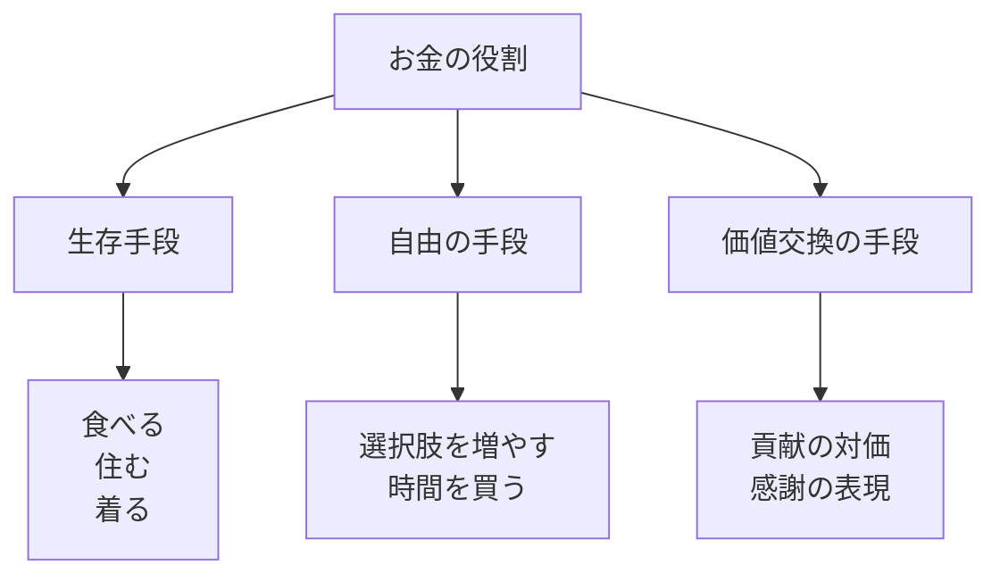
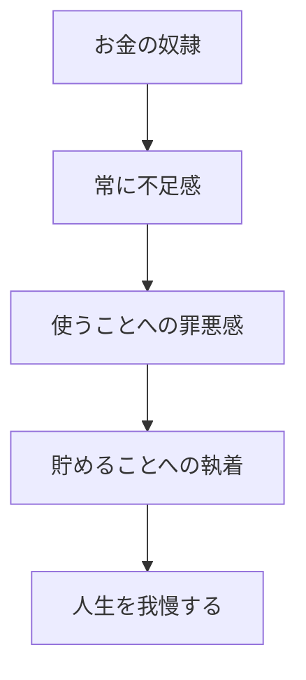
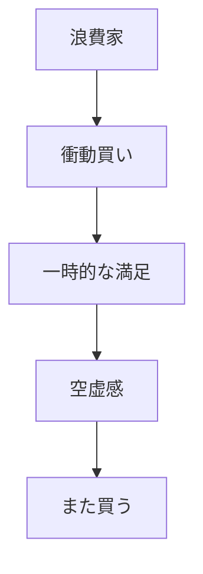
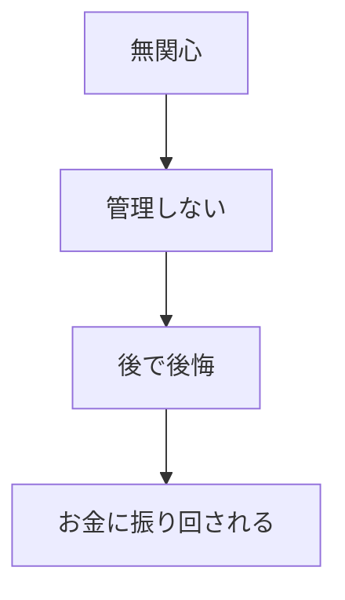
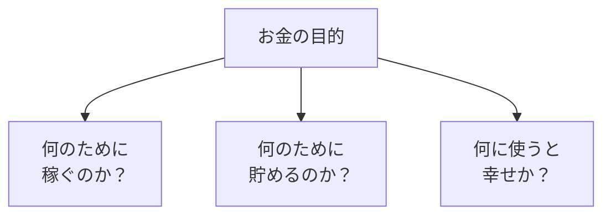
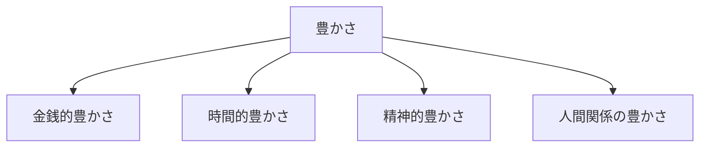

## はじめに

「もっと稼がなきゃ...」

「お金がないと不安...」

「お金のこと、
わからない...」

お金は、
私たちの人生に
深く関わっています。

でも、多くの人は
**お金との健全な関係**を
持てていません。

お金を「敵」にしたり、
「主人」にしたり...

本来、お金は
**「道具」**なのです。

---

## お金の3つの役割

---

## 不健全な関係のパターン

### 1. お金の奴隷

### 2. お金の浪費家

### 3. お金の無関心

---

## 健全な関係を築く

### お金の目的を明確に

### 豊かさの定義

**お金だけが豊かさではない**。

---

## 実践できること

**① 「お金の目的」を書く**

「私はお金を〇〇のために使う」
を3つ書く。

**② 「十分さ」を定義する**

「いくらあれば十分か」を
具体的に数字で書く。

**③ 週に1回「家計簿」をつける**

管理することで、
無関心から脱する。

**④ 「投資」と「浪費」を区別する**

未来に返ってくる使い方か、
一時的な満足か。

---

## まとめ

お金とは、
**人生を豊かにする道具**です。

目的を失えば、
お金はただの数字。

目的を持てば、
お金は自由の手段。

お金を「主人」にするのではなく、
**「道具」として使いこなす**。

それが、
健全な豊かさへの
第一歩です。

---

## セッションでできること

コーチングセッションでは、
あなたとお金の関係を見直し、
健全なマネーマインドセットを
構築します。

- お金に対する信念の分析
- 「十分さ」の定義
- 豊かさの多角的な設計

**お金を味方につけて、
もっと自由に生きましょう。**

[→ 体験セッションの詳細を見る](/sessions)
