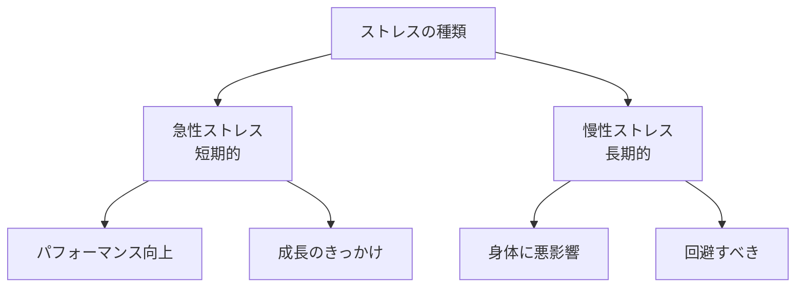
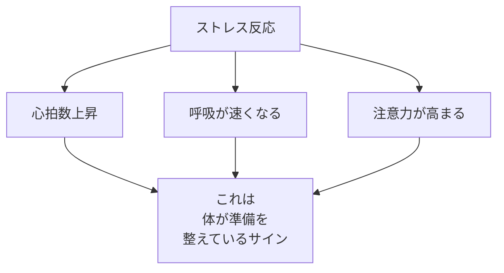
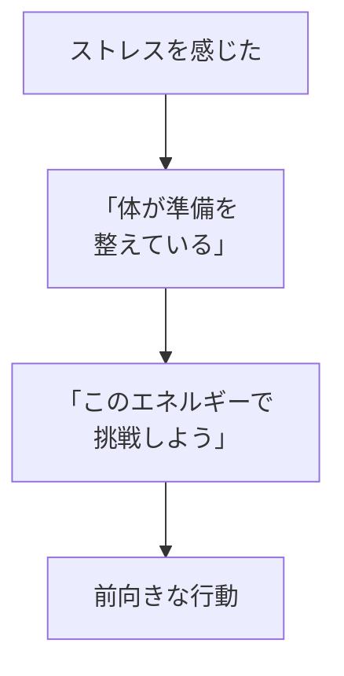
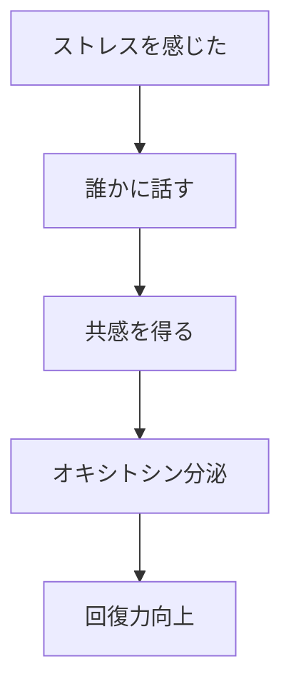

## はじめに

「ストレスは悪いもの」

「ストレスをなくしたい」

そう思っていませんか？

でも、最新の科学は言います。

**「ストレス自体は悪くない」**

問題なのは、
**ストレスへの「捉え方」**です。

---

## ストレスの新しい理解

### 2つのタイプ



### ストレス反応の正体



**「脅威」ではなく、
「挑戦」として捉える**。

---

## 捉え方を変える

### マインドセットの違い

```mermaid
graph TD
    A[脅威マインドセット]
    A --> B[「この状況は<br/>乗り越えられない"]
    B --> C[逃避反応]
    C --> D[パフォーマンス低下]
    
    E[挑戦マインドセット]
    E --> F["この状況は<br/>成長の機会だ"]
    F --> G[前向きな対応]
    G --> H[パフォーマンス向上]
```

---

## 実践テクニック

### 再評価



### 社会支援



---

## 実践できること

**① ストレスを「興奮」と呼ぶ**

「緊張する」ではなく、
「ワクワクする」と言い換える。

**② 前向きな自己対話**

「これは成長の機会だ」
「体が準備を整えている」

**③ 誰かに話す**

一人で抱え込まず、
信頼できる人に相談。

**④ 振り返り**

過去の困難を振り返り、
「あれがあったから今がある」と
再評価する。

---

## まとめ

ストレスは、
**避けるべき敵ではありません**。

適度なストレスは、
**成長の原動力**です。

大切なのは、
**「どう捉えるか」**。

脅威ではなく挑戦として、
恐怖ではなく興奮として。

その捉え方一つで、
同じストレスでも
全く異なる結果が生まれます。

---

## セッションでできること

コーチングセッションでは、
あなたのストレスパターンを分析し、
前向きな捉え方を
身につけます。

- ストレストリガーの特定
- 再評価の練習
- 社会支援ネットワークの構築

**ストレスを味方につけて、
もっと強くなりましょう。**
