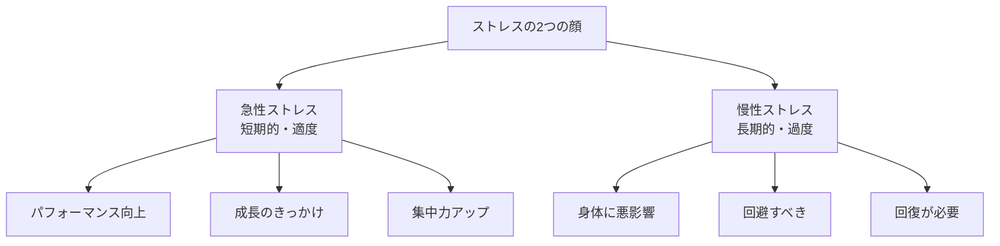
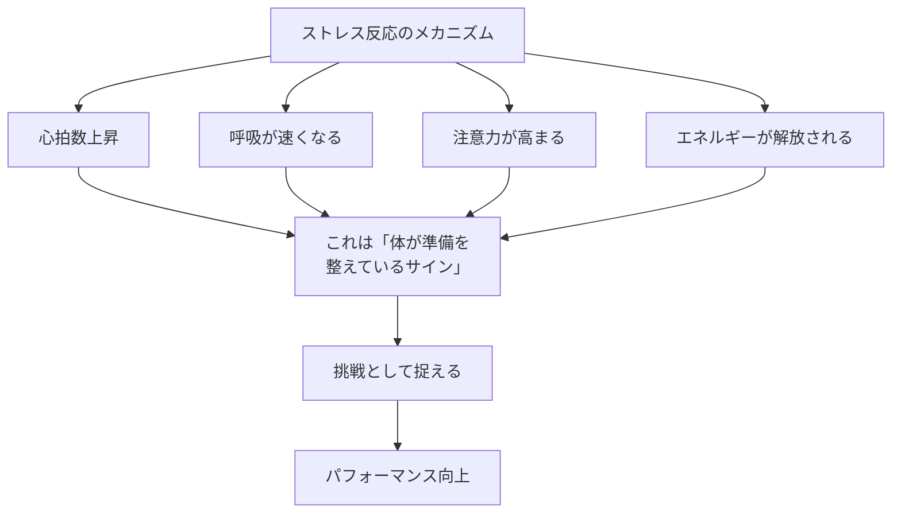
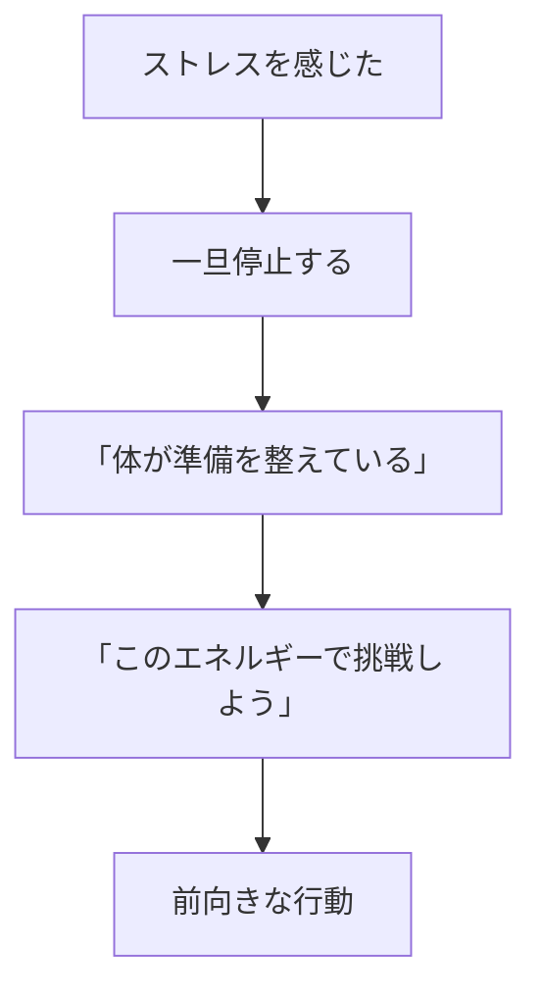
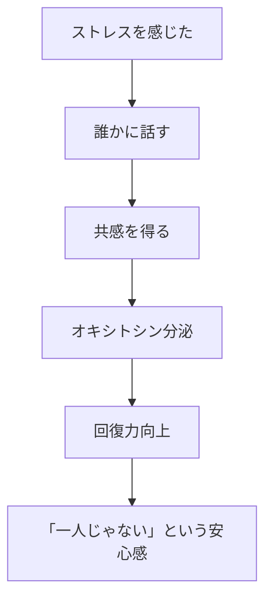

## はじめに：ストレスとの付き合い方を変える

「ストレスは悪いもの」

「ストレスをなくしたい」

そう思っていませんか？私も昔はそうでした。仕事が忙しくなると「ストレスが...」と愚痴り、休むことしか考えられない。でもある日、年収1億を超える起業家から「ストレスがないと僕は死んじゃうよ」って言われて衝撃を受けました。

最新の科学は明確に言っています：**「ストレス自体は悪くない」**。問題なのは、**ストレスへの「捉え方」**なんです。ハーバード大学のケリーマクゴニガル教授の研究によると、ストレスを「体が準備を整えているサイン」と捉える人は、ストレスを感じても健康を損なわないどころか、パフォーマンスが向上するんです。

この記事では、ストレスを味方につけて成長する具体的な方法を3つお伝えします。

---

## ストレスの新しい理解：2つのタイプを見極める

### 急性ストレスと慢性ストレスの違い



#### 急性ストレス：味方になるストレス

プレゼン前のドキドキ、締切間際の集中、スポーツの試合前の緊張。これらはすべて**「体がベストパフォーマンスを出す準備をしている」**サインです。副交感神経と交感神経がバランス良く働き、私たちを最高の状態に導きます。

私のクライアントのMさん（32歳・営業）は「プレゼン前の緊張を『ワクワク』と言い換えただけで、失敗が減った」と言っていました。同じ身体反応でも、「怖い」か「楽しい」かで全く結果が変わるんです。

#### 慢性ストレス：注意が必要なストレス

一方で、数週間・数ヶ月続く過度なストレスは身体を蝕みます。これは「敵」です。睡眠障害、免疫力低下、うつ症状... 慢性ストレスは本当に避けるべきものです。

大切なのは「どちらのストレスか」を見極め、急性ストレスは活用し、慢性ストレスは回避すること。

---

## ストレス反応の正体：体は味方なんだ



ストレスを感じた時の身体反応—心臓がバクバク、息が荒くなる、汗が出る—これらは全部「戦う準備ができた」というサインです。

人類の歴史を振り返れば、これはライオンから逃げる時も、獲物を追う時も同じ反応。つまり**「恐怖」のサインでも「興奮」のサインでもある**んです。どちらに解釈するかは、私たちの「心」に委ねられています。

ケリーマクゴニガル教授の研究で、ストレス反応を「体が準備を整えている」と捉える参加者は、血管が拡張し、血液の流れがスムーズになる「挑戦反応」を示しました。一方「脅威」と捉えると血管が収縮し、心臓への負担が増大。同じストレスでも、捉え方で身体への影響が全く変わるんです。

---

## 捉え方を変える：脅威マインドセット vs 挑戦マインドセット

```mermaid
graph TD
    subgraph 脅威マインドセット
    A1[「この状況は<br/>乗り越えられない"] --> B1[逃避反応]
    B1 --> C1[パフォーマンス低下]
    C1 --> D1[後悔と自己否定]
    end
    
    subgraph 挑戦マインドセット
    A2["この状況は<br/>成長の機会だ"] --> B2[前向きな対応]
    B2 --> C2[パフォーマンス向上]
    C2 --> D2[自信と成長]
    end
```

### 脅威マインドセットの特徴

- 「これは自分にとって危険だ」と解釈
- 回避または過剰な防御反応
- 視野が狭くなり、柔軟性が失われる
- 結果：パフォーマンス低下

### 挑戦マインドセットの特徴

- 「これは自分を成長させる機会だ」と解釈
- 積極的な問題解決
- 創造性と柔軟性が増す
- 結果：パフォーマンス向上

この切り替えは、一朝一夕にはいきません。でも「気づき」さえあれば、練習で身につきます。

---

## 今日から実践できる3つの技術

### 技術1：「再評価」で脳を書き換える



ストレスを感じたら、3ステップで捉え直します：

1. **一旦停止**：自動思考に流されない
2. **ラベリング**：「あ、ストレス反応だ」と認識
3. **再評価**：「体が準備を整えてくれている。ありがとう」

私はプレゼン前に必ず言い聞かせています：「ドキドキしてる。これは体が全力を出す準備をしてくれているサイン。ラッキーだ。」

### 技術2：「緊張」を「興奮」と言い換える

これは本当に効きます。ハーバード商学院の研究で、プレゼン前に「私は興奮している」と言った学生は、「私は落ち着いていなきゃ」と言った学生よりもパフォーマンスが17%向上しました。

言葉の力ってすごいんです。「緊張する」は「脅威」のレッテル。「ワクワクする」は「挑戦」のレッテル。同じ身体状態でも、言葉一つで脳の解釈が変わります。

### 技術3：「社会支援」を意識的に求める



驚くべきことに、ストレスを感じた時に「誰かに相談する」ことで、ストレスホルモン（コルチゾール）が低下し、回復ホルモン（オキシトシン）が分泌されるんです。

人は一人では生きられない。ストレスを抱え込むと「孤独」が増して余計に苦しくなる。誰かに話すことで「一人じゃない」という安心感が得られ、驚くほど楽になります。

---

## 実践：今週やってみる4つの習慣

**① 朝の「挑戦宣言」**

毎朝、鏡を見て「今日はどんな挑戦があるかな」と言う。脅威ではなく挑戦としてフレームする。

**② ストレスラベリング**

ストレスを感じたら、メモか頭の中で「これはストレス反応だ」とラベリング。自覚することが変化の始まり。

**③ 言い換え練習**

「緊張する」→「ワクワクする」「興奮する」「準備万端だ」

**④ 週1回の「相談タイム」**

信頼できる人に、週に1回はストレスを話す時間を作る。一人で抱え込まない。

---

## まとめ：ストレスは味方になれる

ストレスは、**避けるべき敵ではありません**。

適度なストレスは、**成長の原動力**です。

大切なのは、**「どう捉えるか」**。脅威ではなく挑戦として、恐怖ではなく興奮として。その捉え方一つで、同じストレスでも全く異なる結果が生まれます。

ストレスを「悪いもの」から「成長のサイン」に変える。そのマインドシフトが、あなたの人生を大きく変えるかもしれません。

---

## セッションで深掘りできること

コーチングセッションでは、あなたのストレスパターンを一緒に分析し、前向きな捉え方を身につけます：

- **ストレストリガーの特定**：どんな状況で脅威マインドセットになるかを把握
- **再評価の練習**：実際の場面で捉え方を変えるロールプレイ
- **社会支援ネットワークの構築**：頼れる人との関係性を設計

**ストレスを味方につけて、もっと強くなりましょう。**
