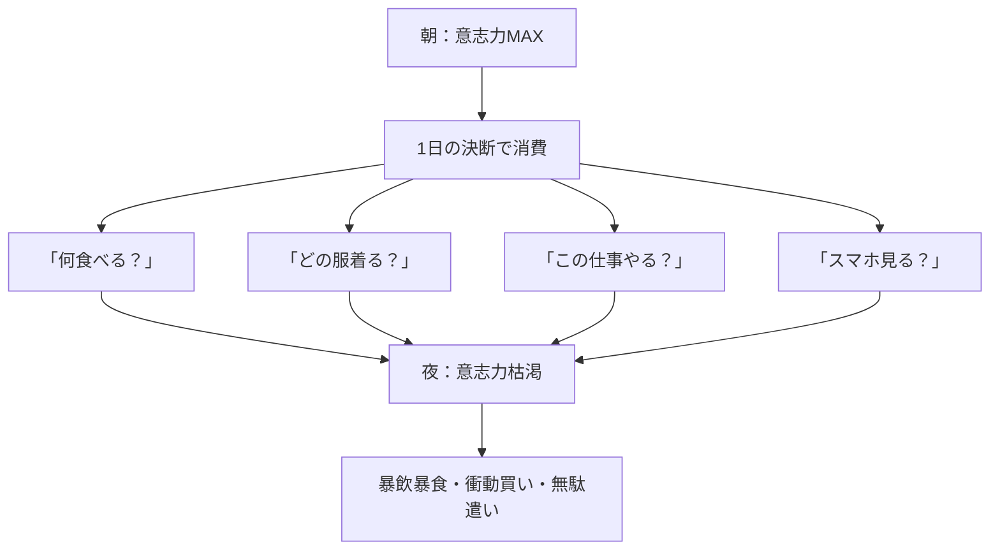
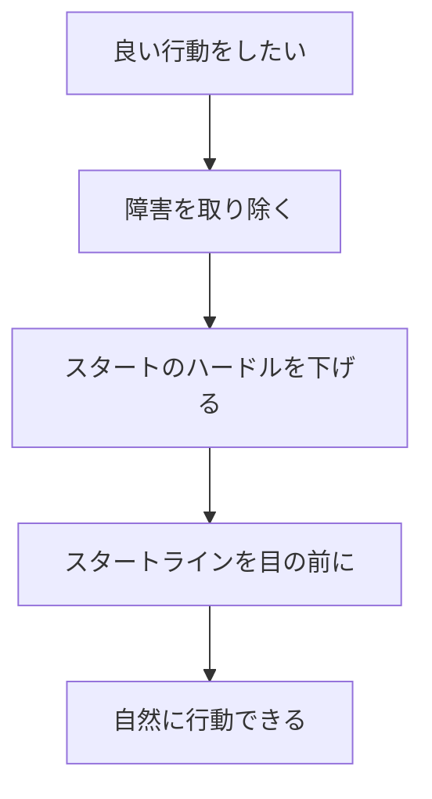
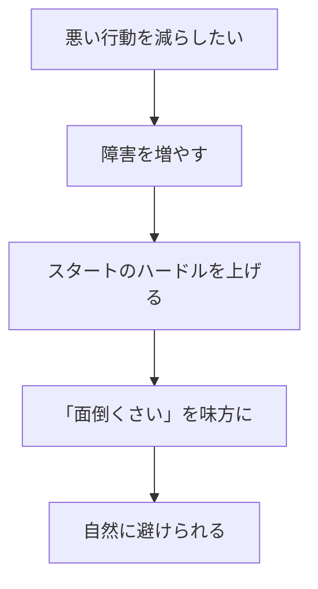
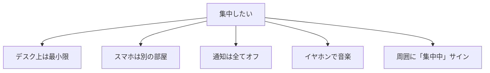

## はじめに：「やる気」に頼る限り、変わらない

「やる気が出ない...」

「意志力が足りない...」

そう思っていませんか？私も何年もそうでした。毎朝「今日こそ早起きして運動するぞ！」と意気込んでも、翌朝の目覚めはいつも同じ。「あと5分...」の繰り返しで、結局いつもと同じ時間に起きて焦って出勤。

でもある日気づきました。**問題は「俺の意志力」じゃなかった**。ベッドの横にスマホを置いているから、ついつい見てしまう。運動着がクローゼットの奥にあるから、着替えるのが面倒くさい。ジムが遠いから、行く気が失せる。

すべて**「環境」**の問題だったんです。

最高のパフォーマーをもって、悪い環境では良い結果は出せません。逆に、**適切な環境を作れば、意志力なしでも行動は変わります**。この記事では、その「環境設計」の具体的な方法をお伝えします。

---

## 意志力の限界：なぜ「がんばる」だけではダメなのか

### 意志力は有限な資源

スタンフォード大学の研究によると、意志力は「筋肉」のように有限な資源です。使えば使うほど疲れ、夜になると枯渇します。だから夜になると甘いものが食べたくなり、衝動買いをしやすくなるんです。

「がんばる」ことは大切です。でも「がんばり続ける」ことは不可能。だから**環境に頼る**ことで、意志力を節約する必要があるんです。

---

## 環境設計の2つの原則

環境設計の基本はシンプル。摩擦の力を味方につけることです。

### 原則1：良い行動の摩擦を減らす

#### 具体例：運動を習慣化する

私が実践した方法を紹介します：

- **寝室に運動着を置く**：朝起きたらすぐ着られる
- **10分運動から始める**：「短いならできる」という心理的ハードルの低下
- **近くのジムを選ぶ**：通う摩擦を最小化
- **YouTubeの運動動画をブックマーク**：準備の摩擦を減らす

結果、3ヶ月続きました。これまで「ジムに行く」ことすら1週間続かなかった私が。

#### 具体例：本を読む習慣

- **枕元に本を置く**：寝る前に手が届く
- **スマホは別の部屋で充電**：読書の邪魔にならない
- **1日1ページから始める**：続けやすいハードル設定

### 原則2：悪い行動の摩擦を増やす

#### 具体例：スマホの使用を減らす

- **スマホの充電はリビングで**：寝室に持ち込まない
- **SNSアプリは削除**：ブラウザ版を使う（摩擦が増える）
- **通知は全てオフ**：誘惑の削減
- **グレースケール表示**：カラフルさによる興奮を抑える

私のクライアントのTさん（29歳・会社員）は「スマホの充電場所を変えただけで、就寝時間が2時間早くなった」と言っていました。意志力ゼロで、環境だけで変わったんです。

#### 具体例：甘いものを減らす

- **お菓子は買わない**：家に置かない
- **遠いコンビニを選ぶ**：買いに行く摩擦を増やす
- **野菜を先に食べる**：お腹がいっぱいになり甘いものが食べにくくなる

---

## 摩擦を制御する具体例：场景別の環境設計

### 集中したい時の環境設計

作家の村上春樹さんは「書斎に入る前に、集中する準備を整える」といいます。私も大事な仕事の時は「集中モード」のルーティンを作っています。同じ音楽を流す、同じ飲み物を用意する、同じ席に座る。これだけで脳が「集中モード」に入りやすくなります。

### 健康的な食事の環境設計

- **小さいお皿を使う**：無意識に少なく取れる
- **野菜を目の高さに**：野菜を先に目に入る
- **水を常に目の前に**：自然と水分摂取が増える
- **テレビを見ながら食べない**：無意識の過食を防ぐ

### 早起きの環境設計

- **カーテンを開けて寝る**：朝日で自然に目覚める
- **目覚ましを遠くに置く**：起きないと止められない
- **朝の準備を前夜に**：朝の決断を減らす
- **楽しみな朝のルーティン**：早起きが楽しみになる

---

## 環境設計の本質：「デフォルト」を味方につける

環境設計の本質は**「デフォルト」**を作ることです。

何も考えなくても、自然と良い行動ができる状態。それがデフォルトです。意志力に頼るのではなく、**仕組みに頼る**。それが持続可能な変化の秘訣です。

私の部屋には「読書コーナー」があります。ソファ、読書灯、毛布、本棚。そこに座るだけで読書モードに入れる環境です。意志力ゼロで、自然と本が読めます。

---

## 今週やってみる：環境設計の実践ステップ

### Step1：今の環境を棚卸し（15分）

良い行動を妨げている摩擦は？悪い行動を助長している環境は？

### Step2：1つだけ摩擦を調整（10分）

全部変えようとせず、1つだけ。枕元に本を置く、スマホの充電場所を変える、など小さく始めてください。

### Step3：1週間試す

効果を測定。うまくいけば次の環境調整へ。うまくいかなければ別のアプローチを試す。

---

## まとめ：環境を味方につけよう

環境設計は、**「自分を試さない」**ことです。

意志力に頼るのではなく、**仕組みに頼る**。環境を変えることで、自然と行動が変わる。それが持続可能な変化の秘訣です。

今日から、あなたの周りの「摩擦」を1つ見つけて調整してみてください。きっと、驚くほど楽に行動が変わるはずです。

---

## セッションで深掘りできること

コーチングセッションでは、あなたの環境を診断し、行動を変える仕組みを一緒に設計します：

- **現在の環境分析**：どこに摩擦があるかを特定
- **摩擦の調整プラン**：あなたに合った環境設計
- **パーソナライズされた習慣化戦略**：無理なく続けられる仕組み作り

**環境を味方につけて、楽に成果を出しましょう。**
