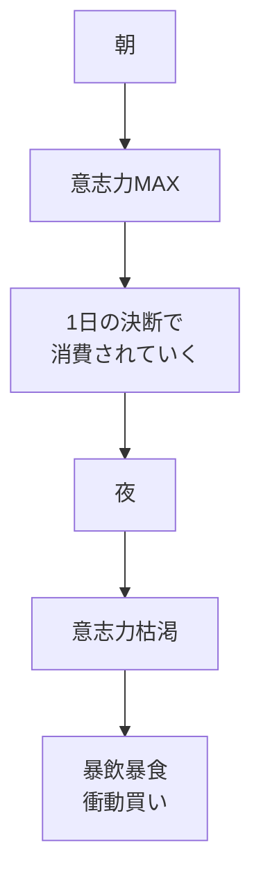
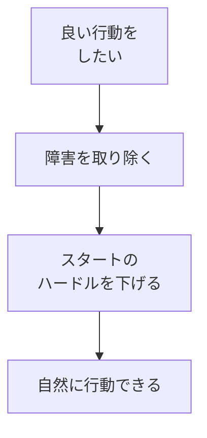
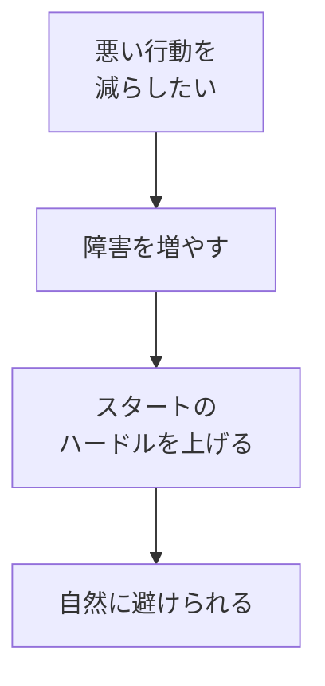
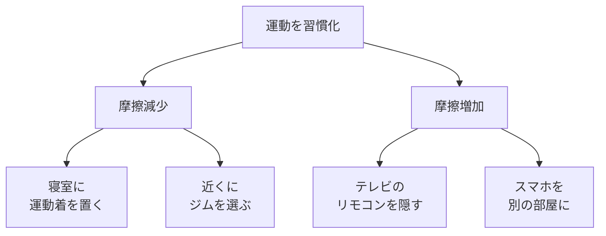
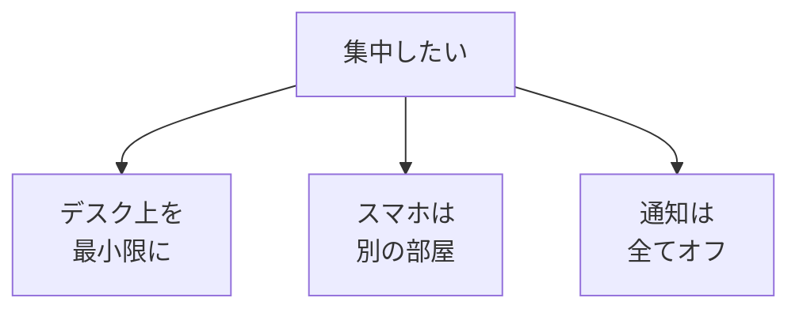

## はじめに

「やる気が出ない...」

「意志力が足りない...」

そう思っていませんか？

でも、問題は
**あなたの「意志力」**ではありません。

**「環境」**です。

最高のパフォーマーをもって、
悪い環境では
良い結果は出せません。

逆に、
**適切な環境を作れば、
意志力なしでも行動は変わります**。

---

## 意志力の限界

### 意志力は有限

**環境に頼る**ことで、
意志力を節約できます。

---

## 環境設計の原則

### 1. 摩擦を減らす（良い行動）

### 2. 摩擦を増やす（悪い行動）

---

## 具体例

### 運動の環境設計

### 集中の環境設計

---

## 実践できること

**① 「行動したいこと」の摩擦を下げる**

本を読みたい→
枕元に本を置く

**② 「やめたいこと」の摩擦を上げる**

スマホの使用を減らしたい→
充電は別の部屋で

**③ 環境を「デフォルト」にする**

良い行動が
何も考えなくても
できる環境を作る。

---

## まとめ

環境設計は、
**「自分を試さない」**ことです。

意志力に頼るのではなく、
**仕組みに頼る**。

それが、
持続可能な変化の
秘訣です。

---

## セッションでできること

コーチングセッションでは、
あなたの環境を診断し、
行動を変える仕組みを
一緒に設計します。

- 現在の環境分析
- 摩擦の特定と調整
- パーソナライズされた環境設計

**環境を味方につけて、
楽に成果を出しましょう。**
