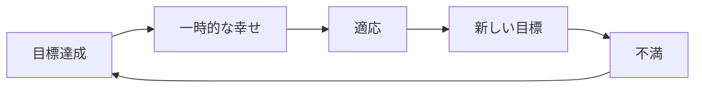
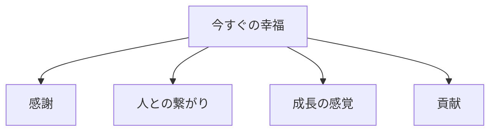
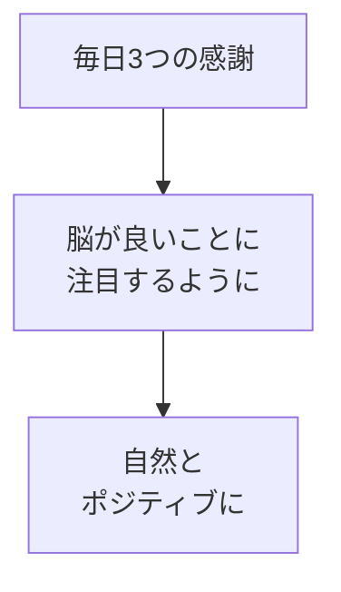
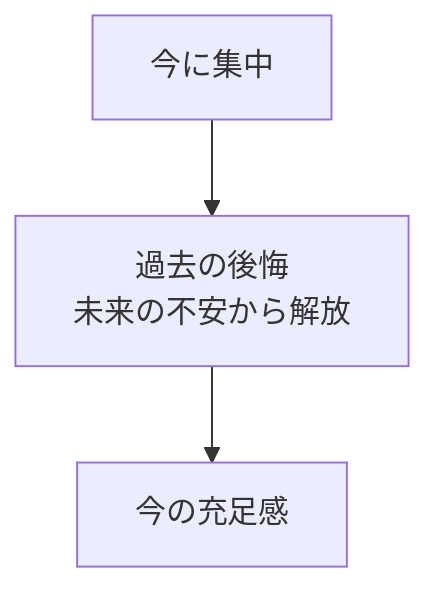

## はじめに

「昇進したら幸せになれる」

「結婚したら幸せになれる」

「お金があれば幸せになれる」

私たちは、
いつも「未来」の幸せを
追いかけています。

でも、その未来は
**来たことがありません**。

昇進しても、
結婚しても、
お金が増えても...

**「幸せ」は一時的で、
すぐに次の「条件」を
追いかけ始めます**。

---

## 条件付き幸福の罠

### ヘドニック・トレッドミル

**幸せは「到達点」ではなく、
「能力」**です。

---

## 今すぐの幸福

### 充足感の源

**これらは「今」
手に入れられます**。

---

## 実践テクニック

### 感謝の習慣

### マインドフルネス

---

## 実践できること

**① 感謝日記**

毎晩、
3つ感謝することを書く。

**② 「今、何を感じている？」**

1日3回、
自分の感情をチェック。

**③ 小さな喜びに注目**

コーヒーの香り、
太陽の光、
誰かの笑顔...

**④ 貢献する**

誰かの役に立つことで、
充実感を得る。

---

## まとめ

幸福は、
**「いつか」ではなく、
「今」**にあります。

条件を待つのではなく、
**感じる力を育てる**。

それが、
持続可能な幸福への
道です。

---

## セッションでできること

コーチングセッションでは、
あなたの幸福観を見直し、
今すぐ実践できる
幸福の習慣を作ります。

- 幸福の源泉の発見
- 感謝の習慣化
- マインドフルネスの導入

**今、この瞬間から、
幸せを感じましょう。**

[→ 体験セッションの詳細を見る](/sessions)
