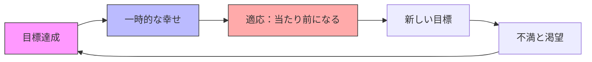
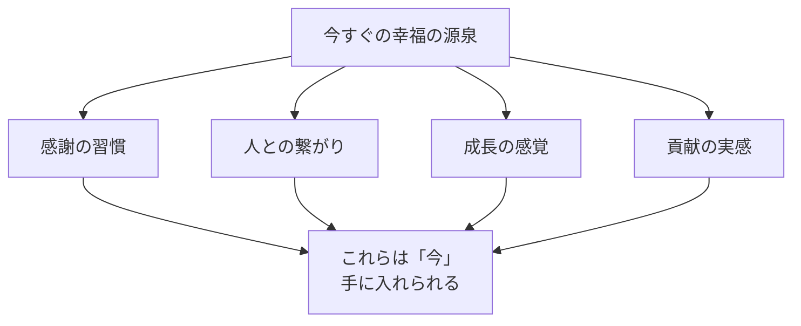
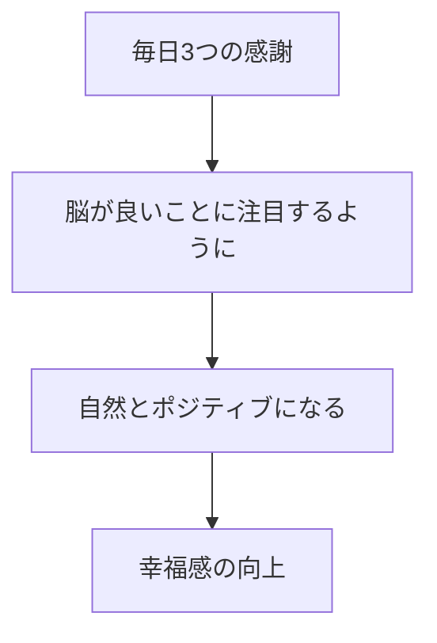
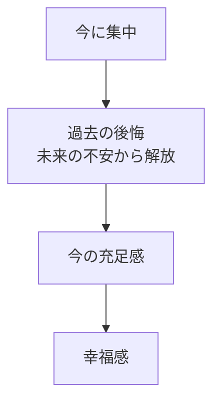

## はじめに：「いつか幸せになる」という幻想

「昇進したら幸せになれる」

「結婚したら幸せになれる」

「お金があれば幸せになれる」

私たちは、いつも「未来」の幸せを追いかけています。でも、その未来は**来たことがありません**。昇進しても、結婚しても、お金が増えても... **「幸せ」は一時的で、すぐに次の「条件」を追いかけ始めます**。

心理学者のソニア・リュボミアスキー教授の研究によると、人の幸福度は「遺伝」（50%）、「環境」（10%）、「意図的な行動」（40%）で決まります。つまり、「何かを達成すれば幸せになる」という考えは幻想なんです。

私も35歳で年収が倍になった時、「これで幸せになれる」と思いました。でも半年後には「もっと欲しい」という気持ちに戻っていました。これが**「ヘドニック・トレッドミル」**—幸福のための経験的適応—なんです。

この記事では、条件を待たずに「今」から幸福を感じる方法をお伝えします。

---

## 「条件付き幸福」の罠：ヘドニック・トレッドミルの仕組み

### ヘドニック・トレッドミルとは

宝くじに当たった人の研究が有名です。当選直後は幸福度が爆上がりしますが、1年後には元の幸福度に戻っています。逆に、大事故で下半身不随になった人も、1年後には元の幸福度に戻ることが多いんです。

人間は適応する生き物。良いことも悪いことも、時間が経てば「新しい基準」として受け入れられてしまう。

だから「何かを達成すれば幸せになる」という考えは、永遠に追いかけ続ける「蜃気楼」なんです。

---

## 今すぐ手に入る4つの幸福の源泉

幸福は「到達点」ではなく「能力」です。どこかに行くのではなく、「感じる力」を育てるんです。

### 源泉1：感謝の習慣

カリフォルニア大学の研究で、毎日感謝を書いたグループは、幸福度が25%向上し、健康状態も改善しました。感謝は「脳のフィルター」を変えます。欠乏に注目する脳が、豊かさに注目する脳に変わるんです。

私の実践：毎朝、通勤中に「今日感謝できる3つのこと」を頭で数えます。意外と簡単に見つかります。「電車が空いてる」「天気がいい」「昨日美味しいご飯食べた」。小さなことでも構いません。

### 源泉2：人との繋がり

ハーバード大学の75年間にわたる研究（グラント研究）で、人生の幸福を最も予測する因子は「人間関係の質」でした。お金でも名声でも地位でもなく、**「誰かと深く繋がっているか」**が最も重要だったんです。

私の実践：週に1回は「深い会話」を意識しています。「最近どう？」じゃなくて、「〇〇の時、どう感じた？」という具合に、感情レベルでの繋がりを大切にしています。

### 源泉3：成長の感覚

「今日は昨日より少し成長した」という感覚。これは自己効力感を高め、幸福感をもたらします。スポーツで少し記録が上がった、新しい知識を得た、人に優しくできた。小さな成長でも構いません。

私の実践：毎晩「今日学んだこと・成長したこと」を1つ書き出しています。「失敗したこと」でもOK。成長している実感が幸福につながります。

### 源泉4：貢献の実感

誰かの役に立った、貢献できたという実感。これは自己超越的な幸福—自分より大きな何かに繋がっている感覚—をもたらします。

私の実践：毎日「誰かに親切にする」ことを1つ意識しています。電車の席を譲る、同僚を褒める、後輩に相談に乗る。小さなことでも、貢献感は積み重なります。

---

## 実践テクニック：幸福を「感じる力」を育てる

### テクニック1：感謝日記

毎晩、紙かスマホに「今日感謝できる3つのこと」を書きます。最初は無理矢理でも、2週間続けると自然に「いいこと」に目が行くようになります。

### テクニック2：マインドフルネス

過去の後悔、未来の不安。これらは幸福の敵です。マインドフルネス（今に集中する練習）は、脳を「今」にアンカーしてくれます。1日3分から始めてみてください。呼吸に集中するだけでOKです。

### テクニック3：小さな喜びへの注目

コーヒーの香り、太陽の光、誰かの笑顔、風の音。日常の「小さな喜び」に意識的に注目します。私は「今日の小さな幸せ」を1つ見つけるゲームをしています。見つけるたびに、脳が「豊かさモード」に切り替わります。

### テクニック4：週1回の「貢献行動」

誰かの役に立つことを週に1回、意識的に行います。ボランティアでも、友人への手伝いでも、職場でのサポートでも。貢献感は自己価値感を高め、幸福感をもたらします。

---

## 今週やってみる：幸福習慣の4ステップ

**① 毎晩3つの感謝を書く（5分）**

紙でもスマホでも。小さなことでも構いません。

**② 1日3回「今、何を感じている？」と自問（1分×3）**

感情を意識的にチェックすることで、今にアンカーされます。

**③ 「今日の小さな幸せ」を1つ見つける**

日常の中で、意識的に「いいこと」に注目する習慣。

**④ 週に1回、誰かに親切にする**

貢献感を味わうための意図的な行動。

---

## まとめ：幸福は「いつか」じゃなく「今」にある

幸福は、**「いつか」ではなく、「今」**にあります。

条件を待つのではなく、**感じる力を育てる**。それが持続可能な幸福への道です。

昇進も結婚もお金も、幸福を「少し」もたらすかもしれません。でも本当の幸福は、日常の感謝、人との繋がり、成長の感覚、貢献の実感の中にあります。

今日から、一つだけ実践してみてください。あなたの幸福の「感じ方」が変わり始めます。

---

## セッションで深掘りできること

コーチングセッションでは、あなたの幸福観を見直し、今すぐ実践できる幸福の習慣を作ります：

- **幸福の源泉の発見**：あなたにとっての幸福とは何か
- **感謝の習慣化**：毎日の感謝実践の設計
- **マインドフルネスの導入**：今に生きる技術の習得

**今、この瞬間から、幸せを感じましょう。**
