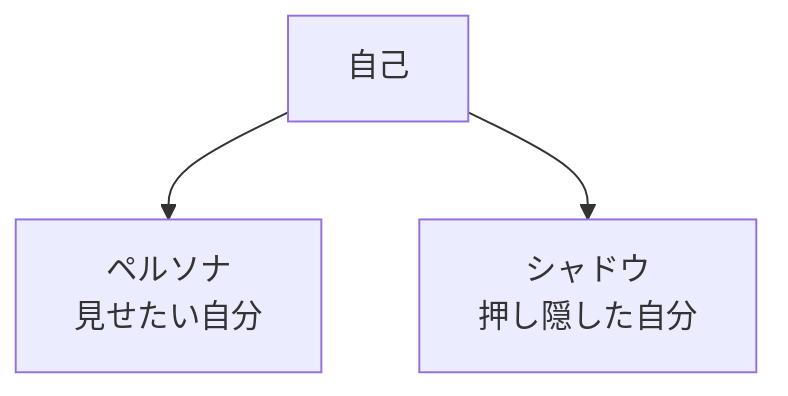
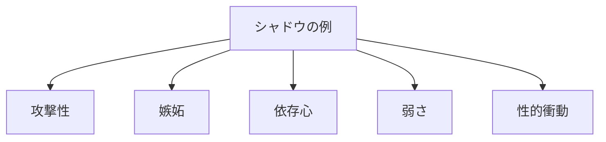
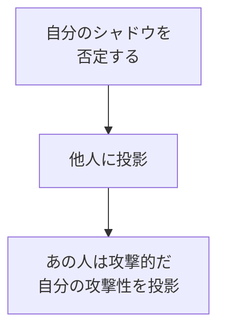
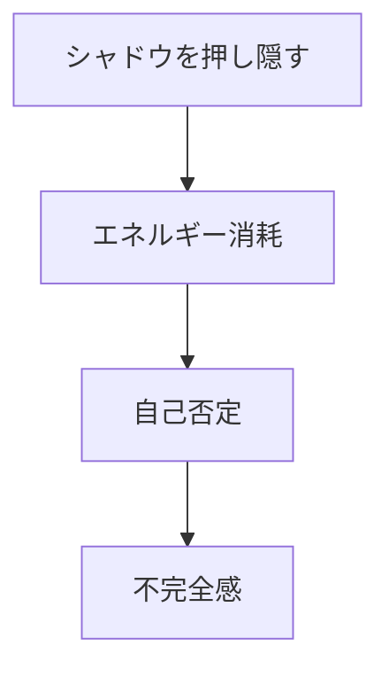
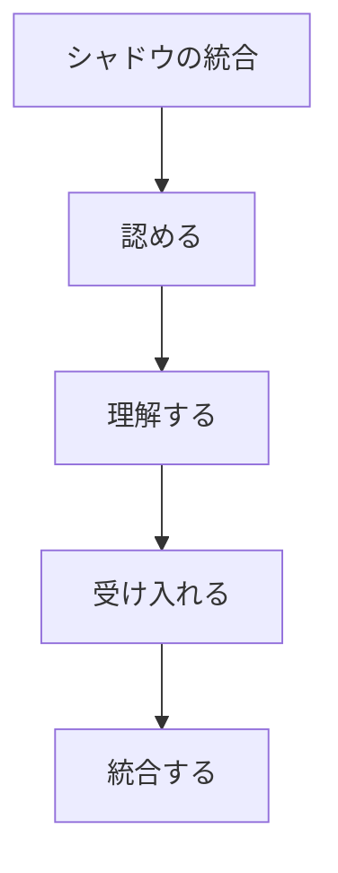

## はじめに

「あんな人になりたくない」

「自分にそんな面はない」

私たちは、
自分の「良くない面」を
否定し、押し隠したくなります。

でも、心理学者ユングは言いました。

**「否定したものは、
　影として強くなる」**

自分の「影」を認め、
統合することで、
**初めて完全な自己**が
生まれます。

---

## シャドウとは何か

### 定義



**シャドウは「悪」ではない**。

認めたくない
自分の一部です。

### 例



---

## シャドウを否定する代償

### プロジェクション



### 内面の葛藤



---

## シャドウの統合

### プロセス



### 統合の例

```mermaid
graph TD
    A[攻撃性の統合]
    A --> B[認める<br/>「私には攻撃性がある"]
    B --> C[理解する<br/>「守るための力だ"]
    C --> D[統合<br/>「適切に使う"]
```

---

## 実践できること

**① イライラする人を観察**

その人に感じる感情は、
自分のシャドウの投影かも。

**② ジャーナリング**

「認めたくない自分」を
書き出す。

**③ 「それも私だ」と言う**

「怒りも私だ」
「弱さも私だ」
「嫉妬も私だ」

**④ 対話する**

シャドウの部分と
対話し、
「何を伝えたい？」と問う。

---

## まとめ

シャドウの統合は、
**「悪い自分」を作ることではありません**。

**完全な自分を
受け入れること**です。

光と影、
両方があって
初めて「私」が完成します。

否定するのではなく、
統合することで、
**真の自由と力**が生まれます。

---

## セッションでできること

コーチングセッションでは、
あなたのシャドウを
安全な場で探索し、
統合をサポートします。

- シャドウの特定
- 投影パターンの分析
- 統合のプロセス

**あなたの全てを受け入れ、
完全な自己を実現しましょう。**
