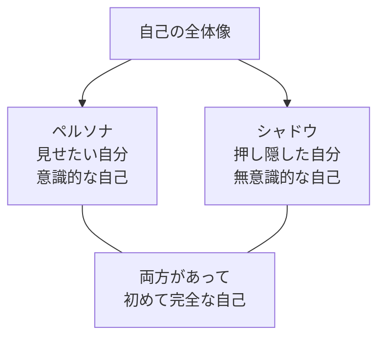
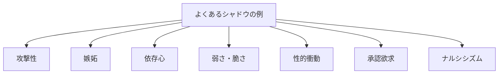
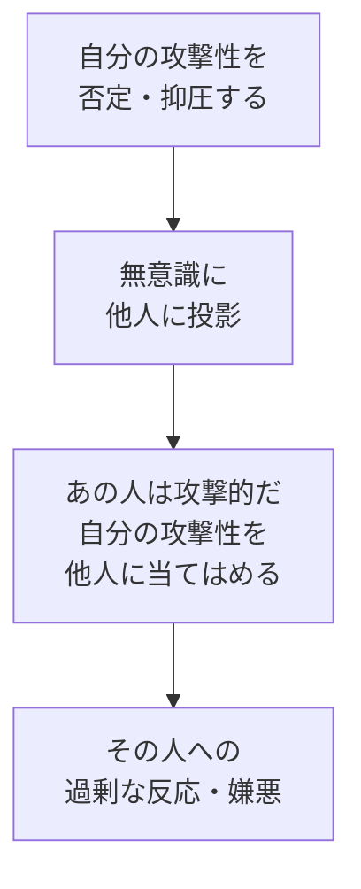
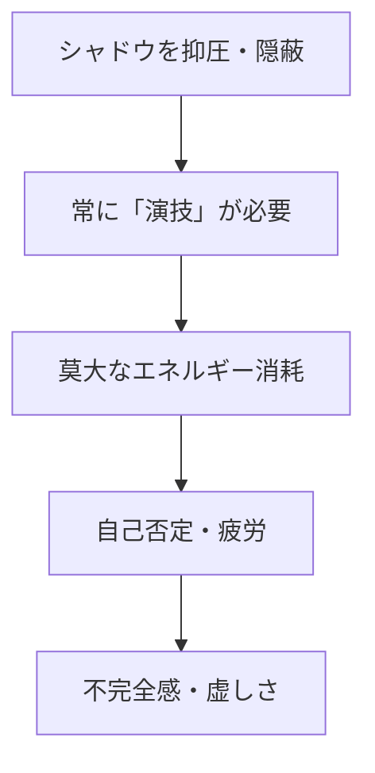
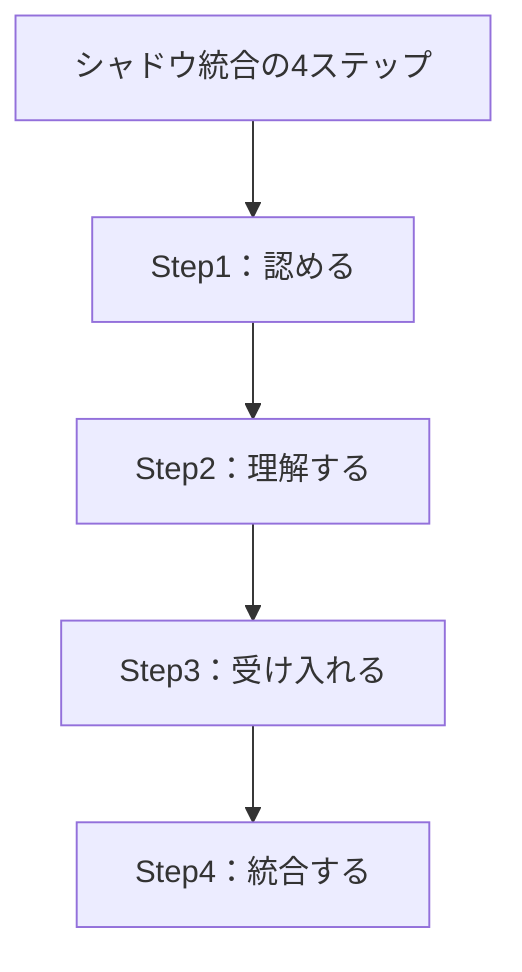
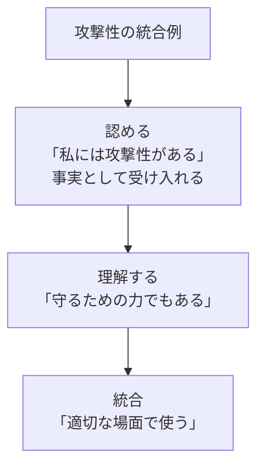

## はじめに：「良い自分」だけを追い求めてきた結果

「あんな人になりたくない」

「自分にそんな面はない」

私たちは、自分の「良くない面」を否定し、押し隠したくなります。嫉妬している自分、攻撃的な自分、弱い自分、依存している自分... こんな自分は「見せたくない」。だから抑圧して、無視して、否定してきました。

でも、心理学者のカール・ユングはこう言いました。**「否定したものは、影として強くなる」**。自分の「影（シャドウ）」を認め、統合することで、**初めて完全な自己**が生まれるんです。

私も30代半ばまで「常に前向きで、常に強く、常に理性的」でいようとしてきました。でもその結果、 unexpected に「攻撃的な感情」が爆発したり、予期せぬ「嫉妬」に襲われたり。抑圧していた分、影が強くなっていたんです。

この記事では、シャドウを理解し、統合する具体的な方法をお伝えします。

---

## シャドウとは何か：自分の「裏側」

### ペルソナとシャドウ

ユング心理学では、自分の中に「ペルソナ（社会的な仮面）」と「シャドウ（抑圧された側面）」があります。

ペルソナは「こうありたい理想の自分」。シャドウは「そうでありたくない、でも持っている自分」。

### シャドウの具体例

**シャドウは「悪」ではありません**。単に、社会的・個人的に「認めたくない」と思っている自分の側面なんです。

---

## シャドウを否定する代償：なぜ「隠す」と苦しくなるのか

### 代償1：プロジェクション（投影）

シャドウを抑圧すると、その感情を「他人に投影」しやすくなります。「あの人は攻撃的だ」と過剰に感じるのは、実は自分の攻撃性を投影しているからかもしれません。

### 代償2：内面のエネルギー消耗

「良い自分」でい続けるのは、実はとても疲れること。常にシャドウを押さえつけ、隠している間、私たちは「自分自身から逃げ続けている」んです。

### 代償3：予期せぬ爆発

抑圧したシャドウは、いつか「予期せぬ形」で現れます。ちょっとしたことで「爆発」したり、普段はしない「過剰な行動」を取ったり。抑圧が強ければ強いほど、影の反動も強くなります。

---

## シャドウの統合：4ステップで完全な自己へ

シャドウの統合とは、「悪い自分」を作ることではありません。**完全な自分を受け入れること**です。

### Step1：認める—「それも私だ」

まずは「あるがまま」を認めること。日記に書き出すのがおすすめです。「私は〇〇な面がある」「〇〇な感情を持つ」。これだけで、抑圧から解放され始めます。

### Step2：理解する—「なぜ持っているのか」

そのシャドウが「どんな役割」を持っているのか理解します。例えば：

- **攻撃性**：「守るため」「境界を保つため」の力
- **嫉妬**：「自分が本当に望むもの」を知る手がかり
- **依存心**：「つながりを求める」という自然な欲求
- **弱さ**：「助けを求める」ことで関係を深める力

シャドウには、必ず「機能」があります。それを理解することで、「悪いもの」から「必要な側面」に変わります。

### Step3：受け入れる—「それも私の一部」

「怒りも私だ」「弱さも私だ」「嫉妬も私だ」。これらを受け入れます。全部が「私」。光も影も、両方があって「私」なんです。

### Step4：統合する—「適切に使う」

シャドウを「抑圧」するのではなく、「統合」します。つまり、その感情や衝動を「適切な場面で、適切な形で」表現できるようになること。

例えば攻撃性なら、「無闇にぶつける」のではなく、「大切なものを守る時に使う力」として統合します。

---

## 実践法：シャドウと向き合う4つの方法

### 方法1：イライラする人を観察する

「あの人がイライラする」時、その感情は自分のシャドウの「投影」かもしれません。「あの人のどこが嫌なのか？」を自問し、その感情が自分の中にもあるか探ってみましょう。

### 方法2：ジャーナリング（日記）

「認めたくない自分」を書き出します。誰にも見せない紙に、「本当は〇〇だ」「〇〇と感じている」と素直に書き出す。書くことで、抑圧が解放されます。

### 方法3：「それも私だ」と言う

毎日、鏡を見ながら（または心の中で）：

- 「怒りも私だ」
- 「弱さも私だ」
- 「嫉妬も私だ」
- 「全部含めて私だ」

### 方法4：シャドウとの対話

瞑想やジャーナリングで、シャドウの部分と「対話」してみましょう。「今、どんなことを伝えたい？」「何が必要？」と問いかけ、返ってくる声を聴きます。

---

## まとめ：光と影、両方があって「私」

シャドウの統合は、**「悪い自分」を作ることではありません**。

**完全な自分を受け入れること**です。

光と影、両方があって初めて「私」が完成します。否定するのではなく、統合することで、**真の自由と力**が生まれます。

完璧な自分を演じる必要はありません。全部の自分を受け入れて、そこから本当の力を生み出しましょう。

---

## セッションで深掘りできること

コーチングセッションでは、あなたのシャドウを安全な場で探索し、統合をサポートします：

- **シャドウの特定**：あなたの抑圧している側面を発見
- **投影パターンの分析**：人に対する感情の背景を理解
- **統合のプロセス**：シャドウを力に変える具体的ステップ

**あなたの全てを受け入れ、完全な自己を実現しましょう。**
