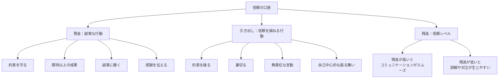
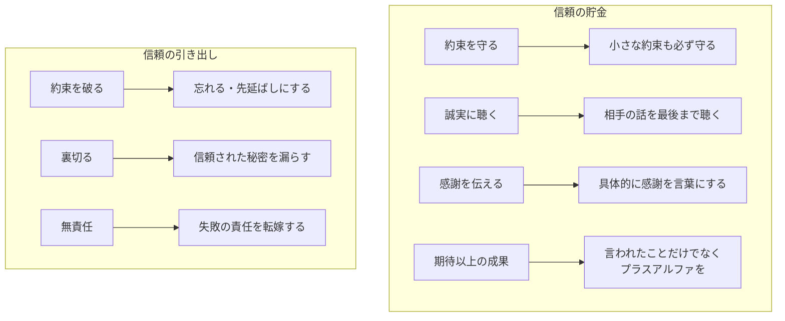
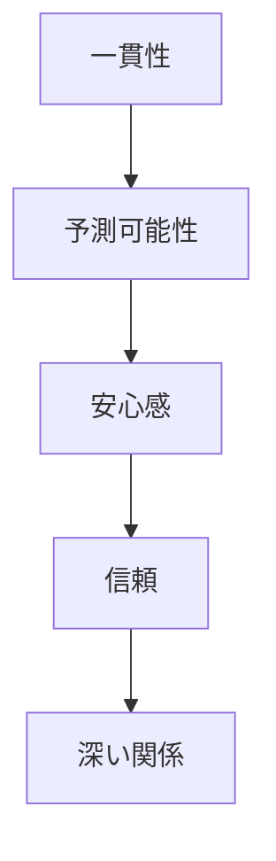
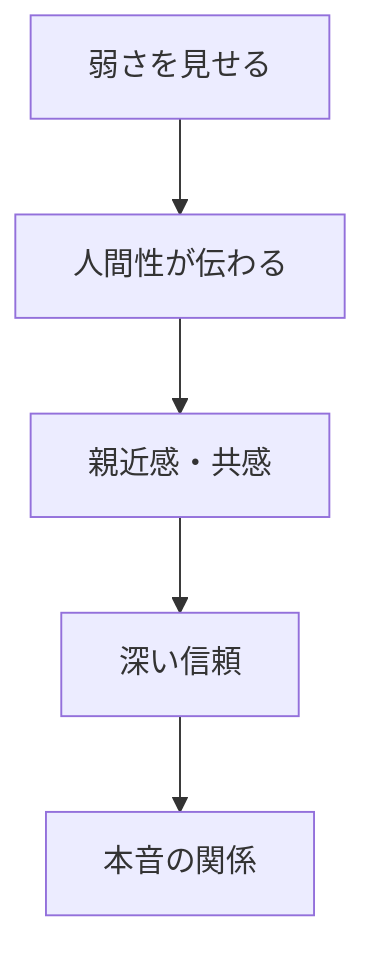

## はじめに：「信頼」は無形の資産

「あの人なら任せられる」

「あの人とは仕事がしたくない」

人間関係には、**見えない「信頼の口座」**が存在します。日々の小さな行動で貯金をしたり、引き出したり... この口座の残高が、**あなたの人間関係の質**を決めています。

スティーブン・コヴィー氏の『7つの習慣』にも登場する「信頼の口座（Emotional Bank Account）」という概念。人間関係は「口座」のように、日々のやり取りで「残高」が変動します。

私のメンターが言っていました。「信頼は氷山のようなもの。積み上げるのに何年もかかるが、一度崩すと水の中に沈んでしまう」。この記事では、信頼という「長期的な資産」を構築する方法をお伝えします。

---

## 信頼の口座とは：見えない資産の仕組み

### 信頼の口座のメタファー

### 貯金と引き出しの具体例

信頼の口座は「人ごと」に存在します。Aさんとの口座、Bさんとの口座... それぞれ独立した残高を持っています。

---

## 信頼構築の2つの基本原則

### 原則1：一貫性—「予測可能であること」

「あの人はいつもそうだ」という予測可能性が信頼の基盤になります。機嫌がコロコロ変わる人、言うことがコロコロ変わる人は信頼されにくい。一方、一貫している人は「安心して任せられる」存在になります。

これは「完璧であること」ではなく「予測可能であること」が大事です。「約束は守るけど、無理な約束はしない」という一貫性でもOKです。

### 原則2：脆弱性の共有—「弱さを見せる勇気」

信頼を築くには「完璧さ」より「人間性」が有効です。適切な場面で弱さや失敗を素直に話すことで、相手も「本音」を話しやすくなります。

私の経験では「失敗談を話した後」に、相手から「本音」が出てくることが多くなりました。「あの人は完璧じゃないんだ」と安心してもらえるんです。

---

## 信頼を貯める4つの実践法

### 実践1：小さな約束を守る

「明日メールする」という小さな約束も、必ず守ります。小さな約束の積み重ねが、大きな信頼になります。

私は「約束したこと」は必ずメモに取り、実行したらチェックします。小さな約束の積み重ねが、信頼の土台になります。

### 実践2：期待値を管理する

約束できる以上のことは約束しません。「無理な約束」をして破るより、「少し控えめの約束」をして超える方が信頼になります。

「明日には無理だけど、明後日ならできる」という正直さが、長期的には信頼になります。

### 実践3：感謝を具体的に伝える

「いつもありがとう」ではなく、「〇〇の時、助かった」と具体的に。具体的な感謝は「相手の行動を見ている」という証拠になります。

私は週に1回、「今週感謝したい人」にメッセージを送るようにしています。信頼の貯金になります。

### 実践4：失敗を素直に認めて修復する

信頼を損ねたら、素直に謝罪し、修復に努めます。「ごめんなさい」の後に、「どうやったら修復できますか？」を問う。

信頼を損ねることは誰にでもあります。大切なのは「隠さず、素直に対処すること」です。

---

## 信頼の複利効果：長期的な資産として

信頼の口座は「複利」で成長します。日々の小さな貯金が、時間とともに大きな資産に。

そしていざという時—病気になった時、転職する時、困った時—その信頼は大きな力になります。「助けて」と言える人が何人いるか。それが信頼の残高です。

私の知り合いで、起業した時に「何十人もの人が手を差し伸べてくれた」人がいます。それは彼が長年、信頼の貯金を続けてきた結果でした。

---

## 今週やってみる：信頼構築の3ステップ

**Step1：現在の「信頼の口座」を棚卸し**

大切な人との関係で、「信頼残高」はどうか？預金が多い関係と、引き出しが多い関係を整理する。

**Step2：1人選んで「小さな約束」を実践**

1人選び、その人への「小さな約束」を必ず守る練習をします。

**Step3：感謝を具体的に伝える**

今週中に、1人に「具体的な感謝」を伝えます。

---

## まとめ：信頼は一日にしてならず

信頼は、**一日にしてならず**。

日々の小さな誠実さが、長期的な資産となります。そして、**いざという時に、その資産は大きな力**となります。

信頼の口座に、今日も貯金を。

---

## セッションで深掘りできること

コーチングセッションでは、あなたの信頼構築のパターンを見直し、強化します：

- **信頼の口座の診断**：あなたの関係性の残高を分析
- **誠実なコミュニケーション**：約束と期待値の管理
- **長期的関係の設計**：信頼を資産として増やす戦略

**信頼という資産を、一緒に増やしていきましょう。**
