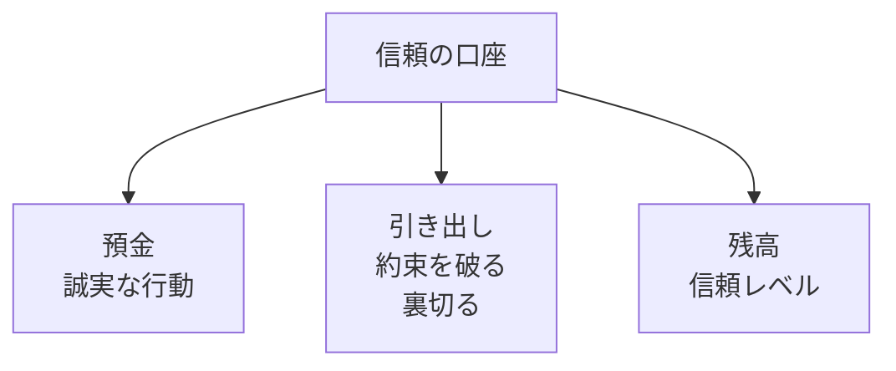
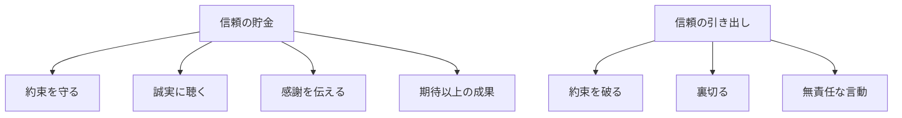
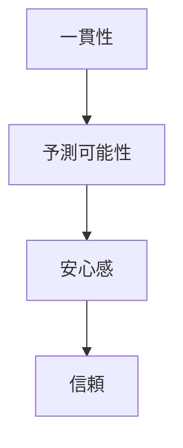
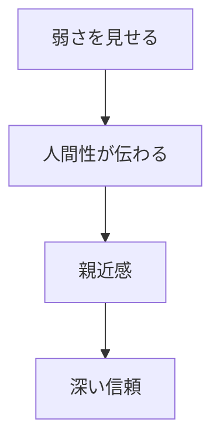

## はじめに

「あの人なら任せられる」

「あの人とは仕事がしたくない」

人間関係には、
**見えない「信頼の口座」**が
存在します。

日々の小さな行動で
貯金をしたり、
引き出したり...

この口座の残高が、
**あなたの人間関係の質**を
決めています。

---

## 信頼の口座とは

### メタファー

### 貯金と引き出し

---

## 信頼構築の原則

### 一貫性

### 脆弱性の共有

---

## 実践できること

**① 小さな約束を守る**

「明日メールする」も
必ず守る。

**② 期待値を管理**

約束できる以上のことは
約束しない。

**③ 感謝を具体的に伝える**

「いつもありがとう」ではなく、
「〇〇の時、助かった」

**④ 失敗を素直に認める**

信頼を損ねたら、
素直に謝罪し、
修復に努める。

---

## まとめ

信頼は、
**一日にしてならず**。

日々の小さな誠実さが、
長期的な資産となります。

そして、
**いざという時に、
その資産は大きな力**となります。

信頼の口座に、
今日も貯金を。

---

## セッションでできること

コーチングセッションでは、
あなたの信頼構築のパターンを
見直し、強化します。

- 信頼の口座の診断
- 誠実なコミュニケーション
- 長期的関係の設計

**信頼という資産を、
一緒に増やしていきましょう。**
