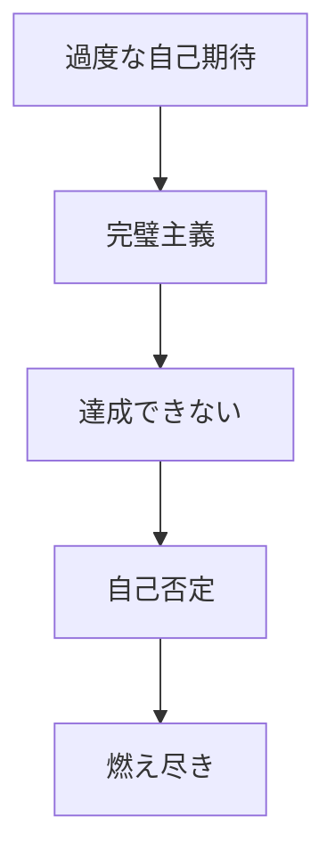
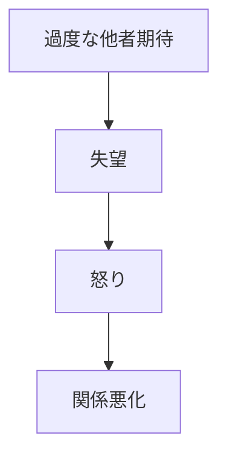
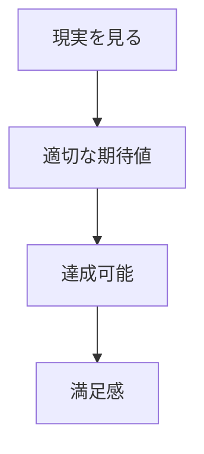
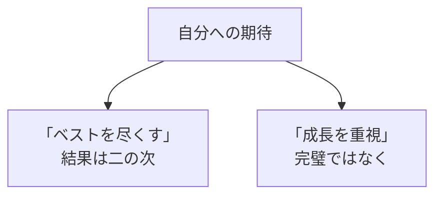

## はじめに

「もっとやれるはず...」

「あの人はわかってくれない...」

私たちは、
自分にも他人にも、
**過度な期待**を
抱きがちです。

そして、
期待が裏切られると、
**失望、怒り、ストレス**が
生まれます。

でも、問題は
**現実**ではなく、
**期待の高さ**なのかも
しれません。

---

## 期待値の罠

### 自分への期待

### 他人への期待

---

## 健康的な期待値

### 現実ベース

### 自分への期待

---

## 実践できること

**① 期待を明示する**

相手に期待を
伝えていないなら、
それは願望でしかない。

**② 「べき」を減らす**

「〜すべき」という
思考に注意。

**③ 現実を受け入れる**

「現実はこうだ」
という受容から始める。

**④ 期待と要求を分ける**

期待は希望、
要求は交渉。

---

## まとめ

期待値管理は、
**「諦める」ことではありません**。

**現実を見て、
適切に調整する**ことです。

過度な期待は、
自分も他人も苦しめます。

現実ベースの期待は、
**満足と成長**をもたらします。

---

## セッションでできること

コーチングセッションでは、
あなたの期待値パターンを分析し、
健康的なレベルに
調整します。

- 過度な期待の特定
- 現実ベースの目標設定
- 自己受容の深化

**期待を手放し、
現実と向き合いましょう。**
