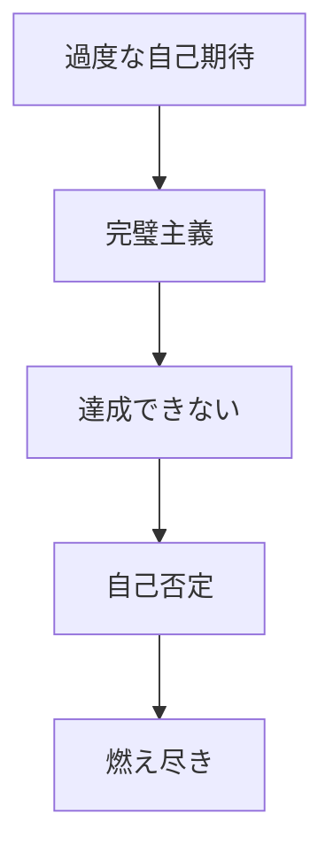
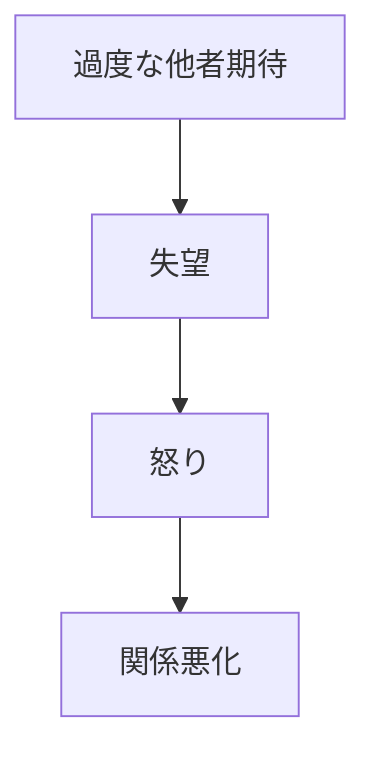
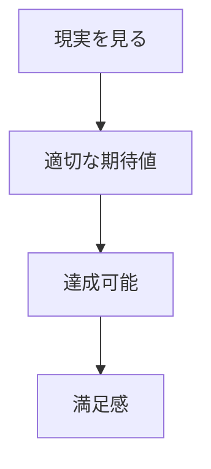
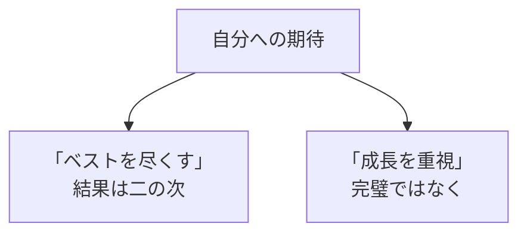

## はじめに

「もっとやれるはず...」

「あの人はわかってくれない...」

私たちは、
自分にも他人にも、
**過度な期待**を
抱きがちです。

そして、
期待が裏切られると、
**失望、怒り、ストレス**が
生まれます。

でも、問題は
**現実**ではなく、
**期待の高さ**なのかも
しれません。

実は私も、かつて「完璧な自分」になるべく、仕事でもプライベートでも過度な期待を背負っていました。結果、いつも疲れ果て、周りの人とも衝突してばかりでした。それが変わったのは、あるクライアントから「あなたは自分に厳しすぎる」と言われた時でした。

---

## 期待値の罠：3つの落とし穴

### 1. 自分への過度な期待

「今日中に終わらせる」「毎日5時起きで勉強する」—そんな理想を掲げて、達成できないと自己嫌悪に陥る。これを繰り返すと、心は削られていきます。

作家の村上春樹さんは、小説を書く時「毎日10ページ」という決まった目標を設けているそうです。多くても少なくても10ページ。無理せず、でも確実に続ける。これが現実ベースの期待値設定です。

### 2. 他人への過度な期待

「彼ならわかってくれるはず」「友達だから協力してくれるはず」—伝えていないのに期待して、裏切られた気分になる。これは相手を追い詰めるだけです。

ある経営者はこう言いました。「部下に期待することは悪くない。でも、期待だけ伝えて方法を教えないのは、種を与えずに収穫を求めるのと同じだ」。

### 3. 「あるべき」の呪縛

「こうあるべき」という理想像が、現実を歪めて見せます。でも「べき」は、しばしば誰かの作った基準に過ぎません。自分の価値観で、現実を再評価する必要があります。

---

## 健康的な期待値を設定する4つのステップ

### 現実ベース

### 自分への期待

---

## 今日からできる5つの実践法

**① 期待を明示する**

相手に期待を
伝えていないなら、
それは願望でしかない。

「〜してほしい」と具体的に伝えましょう。

**② 「べき」を減らす**

「〜すべき」という
思考に注意。

「したい」に置き換えてみて。

**③ 現実を受け入れる**

「現実はこうだ」
という受容から始める。

変えられないことを
嘆くのはやめよう。

**④ 期待と要求を分ける**

期待は希望、
要求は交渉。

混同すると、相手を困らせるだけ。

**⑤ 過去の自分と比較する**

他人と比べるのをやめて、
昨日の自分と比べよう。

それが最も健全な成長の測り方です。

---

## まとめ

期待値管理は、
**「諦める」ことではありません**。

**現実を見て、
適切に調整する**ことです。

過度な期待は、
自分も他人も苦しめます。

現実ベースの期待は、
**満足と成長**をもたらします。

期待を手放すと、心に余裕が生まれます。そこから、本当に大切なことにエネルギーを向けられるようになります。

---

## セッションでできること

コーチングセッションでは、
あなたの期待値パターンを分析し、
健康的なレベルに
調整します。

- 過度な期待の特定
- 現実ベースの目標設定
- 自己受容の深化

**期待を手放し、
現実と向き合いましょう。**
