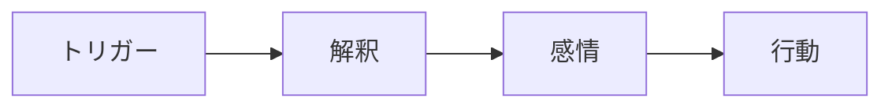
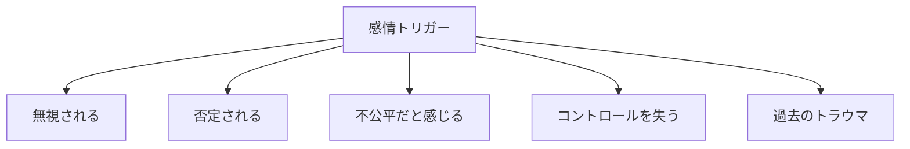
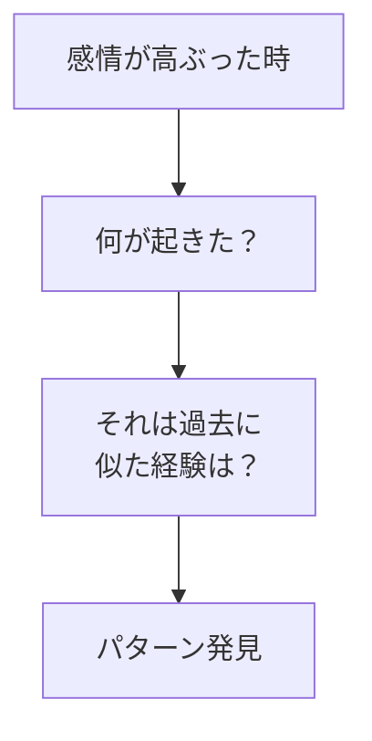
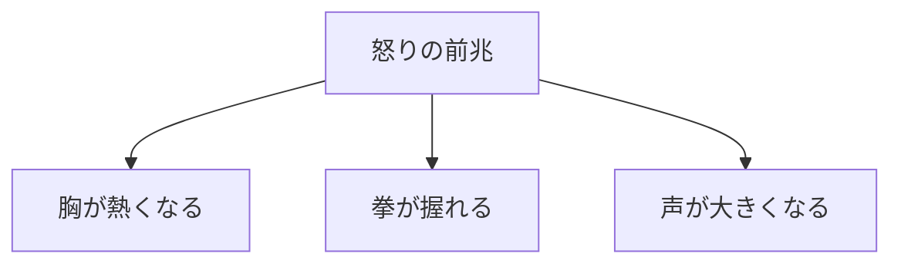
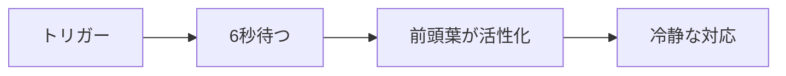
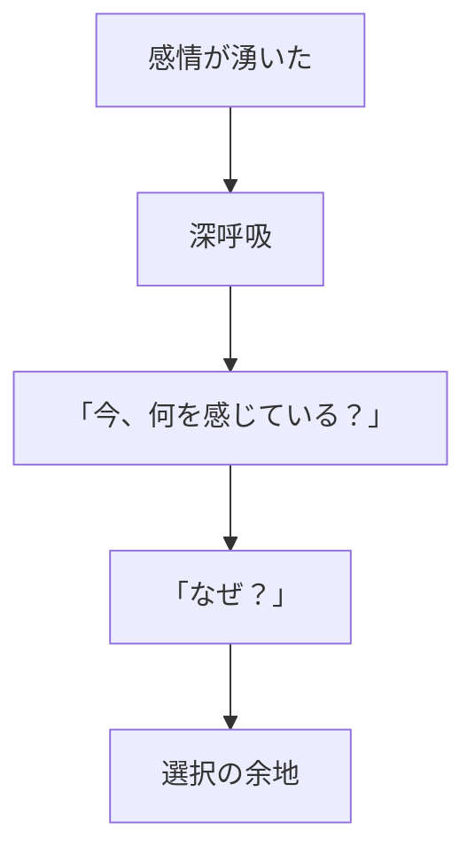

## はじめに

「また怒ってしまった...」

「なぜあんなに
反応してしまったんだろう...」

感情は、
**突然やってくる**ように
感じます。

でも、実は
**「トリガー」**という
引き金が存在します。

そのトリガーを知れば、
**反応をコントロール**できます。

---

## 感情のメカニズム

### トリガーと反応

**トリガーそのものではなく、
解釈が感情を生む**。

### よくあるトリガー

---

## トリガーの探索

### 振り返り

### 身体的サイン

---

## 反応を遅らせる

### 6秒ルール

### 一時停止のテクニック

---

## 実践できること

**① 感情日記**

強い感情を感じた時、
トリガーを記録。

**② 身体のチェック**

感情が湧く前の
身体的サインに注目。

**③ 「なぜ？」を5回**

その感情の
根源まで掘り下げる。

**④ 6秒の習慣**

反応する前に、
必ず6秒待つ。

---

## まとめ

感情トリガーを知ることで、
**感情の奴隷ではなく、
感情の主人**になれます。

反射的な反応ではなく、
**意図的な対応**ができる。

それが、
健全な人間関係と
自己統制への道です。

---

## セッションでできること

コーチングセッションでは、
あなたの感情トリガーを
一緒に探索し、
管理方法を学びます。

- トリガーの特定
- パターンの分析
- 対処法の習得

**感情を理解し、
コントロールする力を
身につけましょう。**
