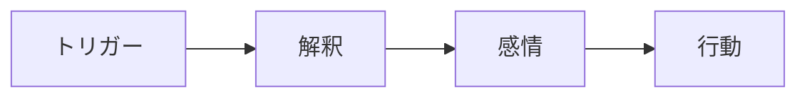
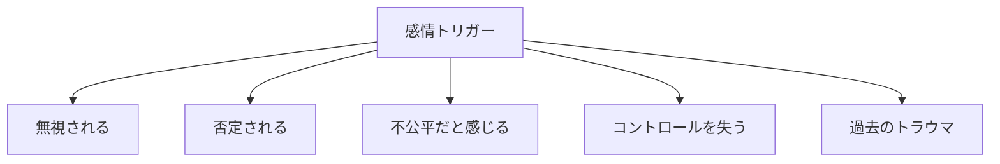
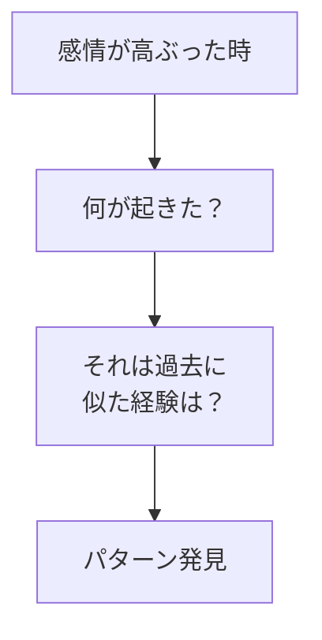
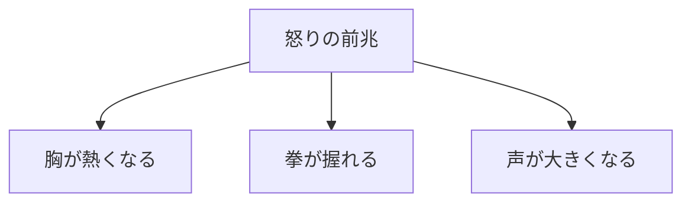
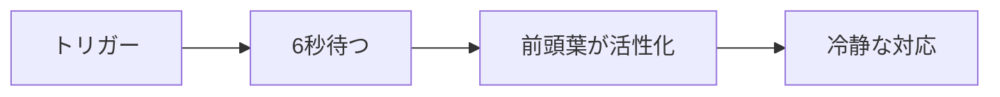
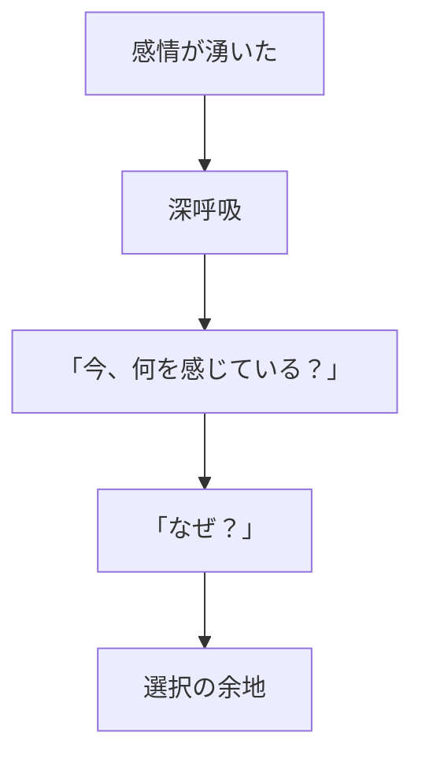

## はじめに

「また怒ってしまった...」

「なぜあんなに
反応してしまったんだろう...」

感情は、
**突然やってくる**ように
感じます。

でも、実は
**「トリガー」**という
引き金が存在します。

そのトリガーを知れば、
**反応をコントロール**できます。

ある女性経営者は、会議中に部下に「それは無理です」と言われると、必ず感情的になってしまいました。ある日、コーチングでそのパターンを分析したところ、実は父親に「無理」と否定され続けた幼少期の経験がトリガーになっていたことが判明しました。気づいた瞬間、彼女の反応は劇的に変わりました。

---

## 感情のメカニズム：3つの要素

### トリガーと反応

**トリガーそのものではなく、
解釈が感情を生む**。

同じ「遅刻」でも、「またか」と思うか、「何かあったのかな」と思うかで、感情は180度変わります。

### よくあるトリガー5選

これらのトリガーは、多くの場合、幼少期や過去の経験と深く結びついています。「否定される＝自分は価値がない」という解釈を、大人になっても無意識に繰り返しているのです。

---

## トリガーの探索：2つのアプローチ

### 振り返り

感情的になった後は、必ず5分間を取って振り返りましょう。「今、何が引き金になった？」「この感覚、前にもあった？」と自問することで、パターンが見えてきます。

### 身体的サイン

感情は、意識する前に身体に現れます。自分の「怒りサイン」を知っておけば、爆発する前にブレーキをかけられます。

---

## 反応を遅らせる：科学的な根拠と実践

### 6秒ルール

脳科学によると、感情が高ぶった時、前頭葉（理性の司令塔）が一時的に機能低下します。6秒待てば、血流が回復し、冷静な判断ができるようになります。

### 一時停止のテクニック

この「一時停止」は、世界のトップリーダーが実践しているテクニックです。ビル・ゲイツは、激怒しそうになると「考える時間」を作ることを習慣にしていると言います。

---

## 今日からできる4つの実践法

**① 感情日記をつける**

強い感情を感じた時、
トリガーを記録。

「何が起きた」「どう解釈した」「身体のどこに感じた」—3つのポイントを書き留めましょう。

**② 身体のチェックを習慣化する**

感情が湧く前の
身体的サインに注目。

「いつも肩がこる」「胃がキリキリする」など、自分のサインを知ることが先制のカギです。

**③ 「なぜ？」を5回繰り返す**

その感情の
根源まで掘り下げる。

「なぜ怒った？」「なぜそれが嫌なの？」—5回繰り返すと、本当のトリガーが見えてきます。

**④ 6秒の習慣を作る**

反応する前に、
必ず6秒待つ。

「1、2、3、4、5、6」—この単純なカウントが、人生を変えることがあります。

---

## まとめ

感情トリガーを知ることで、
**感情の奴隷ではなく、
感情の主人**になれます。

反射的な反応ではなく、
**意図的な対応**ができる。

それが、
健全な人間関係と
自己統制への道です。

感情を抑圧するのではなく、理解すること。そこから、本当の自由が生まれます。

---

## セッションでできること

コーチングセッションでは、
あなたの感情トリガーを
一緒に探索し、
管理方法を学びます。

- トリガーの特定
- パターンの分析
- 対処法の習得

**感情を理解し、
コントロールする力を
身につけましょう。**
