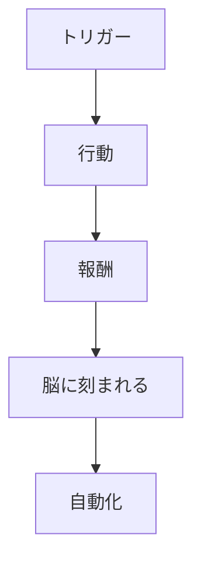
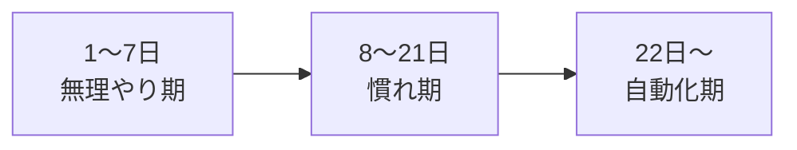
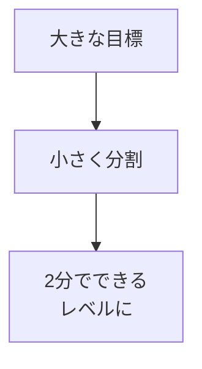
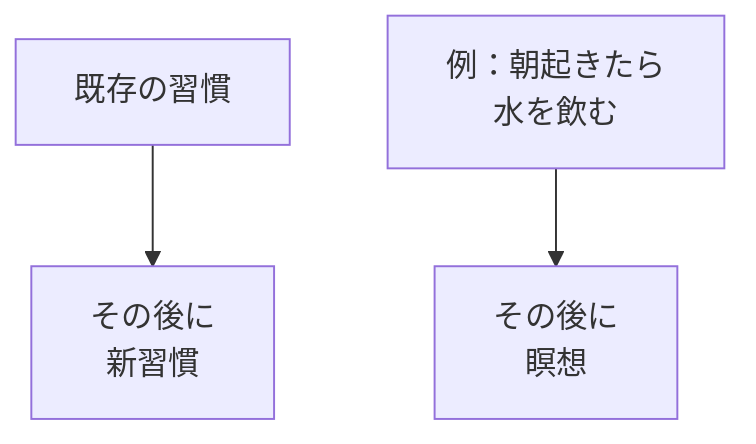
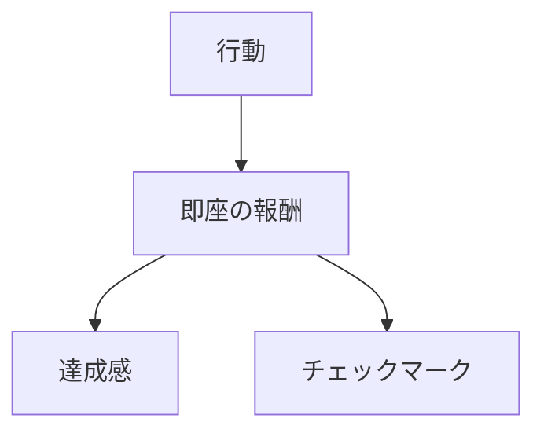

## はじめに

「新しいことを始めたい」

「でも続かない...」

習慣化に失敗するのは、
**意志力が足りないからではありません**。

**方法が間違っている**からです。

科学が明らかにした、
**確実に習慣を身につける方法**を
解説します。

実は、私自身も「毎日運動する」という目標を10回以上挫折しました。でも、ある科学的アプローチを知ってからは、朝のストレッチが毎日の習慣になりました。

---

## 習慣のメカニズム：脳科学の視点から

### 脳の仕組み

**習慣は「ループ」**です。

脳はエネルギーを節約したがる「怠け者」です。同じ行動を繰り返すと、「これは自動でやっとこう」とベースルート化します。これが習慣の本質です。

### 習慣化の期間：3つのフェーズ

「21日で習慣化」という言葉がありますが、実際には**平均66日**かかります。ただし、最初の21日が最重要です。この期間を乗り越えれば、継続率は劇的に上がります。

---

## 習慣化の4つのステップ

### 1. 小さく始める

「毎日1時間ジムに行く」→「毎日2分ストレッチする」。

小さく始めることで、心理的ハードルを下げ、成功体験を積み重ねられます。

### 2. トリガーを設定する

「朝歯を磨いたら、次に筋トレ」—既存の習慣に連結させることで、忘れを防ぎます。

### 3. 報酬を設定する

脳は「すぐに報酬が得られること」を好みます。達成したら、小さな喜びを与えましょう。

### 4. 環境を設計する

習慣の敵は「摩擦」です。運動するなら、前日に服を準備する。本を読むなら、スマホを別の部屋に置く。環境を味方につけましょう。

---

## 今日からできる4つの実践法

**① 「2分ルール」**

新しい習慣は
2分で終わるレベルから。

「読書」なら「1ページだけ」。
「運動」なら「1セットだけ」。

**② 既存習慣に連結させる**

「〜したら、次は〜」

「コーヒーを淹れたら、日記を書く」

**③ 見える化する**

カレンダーにチェック。
連続記録を作る。

「Xマークを続ける」というゲーム感覚が、継続力を生みます。

**④ 環境を味方につける**

障害を減らし、
自動化する。

習慣に必要なものを目の前に。
邪魔なものを遠ざける。

---

## まとめ

習慣化は、
**意志力ではなく、
仕組み**で行います。

小さく始めて、
トリガーを設定し、
報酬を与える。

それが、
確実に新しい自分を
作る方法です。

21日は、ちょうど新月から満月までの期間。新しいサイクルを始めるのに最適な時間です。

---

## セッションでできること

コーチングセッションでは、
あなたの習慣化計画を
一緒に立てます。

- 目標の適切な分割
- トリガーの設定
- 継続のサポート

**新しい習慣で、
新しい自分を作りましょう。**
